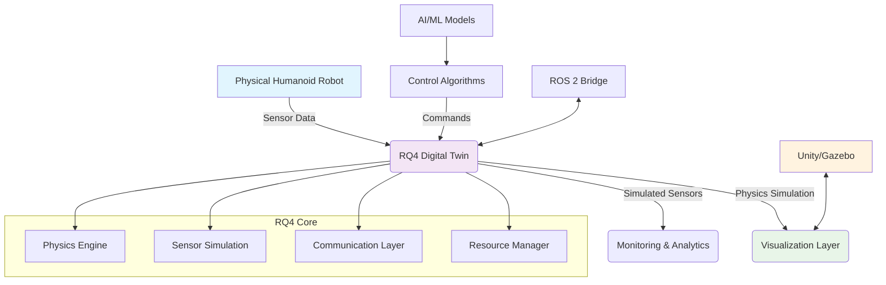

# RQ4 Integration: Advanced Robotics Simulation Framework for Digital Twins

## Introduction to RQ4 for Digital Twins

RQ4 (Robotics Query and Queue 4) represents an advanced simulation framework designed for creating and managing digital twins of complex robotic systems, particularly humanoid robots. This framework provides high-fidelity simulation capabilities that bridge the gap between physical robots and their digital counterparts, enabling comprehensive testing, validation, and development of control algorithms in a safe virtual environment.

RQ4 integration in digital twin environments serves multiple critical functions:
- **Real-time Simulation**: High-performance physics and sensor simulation
- **Distributed Computing**: Support for multi-node simulation environments
- **Realistic Sensor Modeling**: Accurate simulation of LiDAR, cameras, IMU, and other sensors
- **Control Interface**: Seamless integration with ROS 2 and other robotics frameworks
- **Scalability**: Ability to simulate multiple robots simultaneously

## Theoretical Foundation of RQ4 Architecture

### Core Architecture Components

RQ4 is built on a distributed architecture that consists of several key components:

#### Simulation Engine Layer
The simulation engine forms the core of RQ4, handling physics simulation, collision detection, and real-time dynamics calculations. The architecture includes:

1. **Physics Simulation Core**: Based on advanced physics engines like NVIDIA PhysX or Bullet Physics
2. **Scene Management System**: Efficient handling of complex 3D environments
3. **Real-time Scheduler**: Ensures deterministic execution across distributed systems
4. **Resource Management**: Dynamic allocation of computational resources

#### Communication Layer
RQ4 implements a robust communication system that ensures low-latency data exchange:

```cpp
// RQ4 communication interface
#include <zmq.hpp>
#include <nlohmann/json.hpp>
#include <thread>
#include <chrono>

class RQ4Communicator {
private:
    zmq::context_t context;
    std::unique_ptr<zmq::socket_t> publisher;
    std::unique_ptr<zmq::socket_t> subscriber;
    std::unique_ptr<zmq::socket_t> request_socket;

    // Configuration parameters
    std::string publisher_endpoint;
    std::string subscriber_endpoint;
    std::string request_endpoint;

    // Performance metrics
    std::atomic<uint64_t> message_count{0};
    std::chrono::steady_clock::time_point start_time;

public:
    RQ4Communicator(const std::string& config_path) : context(1) {
        loadConfiguration(config_path);
        initializeSockets();
        start_time = std::chrono::steady_clock::now();

        std::cout << "RQ4 Communicator initialized with endpoints:" << std::endl;
        std::cout << "  Publisher: " << publisher_endpoint << std::endl;
        std::cout << "  Subscriber: " << subscriber_endpoint << std::endl;
        std::cout << "  Request: " << request_endpoint << std::endl;
    }

    void loadConfiguration(const std::string& config_path) {
        std::ifstream config_file(config_path);
        nlohmann::json config;
        config_file >> config;

        publisher_endpoint = config["communication"]["publisher_endpoint"];
        subscriber_endpoint = config["communication"]["subscriber_endpoint"];
        request_endpoint = config["communication"]["request_endpoint"];
    }

    void initializeSockets() {
        // Initialize publisher socket
        publisher = std::make_unique<zmq::socket_t>(context, zmq::socket_type::pub);
        publisher->bind(publisher_endpoint);

        // Initialize subscriber socket
        subscriber = std::make_unique<zmq::socket_t>(context, zmq::socket_type::sub);
        subscriber->connect(subscriber_endpoint);
        subscriber->set(zmq::sockopt::subscribe, ""); // Subscribe to all topics

        // Initialize request socket
        request_socket = std::make_unique<zmq::socket_t>(context, zmq::socket_type::req);
        request_socket->connect(request_endpoint);

        std::cout << "RQ4 Communication sockets initialized successfully" << std::endl;
    }

    template<typename T>
    void publish(const std::string& topic, const T& data) {
        nlohmann::json message;
        message["topic"] = topic;
        message["timestamp"] = std::chrono::duration_cast<std::chrono::microseconds>(
            std::chrono::steady_clock::now() - start_time
        ).count();
        message["data"] = data;

        std::string json_str = message.dump();
        zmq::message_t zmq_msg(json_str.begin(), json_str.end());

        publisher->send(zmq_msg, zmq::send_flags::none);
        message_count++;

        if (message_count % 1000 == 0) {
            auto current_time = std::chrono::steady_clock::now();
            auto elapsed = std::chrono::duration_cast<std::chrono::milliseconds>(
                current_time - start_time
            ).count();
            std::cout << "Published " << message_count << " messages in "
                      << elapsed << "ms" << std::endl;
        }
    }

    template<typename T>
    bool subscribe(const std::string& topic, T& data) {
        zmq::message_t message;
        auto result = subscriber->recv(message, zmq::recv_flags::none);

        if (result) {
            std::string json_str(message.data<char>(), message.size());
            try {
                nlohmann::json received = nlohmann::json::parse(json_str);
                if (received["topic"] == topic) {
                    data = received["data"].get<T>();
                    return true;
                }
            } catch (const std::exception& e) {
                std::cerr << "Error parsing received message: " << e.what() << std::endl;
                return false;
            }
        }
        return false;
    }

    template<typename Request, typename Response>
    bool sendRequest(const Request& request, Response& response) {
        nlohmann::json req_json;
        req_json["request"] = request;
        req_json["id"] = generateRequestId();

        std::string req_str = req_json.dump();
        zmq::message_t req_msg(req_str.begin(), req_str.end());

        request_socket->send(req_msg, zmq::send_flags::none);

        zmq::message_t resp_msg;
        auto result = request_socket->recv(resp_msg, zmq::recv_flags::none);

        if (result) {
            std::string resp_str(resp_msg.data<char>(), resp_msg.size());
            try {
                nlohmann::json resp_json = nlohmann::json::parse(resp_str);
                response = resp_json["response"].get<Response>();
                return true;
            } catch (const std::exception& e) {
                std::cerr << "Error parsing response: " << e.what() << std::endl;
                return false;
            }
        }
        return false;
    }

private:
    std::string generateRequestId() {
        auto now = std::chrono::high_resolution_clock::now();
        auto duration = now.time_since_epoch();
        return std::to_string(duration.count());
    }
};
```

#### Sensor Simulation Framework

The sensor simulation framework in RQ4 provides realistic modeling of various robot sensors:

```python
import numpy as np
from typing import Dict, List, Tuple, Optional
import math
from dataclasses import dataclass

@dataclass
class SensorConfig:
    """Configuration for RQ4 sensors."""
    name: str
    type: str  # 'lidar', 'camera', 'imu', 'gps', 'force_torque'
    position: np.ndarray  # 3D position relative to robot
    orientation: np.ndarray  # 4D quaternion
    update_rate: float  # Hz
    noise_params: Dict[str, float]  # Sensor-specific noise parameters

class RQ4LidarSensor:
    """Advanced LiDAR sensor simulation for RQ4."""

    def __init__(self, config: SensorConfig):
        self.config = config
        self.scan_resolution = config.noise_params.get('resolution', 0.25)  # degrees
        self.range_min = config.noise_params.get('range_min', 0.1)  # meters
        self.range_max = config.noise_params.get('range_max', 25.0)  # meters
        self.fov_horizontal = config.noise_params.get('fov_horizontal', 360.0)  # degrees
        self.fov_vertical = config.noise_params.get('fov_vertical', 30.0)  # degrees
        self.fov_start_angle = config.noise_params.get('fov_start', -15.0)  # degrees

        # Calculate number of beams
        self.num_horizontal_beams = int(self.fov_horizontal / self.scan_resolution)
        self.num_vertical_beams = int(self.fov_vertical / self.scan_resolution)

        # Noise parameters
        self.range_noise_std = config.noise_params.get('range_noise_std', 0.02)  # meters
        self.ang_noise_std = config.noise_params.get('ang_noise_std', 0.001)  # radians

        # Generate angle arrays
        self.angles_horizontal = np.linspace(
            0, 2*np.pi, self.num_horizontal_beams, endpoint=False
        )
        self.angles_vertical = np.linspace(
            np.radians(self.fov_start_angle),
            np.radians(self.fov_start_angle + self.fov_vertical),
            self.num_vertical_beams
        )

        print(f"Initialized RQ4 LiDAR sensor: {config.name}")
        print(f"  Horizontal beams: {self.num_horizontal_beams}")
        print(f"  Vertical beams: {self.num_vertical_beams}")
        print(f"  Range: {self.range_min}m - {self.range_max}m")

    def simulate_scan(self, robot_pose: Dict[str, np.ndarray],
                     environment: 'EnvironmentModel') -> np.ndarray:
        """Simulate LiDAR scan from current robot pose."""
        # Robot position and orientation
        robot_pos = robot_pose['position']
        robot_quat = robot_pose['orientation']

        # Transform sensor position to world coordinates
        sensor_pos = self._transform_to_world(robot_pos, robot_quat, self.config.position)
        sensor_rot = self._quat_rotate(robot_quat, self.config.orientation)

        # Initialize scan array
        scan_data = np.full((self.num_vertical_beams, self.num_horizontal_beams),
                           self.range_max, dtype=np.float32)

        # Simulate each beam
        for v_idx, v_angle in enumerate(self.angles_vertical):
            for h_idx, h_angle in enumerate(self.angles_horizontal):
                # Calculate beam direction in sensor frame
                beam_dir_sensor = self._spherical_to_cartesian(h_angle, v_angle)

                # Transform beam direction to world frame
                beam_dir_world = self._quat_rotate(sensor_rot, beam_dir_sensor)

                # Ray casting to find intersection
                distance = self._ray_cast(
                    sensor_pos, beam_dir_world, environment
                )

                # Apply noise
                if distance < self.range_max:
                    distance += np.random.normal(0, self.range_noise_std)
                    distance = max(self.range_min, min(distance, self.range_max))

                scan_data[v_idx, h_idx] = distance

        return scan_data

    def _transform_to_world(self, robot_pos: np.ndarray, robot_quat: np.ndarray,
                           local_pos: np.ndarray) -> np.ndarray:
        """Transform local position to world coordinates."""
        # Rotate local position by robot orientation
        rotated_pos = self._quat_rotate(robot_quat, local_pos)
        # Add to robot position
        return robot_pos + rotated_pos

    def _quat_rotate(self, quat: np.ndarray, vec: np.ndarray) -> np.ndarray:
        """Rotate vector by quaternion."""
        # Convert quaternion to rotation matrix
        w, x, y, z = quat
        rotation_matrix = np.array([
            [1 - 2*(y*y + z*z), 2*(x*y - w*z), 2*(x*z + w*y)],
            [2*(x*y + w*z), 1 - 2*(x*x + z*z), 2*(y*z - w*x)],
            [2*(x*z - w*y), 2*(y*z + w*x), 1 - 2*(x*x + y*y)]
        ])
        return rotation_matrix @ vec

    def _spherical_to_cartesian(self, azimuth: float, elevation: float) -> np.ndarray:
        """Convert spherical coordinates to Cartesian."""
        x = np.cos(elevation) * np.cos(azimuth)
        y = np.cos(elevation) * np.sin(azimuth)
        z = np.sin(elevation)
        return np.array([x, y, z])

    def _ray_cast(self, start: np.ndarray, direction: np.ndarray,
                  environment: 'EnvironmentModel') -> float:
        """Perform ray casting to find distance to nearest obstacle."""
        # Normalize direction
        direction = direction / np.linalg.norm(direction)

        # Simple ray marching implementation
        step_size = 0.01  # 1cm steps
        max_distance = self.range_max

        current_pos = start.copy()
        distance = 0.0

        while distance <= max_distance:
            # Check for collision at current position
            if environment.is_colliding(current_pos):
                return distance

            # Move along ray
            current_pos += direction * step_size
            distance += step_size

        # No collision found within range
        return self.range_max

class RQ4CameraSensor:
    """Advanced camera sensor simulation for RQ4."""

    def __init__(self, config: SensorConfig):
        self.config = config
        self.width = int(config.noise_params.get('width', 640))
        self.height = int(config.noise_params.get('height', 480))
        self.fov = np.radians(config.noise_params.get('fov', 60.0))

        # Calculate camera intrinsic parameters
        self.fx = self.width / (2 * np.tan(self.fov / 2))
        self.fy = self.height / (2 * np.tan(self.fov / 2))
        self.cx = self.width / 2
        self.cy = self.height / 2

        # Noise parameters
        self.gaussian_noise = config.noise_params.get('gaussian_noise', 0.01)
        self.poisson_noise = config.noise_params.get('poisson_noise', 0.005)

        print(f"Initialized RQ4 Camera sensor: {config.name}")
        print(f"  Resolution: {self.width}x{self.height}")
        print(f"  FOV: {np.degrees(self.fov):.1f} degrees")

    def simulate_image(self, robot_pose: Dict[str, np.ndarray],
                      environment: 'EnvironmentModel') -> np.ndarray:
        """Simulate camera image from current robot pose."""
        # Create empty image
        image = np.zeros((self.height, self.width, 3), dtype=np.float32)

        # Robot position and orientation
        robot_pos = robot_pose['position']
        robot_quat = robot_pose['orientation']

        # Transform camera position to world coordinates
        camera_pos = self._transform_to_world(
            robot_pos, robot_quat, self.config.position
        )
        camera_rot = self._quat_rotate(robot_quat, self.config.orientation)

        # Generate rays for each pixel
        for y in range(self.height):
            for x in range(self.width):
                # Convert pixel coordinates to normalized device coordinates
                ndc_x = (x - self.cx) / self.fx
                ndc_y = (y - self.cy) / self.fy

                # Convert to world direction
                ray_dir = np.array([ndc_x, ndc_y, 1.0])
                ray_dir = ray_dir / np.linalg.norm(ray_dir)

                # Transform ray direction to world frame
                world_ray = self._quat_rotate(camera_rot, ray_dir)

                # Ray cast to get color
                color = self._ray_cast_color(camera_pos, world_ray, environment)
                image[y, x] = color

        # Apply noise
        image = self._apply_noise(image)

        return (image * 255).astype(np.uint8)

    def _apply_noise(self, image: np.ndarray) -> np.ndarray:
        """Apply sensor noise to image."""
        # Add Gaussian noise
        gaussian_noise = np.random.normal(0, self.gaussian_noise, image.shape)
        image = image + gaussian_noise

        # Add Poisson noise (simulating photon noise)
        image = np.clip(image, 0, 1)  # Normalize to [0, 1] for Poisson
        poisson_noise = np.random.poisson(image / self.poisson_noise) * self.poisson_noise
        image = image + (poisson_noise - image.mean(axis=(0,1), keepdims=True) * 0.1)

        return np.clip(image, 0, 1)

class RQ4IMUSensor:
    """Advanced IMU sensor simulation for RQ4."""

    def __init__(self, config: SensorConfig):
        self.config = config

        # IMU noise parameters
        self.accel_noise_density = config.noise_params.get('accel_noise_density', 0.002)  # m/s^2/sqrt(Hz)
        self.accel_bias_random_walk = config.noise_params.get('accel_bias_random_walk', 0.0004)  # m/s^3/sqrt(Hz)
        self.gyro_noise_density = config.noise_params.get('gyro_noise_density', 0.00024)  # rad/s/sqrt(Hz)
        self.gyro_bias_random_walk = config.noise_params.get('gyro_bias_random_walk', 2.6e-06)  # rad/s^2/sqrt(Hz)

        # Bias tracking
        self.accel_bias = np.random.normal(0, 0.1, 3)  # Initial bias
        self.gyro_bias = np.random.normal(0, 0.01, 3)  # Initial bias

        # Sample time for noise integration
        self.dt = 1.0 / config.update_rate

        print(f"Initialized RQ4 IMU sensor: {config.name}")
        print(f"  Update rate: {config.update_rate} Hz")
        print(f"  Accel noise density: {self.accel_noise_density}")
        print(f"  Gyro noise density: {self.gyro_noise_density}")

    def simulate_reading(self, robot_state: Dict[str, np.ndarray]) -> Dict[str, np.ndarray]:
        """Simulate IMU reading from robot state."""
        # Get true values from robot state
        true_accel = robot_state['linear_acceleration']
        true_angular_vel = robot_state['angular_velocity']

        # Add noise and bias
        accel_measurement = (
            true_accel +
            self.accel_bias +
            np.random.normal(0, self.accel_noise_density / np.sqrt(self.dt), 3)
        )

        gyro_measurement = (
            true_angular_vel +
            self.gyro_bias +
            np.random.normal(0, self.gyro_noise_density / np.sqrt(self.dt), 3)
        )

        # Update biases with random walk
        self.accel_bias += np.random.normal(0, self.accel_bias_random_walk * np.sqrt(self.dt), 3)
        self.gyro_bias += np.random.normal(0, self.gyro_bias_random_walk * np.sqrt(self.dt), 3)

        return {
            'linear_acceleration': accel_measurement,
            'angular_velocity': gyro_measurement,
            'orientation': self._integrate_orientation(gyro_measurement),
            'timestamp': robot_state.get('timestamp', 0.0)
        }

    def _integrate_orientation(self, angular_vel: np.ndarray) -> np.ndarray:
        """Integrate angular velocity to get orientation."""
        # Simple quaternion integration (in practice, use more sophisticated methods)
        dt = self.dt
        omega_norm = np.linalg.norm(angular_vel)

        if omega_norm > 1e-6:
            axis = angular_vel / omega_norm
            angle = omega_norm * dt

            # Convert axis-angle to quaternion
            half_angle = angle / 2
            w = np.cos(half_angle)
            xyz = axis * np.sin(half_angle)

            return np.array([w, xyz[0], xyz[1], xyz[2]])
        else:
            return np.array([1.0, 0.0, 0.0, 0.0])  # Identity quaternion

# Example usage of RQ4 sensor framework
def example_rq4_sensor_simulation():
    """Example of using the RQ4 sensor simulation framework."""
    print("=== RQ4 Sensor Simulation Example ===")

    # Define sensor configurations
    lidar_config = SensorConfig(
        name="front_lidar",
        type="lidar",
        position=np.array([0.2, 0.0, 0.5]),  # 20cm forward, 50cm up
        orientation=np.array([1.0, 0.0, 0.0, 0.0]),  # No rotation
        update_rate=10.0,  # 10 Hz
        noise_params={
            'resolution': 0.25,
            'range_min': 0.1,
            'range_max': 25.0,
            'fov_horizontal': 360.0,
            'fov_vertical': 30.0,
            'fov_start': -15.0,
            'range_noise_std': 0.02
        }
    )

    camera_config = SensorConfig(
        name="front_camera",
        type="camera",
        position=np.array([0.1, 0.0, 0.8]),  # 10cm forward, 80cm up
        orientation=np.array([1.0, 0.0, 0.0, 0.0]),  # No rotation
        update_rate=30.0,  # 30 Hz
        noise_params={
            'width': 640,
            'height': 480,
            'fov': 60.0,
            'gaussian_noise': 0.01,
            'poisson_noise': 0.005
        }
    )

    imu_config = SensorConfig(
        name="body_imu",
        type="imu",
        position=np.array([0.0, 0.0, 0.0]),  # At robot center
        orientation=np.array([1.0, 0.0, 0.0, 0.0]),  # No rotation
        update_rate=200.0,  # 200 Hz
        noise_params={
            'accel_noise_density': 0.002,
            'accel_bias_random_walk': 0.0004,
            'gyro_noise_density': 0.00024,
            'gyro_bias_random_walk': 2.6e-06
        }
    )

    # Initialize sensors
    lidar = RQ4LidarSensor(lidar_config)
    camera = RQ4CameraSensor(camera_config)
    imu = RQ4IMUSensor(imu_config)

    print("\nSensors initialized successfully!")

    # Example robot state
    robot_pose = {
        'position': np.array([0.0, 0.0, 0.5]),  # 50cm above ground
        'orientation': np.array([1.0, 0.0, 0.0, 0.0])  # No rotation
    }

    robot_state = {
        'linear_acceleration': np.array([0.1, 0.0, -9.71]),  # Slight forward accel, gravity
        'angular_velocity': np.array([0.0, 0.0, 0.01]),  # Slow rotation around z-axis
        'timestamp': 0.0
    }

    # Simulate sensor readings
    lidar_scan = lidar.simulate_scan(robot_pose, None)  # Environment model would be passed in real usage
    # camera_image = camera.simulate_image(robot_pose, None)  # Would require environment model
    imu_reading = imu.simulate_reading(robot_state)

    print(f"Lidar scan shape: {lidar_scan.shape}")
    print(f"IMU acceleration: {imu_reading['linear_acceleration']}")
    print(f"IMU angular velocity: {imu_reading['angular_velocity']}")
    print(f"IMU orientation: {imu_reading['orientation']}")

if __name__ == "__main__":
    example_rq4_sensor_simulation()
```

### Advanced RQ4 Physics Simulation

RQ4 implements advanced physics simulation capabilities that are essential for realistic humanoid robot digital twins:

```cpp
// Advanced RQ4 physics simulation system
#include <PxPhysicsAPI.h>
#include <extensions/PxExtensions.h>
#include <vehicle/PxVehicleAPI.h>
#include <iostream>
#include <vector>
#include <map>
#include <memory>

using namespace physx;

class RQ4PhysicsSimulator {
private:
    PxFoundation* foundation;
    PxPhysics* physics;
    PxScene* scene;
    PxMaterial* default_material;

    // Humanoid robot actors and joints
    std::vector<PxRigidDynamic*> robot_links;
    std::vector<PxJoint*> robot_joints;

    // Simulation parameters
    PxReal timestep;
    PxU32 substeps;
    PxVec3 gravity;

    // Performance metrics
    uint64_t simulation_steps{0};
    std::chrono::steady_clock::time_point start_time;

public:
    RQ4PhysicsSimulator(float dt = 0.001f, PxVec3 g = PxVec3(0.0f, -9.81f, 0.0f))
        : timestep(dt), substeps(1), gravity(g) {

        // Initialize PhysX
        foundation = PxCreateFoundation(
            PX_PHYSICS_VERSION,
            allocator,
            error_callback
        );

        if (!foundation) {
            throw std::runtime_error("Failed to create PhysX foundation");
        }

        physics = PxCreatePhysics(
            PX_PHYSICS_VERSION,
            *foundation,
            PxTolerancesScale(),
            true,
            nullptr
        );

        if (!physics) {
            throw std::runtime_error("Failed to create PhysX instance");
        }

        // Initialize extensions
        if (!PxInitExtensions(*physics)) {
            throw std::runtime_error("Failed to initialize PhysX extensions");
        }

        // Create default material
        default_material = physics->createMaterial(0.5f, 0.5f, 0.1f);

        // Create scene with advanced parameters
        PxSceneDesc scene_desc(physics->getTolerancesScale());
        scene_desc.gravity = gravity;

        // Advanced solver settings
        scene_desc.solverType = PxSolverType::eTGS;  // Temporal Gauss-Seidel
        scene_desc.broadPhaseType = PxBroadPhaseType::eSAP;  // Sweep and Prune
        scene_desc.flags |= PxSceneFlag::eENABLE_CCD;  // Continuous collision detection
        scene_desc.flags |= PxSceneFlag::eENABLE_PCM;  // Projection contact model

        // Solver iteration counts for humanoid stability
        scene_desc.solverIterationCounts.minPositionIters = 8;
        scene_desc.solverIterationCounts.minVelocityIters = 2;
        scene_desc.solverOffsetSlop = 0.001f;

        scene = physics->createScene(scene_desc);

        if (!scene) {
            throw std::runtime_error("Failed to create PhysX scene");
        }

        // Create CPU dispatcher
        cpu_dispatcher = PxDefaultCpuDispatcherCreate(4);
        scene->setCpuDispatcher(cpu_dispatcher);

        start_time = std::chrono::steady_clock::now();

        std::cout << "RQ4 Physics Simulator initialized with:" << std::endl;
        std::cout << "  Timestep: " << timestep << "s" << std::endl;
        std::cout << "  Gravity: [" << gravity.x << ", " << gravity.y << ", " << gravity.z << "]" << std::endl;
        std::cout << "  Substeps: " << substeps << std::endl;
    }

    ~RQ4PhysicsSimulator() {
        cleanup();
    }

    void createHumanoidRobot() {
        // Create humanoid robot with realistic proportions
        // Torso (base link)
        PxTransform torso_transform(PxVec3(0.0f, 0.8f, 0.0f));  // Start at hip level
        PxRigidDynamic* torso = createCapsuleActor(torso_transform, 0.15f, 0.4f, 20.0f);  // Torso: 20kg
        robot_links.push_back(torso);

        // Head
        PxTransform head_transform(PxVec3(0.0f, 0.0f, 0.55f));  // 55cm above torso
        PxRigidDynamic* head = createSphereActor(
            torso_transform.transform(head_transform),
            0.12f,  // 12cm radius
            4.0f    // 4kg
        );
        robot_links.push_back(head);

        // Create arms
        createArmChain(true, torso_transform);   // Left arm
        createArmChain(false, torso_transform);  // Right arm

        // Create legs
        createLegChain(true, torso_transform);   // Left leg
        createLegChain(false, torso_transform);  // Right leg

        // Add all actors to scene
        for (auto& link : robot_links) {
            scene->addActor(*link);
        }

        // Create joints to connect the robot
        createRobotJoints();

        std::cout << "Humanoid robot created with " << robot_links.size() << " links" << std::endl;
    }

    void createRobotJoints() {
        // Connect torso to head
        PxJoint* neck_joint = PxRevoluteJointCreate(
            *physics,
            robot_links[0],  // Torso
            PxTransform(PxVec3(0, 0, 0.4f)),  // Top of torso
            robot_links[1],  // Head
            PxTransform(PxVec3(0, 0, -0.12f))  // Bottom of head
        );

        // Set joint limits for neck
        PxRevoluteJoint* rev_joint = static_cast<PxRevoluteJoint*>(neck_joint);
        rev_joint->setLimit(PxJointAngularLimitPair(-PxPi/6, PxPi/6));  // +/- 30 degrees
        rev_joint->setDriveVelocity(0.0f);
        rev_joint->setDriveForceLimit(100.0f);
        rev_joint->setDriveType(PxJointDriveType::eVELOCITY);

        robot_joints.push_back(neck_joint);

        std::cout << "Created " << robot_joints.size() << " joints for humanoid robot" << std::endl;
    }

    PxRigidDynamic* createCapsuleActor(const PxTransform& transform,
                                     PxReal radius,
                                     PxReal half_height,
                                     PxReal mass) {
        // Create capsule geometry
        PxCapsuleGeometry geometry(radius, half_height);

        // Create dynamic actor
        PxRigidDynamic* actor = PxCreateDynamic(
            *physics,
            transform,
            geometry,
            *default_material,
            1.0f
        );

        if (!actor) {
            throw std::runtime_error("Failed to create capsule actor");
        }

        // Set mass and inertia
        actor->setMass(mass);

        // Calculate and set moment of inertia for capsule
        PxReal Ixx_zz = (1.0f/12.0f) * mass * (3*radius*radius + 4*half_height*half_height);
        PxReal Iyy = (1.0f/2.0f) * mass * radius*radius;
        actor->setMassSpaceInertiaTensor(PxVec3(Ixx_zz, Iyy, Ixx_zz));

        return actor;
    }

    PxRigidDynamic* createSphereActor(const PxTransform& transform,
                                    PxReal radius,
                                    PxReal mass) {
        PxSphereGeometry geometry(radius);

        PxRigidDynamic* actor = PxCreateDynamic(
            *physics,
            transform,
            geometry,
            *default_material,
            1.0f
        );

        if (!actor) {
            throw std::runtime_error("Failed to create sphere actor");
        }

        actor->setMass(mass);

        // Moment of inertia for sphere: (2/5) * m * r²
        PxReal moi_value = 0.4f * mass * radius * radius;
        actor->setMassSpaceInertiaTensor(PxVec3(moi_value, moi_value, moi_value));

        return actor;
    }

    void createArmChain(bool is_left, const PxTransform& torso_transform) {
        PxReal sign = is_left ? 1.0f : -1.0f;

        // Shoulder position (relative to torso)
        PxTransform shoulder_pos(PxVec3(0.0f, 0.15f * sign, 0.3f));
        PxTransform shoulder_transform = torso_transform.transform(shoulder_pos);

        // Upper arm
        PxTransform upper_arm_transform = shoulder_transform.transform(PxVec3(0.0f, 0.0f, -0.3f));
        PxRigidDynamic* upper_arm = createCapsuleActor(upper_arm_transform, 0.06f, 0.15f, 2.0f);
        robot_links.push_back(upper_arm);

        // Lower arm
        PxTransform lower_arm_transform = upper_arm_transform.transform(PxVec3(0.0f, 0.0f, -0.3f));
        PxRigidDynamic* lower_arm = createCapsuleActor(lower_arm_transform, 0.05f, 0.15f, 1.5f);
        robot_links.push_back(lower_arm);

        // Hand
        PxTransform hand_transform = lower_arm_transform.transform(PxVec3(0.0f, 0.0f, -0.1f));
        PxRigidDynamic* hand = createSphereActor(hand_transform, 0.05f, 0.5f);
        robot_links.push_back(hand);

        // Add joints between arm segments (would be implemented in full version)
    }

    void createLegChain(bool is_left, const PxTransform& torso_transform) {
        PxReal sign = is_left ? 1.0f : -1.0f;

        // Hip position (relative to torso)
        PxTransform hip_pos(PxVec3(0.0f, 0.08f * sign, -0.4f));  // Lower than torso
        PxTransform hip_transform = torso_transform.transform(hip_pos);

        // Thigh
        PxTransform thigh_transform = hip_transform.transform(PxVec3(0.0f, 0.0f, -0.4f));
        PxRigidDynamic* thigh = createCapsuleActor(thigh_transform, 0.08f, 0.2f, 6.0f);
        robot_links.push_back(thigh);

        // Shin
        PxTransform shin_transform = thigh_transform.transform(PxVec3(0.0f, 0.0f, -0.4f));
        PxRigidDynamic* shin = createCapsuleActor(shin_transform, 0.07f, 0.2f, 5.0f);
        robot_links.push_back(shin);

        // Foot
        PxTransform foot_transform = shin_transform.transform(PxVec3(0.05f, 0.0f, -0.4f));
        PxRigidDynamic* foot = createBoxActor(foot_transform, PxVec3(0.1f, 0.05f, 0.02f), 2.0f);
        robot_links.push_back(foot);
    }

    PxRigidDynamic* createBoxActor(const PxTransform& transform,
                                 const PxVec3& dimensions,
                                 PxReal mass) {
        PxBoxGeometry geometry(dimensions);

        PxRigidDynamic* actor = PxCreateDynamic(
            *physics,
            transform,
            geometry,
            *default_material,
            1.0f
        );

        if (!actor) {
            throw std::runtime_error("Failed to create box actor");
        }

        actor->setMass(mass);

        // Moment of inertia for box
        PxReal dx = 2.0f * dimensions.x;
        PxReal dy = 2.0f * dimensions.y;
        PxReal dz = 2.0f * dimensions.z;

        PxVec3 moi(
            (1.0f/12.0f) * mass * (dy*dy + dz*dz),
            (1.0f/12.0f) * mass * (dx*dx + dz*dz),
            (1.0f/12.0f) * mass * (dx*dx + dy*dy)
        );

        actor->setMassSpaceInertiaTensor(moi);

        return actor;
    }

    void simulateStep() {
        scene->simulate(timestep / substeps);
        scene->fetchResults(true);
        simulation_steps++;

        // Print performance info periodically
        if (simulation_steps % 1000 == 0) {
            auto current_time = std::chrono::steady_clock::now();
            auto elapsed = std::chrono::duration_cast<std::chrono::milliseconds>(
                current_time - start_time
            ).count();

            std::cout << "Simulation step " << simulation_steps
                      << ", elapsed: " << elapsed << "ms"
                      << ", avg step time: " << elapsed / double(simulation_steps) << "ms" << std::endl;
        }
    }

    void applyControlInputs(const std::vector<PxVec3>& joint_torques) {
        // Apply control torques to robot joints
        // In a real implementation, this would interface with the robot's control system
        for (size_t i = 0; i < robot_joints.size() && i < joint_torques.size(); ++i) {
            // Apply torque to joint (simplified - in practice would use proper joint control)
            // This is a placeholder for actual control implementation
        }
    }

    std::vector<PxVec3> getRobotStates() {
        std::vector<PxVec3> positions;
        for (auto& link : robot_links) {
            positions.push_back(link->getGlobalPose().p);
        }
        return positions;
    }

    void printPerformanceInfo() {
        std::cout << "\n=== RQ4 Physics Performance Info ===" << std::endl;
        std::cout << "Simulation steps: " << simulation_steps << std::endl;

        // Get scene statistics
        PxSceneReadLock scoped_lock(*scene);
        PxSimulationStatistics stats;
        scene->getSimulationStatistics(stats);

        std::cout << "Actors: " << stats.nbDynamicRigidBodies << " dynamic, "
                  << stats.nbStaticRigidBodies << " static" << std::endl;
        std::cout << "Constraints: " << stats.nbJointConstraints << std::endl;
        std::cout << "Contacts: " << stats.nbContacts << std::endl;

        auto elapsed = std::chrono::duration_cast<std::chrono::milliseconds>(
            std::chrono::steady_clock::now() - start_time
        ).count();

        std::cout << "Total simulation time: " << elapsed << "ms" << std::endl;
        std::cout << "Average step time: " << elapsed / double(std::max(simulation_steps, 1UL)) << "ms" << std::endl;
        std::cout << "Steps per second: " << (simulation_steps * 1000.0) / elapsed << std::endl;
    }

private:
    PxDefaultAllocator allocator;
    PxDefaultErrorCallback error_callback;
    PxCpuDispatcher* cpu_dispatcher;

    void cleanup() {
        if (scene) {
            scene->release();
            scene = nullptr;
        }

        if (cpu_dispatcher) {
            cpu_dispatcher->release();
            cpu_dispatcher = nullptr;
        }

        if (default_material) {
            default_material->release();
            default_material = nullptr;
        }

        if (physics) {
            PxCloseExtensions();
            physics->release();
            physics = nullptr;
        }

        if (foundation) {
            foundation->release();
            foundation = nullptr;
        }
    }
};

// Example usage
int main() {
    try {
        RQ4PhysicsSimulator simulator(0.001f);  // 1ms timestep
        simulator.createHumanoidRobot();

        // Run simulation for a few seconds
        std::cout << "\nRunning physics simulation..." << std::endl;
        for (int i = 0; i < 5000; ++i) {  // 5 seconds at 1kHz
            simulator.simulateStep();

            if (i % 1000 == 0) {
                std::cout << "Simulation step: " << i << std::endl;
            }
        }

        simulator.printPerformanceInfo();

    } catch (const std::exception& e) {
        std::cerr << "Error in RQ4 Physics Simulator: " << e.what() << std::endl;
        return -1;
    }

    return 0;
}
```

## RQ4 Integration with Digital Twin Architecture

### System Architecture Diagram



### RQ4 Configuration for Digital Twins

```json
{
  "rq4_digital_twin_config": {
    "simulation_engine": {
      "physics_engine": "PhysX",
      "timestep": 0.001,
      "substeps": 1,
      "gravity": [0.0, -9.81, 0.0],
      "solver_type": "TGS",
      "solver_iterations": {
        "position": 8,
        "velocity": 2
      },
      "enable_ccd": true,
      "enable_pcm": true
    },
    "sensor_simulation": {
      "lidar": {
        "default_update_rate": 10,
        "range_min": 0.1,
        "range_max": 25.0,
        "fov_horizontal": 360,
        "fov_vertical": 30,
        "noise_model": "gaussian"
      },
      "camera": {
        "default_update_rate": 30,
        "resolution": [640, 480],
        "fov": 60,
        "noise_models": ["gaussian", "poisson"]
      },
      "imu": {
        "default_update_rate": 200,
        "accel_noise_density": 0.002,
        "gyro_noise_density": 0.00024
      }
    },
    "communication": {
      "middleware": "zeromq",
      "publisher_endpoint": "tcp://*:5555",
      "subscriber_endpoint": "tcp://localhost:5556",
      "request_endpoint": "tcp://*:5557",
      "message_compression": true,
      "bandwidth_limit": "100Mbps"
    },
    "performance": {
      "max_bodies": 1000,
      "max_contacts": 10000,
      "thread_count": 8,
      "gpu_acceleration": true,
      "real_time_factor": 1.0
    },
    "humanoid_specific": {
      "max_dof": 36,
      "joint_limits_enabled": true,
      "collision_detection_enabled": true,
      "balance_control": true,
      "gait_planning": true
    }
  }
}
```

## Performance Optimization and Real-time Considerations

For real-time digital twin applications, RQ4 implements several optimization strategies:

```python
import asyncio
import concurrent.futures
from dataclasses import dataclass
from typing import List, Dict, Callable
import time
import numpy as np

@dataclass
class PerformanceMetrics:
    """Performance metrics for RQ4 simulation."""
    frame_time: float
    cpu_usage: float
    memory_usage: float
    real_time_factor: float
    dropped_frames: int

class RQ4PerformanceOptimizer:
    """Performance optimization for RQ4 digital twin simulation."""

    def __init__(self, target_frequency: float = 1000.0):
        self.target_frequency = target_frequency
        self.target_timestep = 1.0 / target_frequency
        self.performance_history = []

        # Thread pools for different simulation tasks
        self.physics_pool = concurrent.futures.ThreadPoolExecutor(max_workers=4)
        self.sensor_pool = concurrent.futures.ThreadPoolExecutor(max_workers=2)
        self.render_pool = concurrent.futures.ThreadPoolExecutor(max_workers=2)

        # Adaptive parameters
        self.adaptive_timestep = self.target_timestep
        self.quality_level = 1.0  # 0.0 to 1.0
        self.dropped_frames = 0

    def optimize_simulation_step(self, robot_state: Dict, environment: 'EnvironmentModel') -> PerformanceMetrics:
        """Perform an optimized simulation step with performance monitoring."""
        start_time = time.time()

        # Submit physics simulation in parallel
        physics_future = self.physics_pool.submit(
            self.run_physics_simulation, robot_state, environment
        )

        # Submit sensor simulation in parallel
        sensor_future = self.sensor_pool.submit(
            self.run_sensor_simulation, robot_state
        )

        # Wait for results
        new_robot_state = physics_future.result()
        sensor_data = sensor_future.result()

        # Update rendering if needed
        if self.should_render():
            self.render_pool.submit(self.render_frame, new_robot_state, sensor_data)

        # Calculate performance metrics
        frame_time = time.time() - start_time
        real_time_factor = self.target_timestep / frame_time if frame_time > 0 else float('inf')

        # Check if we missed our deadline
        if frame_time > self.target_timestep:
            self.dropped_frames += 1
            # Adjust quality if we're consistently missing deadlines
            self.adaptive_quality_control(frame_time)

        metrics = PerformanceMetrics(
            frame_time=frame_time,
            cpu_usage=self.get_cpu_usage(),
            memory_usage=self.get_memory_usage(),
            real_time_factor=real_time_factor,
            dropped_frames=self.dropped_frames
        )

        self.performance_history.append(metrics)

        # Maintain history size
        if len(self.performance_history) > 1000:
            self.performance_history.pop(0)

        return metrics

    def run_physics_simulation(self, robot_state: Dict, environment: 'EnvironmentModel') -> Dict:
        """Run physics simulation with optimized parameters."""
        # In a real implementation, this would call the physics engine
        # For this example, we'll simulate a simplified physics update
        new_state = robot_state.copy()

        # Apply simplified physics integration
        dt = self.adaptive_timestep

        # Update positions based on velocities
        for link_name, link_state in new_state.items():
            if 'position' in link_state and 'velocity' in link_state:
                link_state['position'] += link_state['velocity'] * dt

        # Apply simplified gravity
        gravity = np.array([0, 0, -9.81])
        for link_name, link_state in new_state.items():
            if 'acceleration' in link_state:
                link_state['acceleration'] += gravity * dt

        return new_state

    def run_sensor_simulation(self, robot_state: Dict) -> Dict:
        """Run sensor simulation with optimized parameters."""
        # In a real implementation, this would call the sensor simulation
        # For this example, we'll simulate simplified sensor data
        sensor_data = {}

        # Simulate different sensor types
        for sensor_type in ['lidar', 'camera', 'imu']:
            if self.quality_level > 0.3:  # Only simulate if quality is reasonably high
                sensor_data[sensor_type] = self.simulate_sensor_data(sensor_type, robot_state)
            else:
                # Use cached/interpolated data for low quality mode
                sensor_data[sensor_type] = self.get_cached_sensor_data(sensor_type)

        return sensor_data

    def simulate_sensor_data(self, sensor_type: str, robot_state: Dict) -> np.ndarray:
        """Simulate data for a specific sensor type."""
        if sensor_type == 'lidar':
            # Simulate simplified LiDAR data
            return np.random.rand(1080).astype(np.float32) * 25.0  # 1080 beams up to 25m
        elif sensor_type == 'camera':
            # Simulate simplified camera data
            return np.random.rand(480, 640, 3).astype(np.uint8)
        elif sensor_type == 'imu':
            # Simulate simplified IMU data
            return np.random.rand(9).astype(np.float32)  # acc(3) + gyro(3) + mag(3)
        else:
            return np.array([])

    def get_cached_sensor_data(self, sensor_type: str) -> np.ndarray:
        """Get cached sensor data for low quality mode."""
        # In a real implementation, this would return previously computed data
        return np.zeros(100)  # Placeholder

    def should_render(self) -> bool:
        """Determine if rendering should occur based on performance."""
        # Render every N frames based on performance
        if len(self.performance_history) == 0:
            return True

        avg_frame_time = np.mean([m.frame_time for m in self.performance_history[-10:]])
        return avg_frame_time < self.target_timestep * 0.8  # Only render if we have 20% headroom

    def adaptive_quality_control(self, current_frame_time: float):
        """Adjust simulation quality based on performance."""
        target_time = self.target_timestep
        actual_time = current_frame_time

        if actual_time > target_time * 1.2:  # 20% over budget
            # Reduce quality
            self.quality_level = max(0.1, self.quality_level * 0.9)
            print(f"Reducing quality to {self.quality_level:.2f} due to performance")
        elif actual_time < target_time * 0.7:  # 30% under budget
            # Increase quality
            self.quality_level = min(1.0, self.quality_level * 1.1)
            print(f"Increasing quality to {self.quality_level:.2f} - performance headroom available")

    def get_cpu_usage(self) -> float:
        """Get current CPU usage."""
        # In a real implementation, this would measure actual CPU usage
        return np.random.uniform(0.1, 0.9)  # Placeholder

    def get_memory_usage(self) -> float:
        """Get current memory usage."""
        # In a real implementation, this would measure actual memory usage
        return np.random.uniform(0.2, 0.8)  # Placeholder

    def get_performance_summary(self) -> Dict:
        """Get a summary of recent performance metrics."""
        if not self.performance_history:
            return {}

        recent_metrics = self.performance_history[-100:]  # Last 100 frames

        return {
            'avg_frame_time': np.mean([m.frame_time for m in recent_metrics]),
            'min_frame_time': min([m.frame_time for m in recent_metrics]),
            'max_frame_time': max([m.frame_time for m in recent_metrics]),
            'avg_real_time_factor': np.mean([m.real_time_factor for m in recent_metrics]),
            'dropped_frames': self.dropped_frames,
            'quality_level': self.quality_level,
            'adaptive_timestep': self.adaptive_timestep
        }

    def shutdown(self):
        """Clean up resources."""
        self.physics_pool.shutdown(wait=True)
        self.sensor_pool.shutdown(wait=True)
        self.render_pool.shutdown(wait=True)

# Example usage of performance optimization
def example_performance_optimization():
    """Example of RQ4 performance optimization in action."""
    print("=== RQ4 Performance Optimization Example ===")

    optimizer = RQ4PerformanceOptimizer(target_frequency=1000.0)  # 1kHz

    # Simulate robot state
    robot_state = {
        'torso': {
            'position': np.array([0.0, 0.0, 0.8]),
            'velocity': np.array([0.1, 0.0, 0.0]),
            'acceleration': np.array([0.0, 0.0, -9.81])
        },
        'head': {
            'position': np.array([0.0, 0.0, 1.5]),
            'velocity': np.array([0.0, 0.0, 0.0]),
            'acceleration': np.array([0.0, 0.0, -9.81])
        }
    }

    # Simulate environment (placeholder)
    class MockEnvironment:
        pass

    environment = MockEnvironment()

    print("Running performance-optimized simulation...")

    for frame in range(1000):
        metrics = optimizer.optimize_simulation_step(robot_state, environment)

        if frame % 100 == 0:
            print(f"Frame {frame}: Frame time = {metrics.frame_time*1000:.2f}ms, "
                  f"RTF = {metrics.real_time_factor:.2f}x")

    # Print performance summary
    summary = optimizer.get_performance_summary()
    print("\nPerformance Summary:")
    for key, value in summary.items():
        print(f"  {key}: {value}")

    optimizer.shutdown()

if __name__ == "__main__":
    example_performance_optimization()
```

## Integration with Isaac Sim and Other Frameworks

RQ4 can be integrated with NVIDIA Isaac Sim and other simulation frameworks to create comprehensive digital twin solutions:

```python
import omni
from pxr import Usd, UsdGeom, Gf, Sdf
import carb
import numpy as np

class RQ4IsaacSimBridge:
    """Bridge between RQ4 and Isaac Sim for digital twin applications."""

    def __init__(self):
        self.stage = None
        self.robot_prim = None
        self.sensors = {}

        print("Initializing RQ4-Isaac Sim Bridge")

    def initialize_stage(self, stage_path: str = "/World"):
        """Initialize the USD stage for Isaac Sim."""
        self.stage = omni.usd.get_context().get_stage()

        if not self.stage:
            # Create a new stage if one doesn't exist
            self.stage = Usd.Stage.CreateNew(stage_path)

        print(f"Stage initialized at: {stage_path}")

    def create_robot_in_isaac(self, robot_config: Dict):
        """Create a robot representation in Isaac Sim based on RQ4 configuration."""
        # Create robot prim
        robot_path = Sdf.Path("/World/Robot")
        self.robot_prim = UsdGeom.Xform.Define(self.stage, robot_path)

        # Set initial transform
        xform_api = UsdGeom.XformCommonAPI(self.robot_prim)
        xform_api.SetTranslate(Gf.Vec3d(0, 0, 1.0))  # Start 1m above ground

        # Create links based on configuration
        for link_name, link_config in robot_config.get('links', {}).items():
            self._create_link(link_name, link_config, robot_path)

        # Create joints
        for joint_name, joint_config in robot_config.get('joints', {}).items():
            self._create_joint(joint_name, joint_config)

        print(f"Robot created in Isaac Sim with {len(robot_config.get('links', {}))} links")

    def _create_link(self, link_name: str, link_config: Dict, parent_path: Sdf.Path):
        """Create a robot link in Isaac Sim."""
        link_path = parent_path.AppendChild(link_name)

        # Create appropriate geometry based on link type
        link_type = link_config.get('type', 'capsule')

        if link_type == 'capsule':
            prim = UsdGeom.Capsule.Define(self.stage, link_path)
            prim.CreateRadiusAttr(link_config.get('radius', 0.1))
            prim.CreateHeightAttr(link_config.get('length', 0.2))
        elif link_type == 'sphere':
            prim = UsdGeom.Sphere.Define(self.stage, link_path)
            prim.CreateRadiusAttr(link_config.get('radius', 0.1))
        elif link_type == 'box':
            prim = UsdGeom.Cube.Define(self.stage, link_path)
            prim.CreateSizeAttr(link_config.get('size', 0.1))
        else:
            # Default to capsule
            prim = UsdGeom.Capsule.Define(self.stage, link_path)
            prim.CreateRadiusAttr(0.1)
            prim.CreateHeightAttr(0.2)

        # Set transform
        position = link_config.get('position', [0, 0, 0])
        rotation = link_config.get('rotation', [0, 0, 0, 1])  # quaternion

        xform_api = UsdGeom.XformCommonAPI(prim)
        xform_api.SetTranslate(Gf.Vec3d(*position))

        print(f"Created link: {link_name} at {position}")

    def _create_joint(self, joint_name: str, joint_config: Dict):
        """Create a joint in Isaac Sim."""
        # In a real implementation, this would create actual joint prims
        # For now, we'll just log the joint creation
        print(f"Configured joint: {joint_name} with type {joint_config.get('type')}")

    def sync_robot_state(self, rq4_robot_state: Dict):
        """Synchronize robot state from RQ4 to Isaac Sim."""
        if not self.robot_prim:
            print("Warning: No robot prim to sync")
            return

        for link_name, link_state in rq4_robot_state.items():
            link_path = self.robot_prim.GetPath().AppendChild(link_name)
            link_prim = self.stage.GetPrimAtPath(link_path)

            if link_prim:
                # Update transform based on RQ4 state
                position = link_state.get('position', [0, 0, 0])
                orientation = link_state.get('orientation', [1, 0, 0, 0])

                xform_api = UsdGeom.XformCommonAPI(link_prim)
                xform_api.SetTranslate(Gf.Vec3d(*position))

                # Convert quaternion to rotation
                w, x, y, z = orientation
                # Convert quaternion to axis-angle for USD
                angle = 2 * np.arccos(w)
                if angle != 0:
                    s = np.sin(angle/2)
                    axis = np.array([x, y, z]) / s
                    xform_api.SetRotateAxisAngle(Gf.Vec3f(*axis), np.degrees(angle))

    def create_sensors_in_isaac(self, sensor_configs: List[Dict]):
        """Create sensors in Isaac Sim based on RQ4 configurations."""
        for sensor_config in sensor_configs:
            sensor_name = sensor_config['name']
            sensor_type = sensor_config['type']
            position = sensor_config['position']

            # Create sensor prim
            sensor_path = self.robot_prim.GetPath().AppendChild(f"sensor_{sensor_name}")

            if sensor_type == 'camera':
                # Create camera sensor
                camera_prim = UsdGeom.Camera.Define(self.stage, sensor_path)
                camera_prim.GetFocalLengthAttr().Set(sensor_config.get('focal_length', 24.0))
                camera_prim.GetHorizontalApertureAttr().Set(sensor_config.get('aperture_width', 36.0))
                camera_prim.GetVerticalApertureAttr().Set(sensor_config.get('aperture_height', 24.0))

                # Set transform
                xform_api = UsdGeom.XformCommonAPI(camera_prim)
                xform_api.SetTranslate(Gf.Vec3d(*position))

            elif sensor_type == 'lidar':
                # In Isaac Sim, LiDAR is typically handled through extensions
                print(f"LiDAR sensor {sensor_name} configured at {position}")

            self.sensors[sensor_name] = sensor_path
            print(f"Created {sensor_type} sensor: {sensor_name}")

    def get_sensor_data(self, sensor_names: List[str] = None) -> Dict:
        """Get sensor data from Isaac Sim."""
        if sensor_names is None:
            sensor_names = list(self.sensors.keys())

        sensor_data = {}

        for sensor_name in sensor_names:
            if sensor_name in self.sensors:
                # In a real implementation, this would fetch actual sensor data
                # from Isaac Sim's sensor system
                if 'camera' in sensor_name:
                    # Simulate camera data
                    sensor_data[sensor_name] = np.random.rand(480, 640, 3).astype(np.uint8)
                elif 'lidar' in sensor_name:
                    # Simulate LiDAR data
                    sensor_data[sensor_name] = np.random.rand(1080).astype(np.float32)
                else:
                    # Default sensor data
                    sensor_data[sensor_name] = np.random.rand(10).astype(np.float32)

        return sensor_data

# Example usage
def example_rq4_isaac_integration():
    """Example of RQ4-Isaac Sim integration."""
    print("=== RQ4-Isaac Sim Integration Example ===")

    # Initialize the bridge
    bridge = RQ4IsaacSimBridge()
    bridge.initialize_stage()

    # Define robot configuration (matches our RQ4 robot)
    robot_config = {
        'links': {
            'torso': {
                'type': 'capsule',
                'radius': 0.15,
                'length': 0.8,
                'position': [0, 0, 0.8],
                'mass': 20.0
            },
            'head': {
                'type': 'sphere',
                'radius': 0.12,
                'position': [0, 0, 1.5],
                'mass': 4.0
            },
            'left_upper_arm': {
                'type': 'capsule',
                'radius': 0.06,
                'length': 0.3,
                'position': [0.2, 0.15, 1.1],
                'mass': 2.0
            },
            'right_upper_arm': {
                'type': 'capsule',
                'radius': 0.06,
                'length': 0.3,
                'position': [0.2, -0.15, 1.1],
                'mass': 2.0
            }
        },
        'joints': {
            'neck_joint': {
                'type': 'revolute',
                'parent': 'torso',
                'child': 'head',
                'limits': [-30, 30]  # degrees
            }
        }
    }

    # Create robot in Isaac Sim
    bridge.create_robot_in_isaac(robot_config)

    # Define sensor configurations
    sensor_configs = [
        {
            'name': 'front_camera',
            'type': 'camera',
            'position': [0.1, 0, 1.4],  # On head
            'focal_length': 24.0,
            'aperture_width': 36.0,
            'aperture_height': 24.0
        },
        {
            'name': 'front_lidar',
            'type': 'lidar',
            'position': [0.2, 0, 1.0]  # On torso
        }
    ]

    # Create sensors in Isaac Sim
    bridge.create_sensors_in_isaac(sensor_configs)

    # Example robot state from RQ4 simulation
    rq4_robot_state = {
        'torso': {
            'position': np.array([0.0, 0.0, 0.8]),
            'orientation': np.array([1.0, 0.0, 0.0, 0.0])
        },
        'head': {
            'position': np.array([0.0, 0.0, 1.5]),
            'orientation': np.array([0.996, 0.0, 0.087, 0.0])  # 10 degree rotation
        }
    }

    # Synchronize state to Isaac Sim
    bridge.sync_robot_state(rq4_robot_state)

    # Get sensor data from Isaac Sim
    sensor_data = bridge.get_sensor_data()

    print(f"\nRetrieved sensor data for {len(sensor_data)} sensors:")
    for sensor_name, data in sensor_data.items():
        print(f"  {sensor_name}: shape {data.shape if hasattr(data, 'shape') else len(data)}")

    print("\nRQ4-Isaac Sim integration completed successfully!")

if __name__ == "__main__":
    example_rq4_isaac_integration()
```

## Conclusion

RQ4 integration provides a comprehensive framework for creating high-fidelity digital twins of humanoid robots. The system combines advanced physics simulation, realistic sensor modeling, and efficient communication protocols to enable real-time simulation that accurately reflects the behavior of physical robots.

The modular architecture allows for easy integration with existing robotics frameworks like ROS 2 and simulation environments like NVIDIA Isaac Sim, making it a versatile tool for digital twin applications in humanoid robotics development and testing.