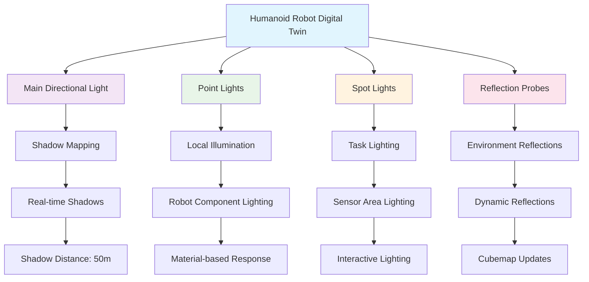

# Unity Rendering

## Visual Rendering in Digital Twins

This chapter covers rendering techniques in Unity for creating realistic digital twins of humanoid robots. Unity's rendering pipeline provides advanced capabilities for simulating real-world lighting, materials, and visual effects that are crucial for accurate digital twin representation. In humanoid robotics applications, realistic rendering enables better simulation-to-reality transfer, allowing developers to visualize robot behavior, sensor data, and environmental interactions with high fidelity.

Digital twins require precise visual representation to serve as effective tools for robot development, testing, and validation. Unity's flexible rendering system supports Physically-Based Rendering (PBR), advanced lighting models, and real-time performance optimization techniques that are essential for creating believable digital environments. This chapter explores Unity's rendering capabilities with a focus on humanoid robot digital twins, covering graphics pipeline optimization, material systems, lighting techniques, and performance considerations.

## Unity Graphics Pipeline

Unity's Scriptable Render Pipeline (SRP) provides developers with extensive control over the rendering process, allowing customization of how objects are drawn, lit, and processed. For humanoid robot digital twins, understanding the graphics pipeline is crucial for achieving both visual quality and performance.

The rendering pipeline consists of several key stages:

1. **Culling**: Determines which objects are visible to the camera and should be rendered
2. **Setup**: Configures rendering states and shader properties
3. **Geometry Processing**: Transforms vertices and applies vertex shaders
4. **Rasterization**: Converts geometry into fragments/pixels
5. **Fragment Processing**: Applies pixel shaders and calculates final colors
6. **Output Merging**: Combines results with depth, stencil, and color buffers

For humanoid robots, the pipeline must handle complex articulated models with multiple materials, realistic skin and metal surfaces, and dynamic lighting conditions. Unity's SRP allows developers to customize these stages for specific use cases.

Here's an example of a custom render pass in Unity's Universal Render Pipeline (URP):

```csharp
using UnityEngine;
using UnityEngine.Rendering;
using UnityEngine.Rendering.Universal;

public class HumanoidRobotRenderPass : ScriptableRenderPass
{
    private static readonly string k_RenderTag = "Humanoid Robot Render Pass";
    private static readonly int k_SourceId = Shader.PropertyToID("_SourceTexture");
    private static readonly int k_DestinationId = Shader.PropertyToID("_DestinationTexture");

    private Material m_Material;
    private RenderTargetIdentifier m_Source;
    private RenderTargetIdentifier m_Destination;
    private RenderTextureDescriptor m_Descriptor;

    public HumanoidRobotRenderPass(RenderTextureDescriptor descriptor)
    {
        m_Descriptor = descriptor;
        renderPassEvent = RenderPassEvent.AfterRenderingOpaques;
    }

    public void Setup(RenderTargetIdentifier source, RenderTargetIdentifier destination, Material material)
    {
        m_Source = source;
        m_Destination = destination;
        m_Material = material;
    }

    public override void Execute(ScriptableRenderContext context, ref RenderingData renderingData)
    {
        if (m_Material == null) return;

        CommandBuffer cmd = CommandBufferPool.Get(k_RenderTag);

        RenderTextureDescriptor opaqueDesc = m_Descriptor;
        opaqueDesc.depthBufferBits = 0;

        // Blit source texture to destination texture with custom material
        cmd.SetGlobalTexture(k_SourceId, m_Source);
        cmd.Blit(m_Source, m_Destination, m_Material, 0);

        context.ExecuteCommandBuffer(cmd);
        CommandBufferPool.Release(cmd);
    }
}

public class HumanoidRobotRendererFeature : ScriptableRendererFeature
{
    public Material material;
    private HumanoidRobotRenderPass m_RenderPass;

    public override void Create()
    {
        m_RenderPass = new HumanoidRobotRenderPass(base.renderTextureDescriptor);
        m_RenderPass.renderPassEvent = RenderPassEvent.AfterRenderingOpaques;
    }

    public override void AddRenderPasses(ScriptableRenderer renderer, ref RenderingData renderingData)
    {
        if (material == null) return;
        m_RenderPass.Setup(renderer.cameraColorTarget, RenderTargetHandle.CameraTarget.Identifier(), material);
        renderer.EnqueuePass(m_RenderPass);
    }
}
```

The graphics pipeline optimization for humanoid robots involves several considerations:

- **LOD (Level of Detail) Systems**: Implementing multiple versions of robot models with varying polygon counts based on camera distance
- **Occlusion Culling**: Using Unity's occlusion culling to avoid rendering parts of the robot that are not visible
- **Dynamic Batching**: Combining multiple small robot components for efficient rendering
- **Shader Variants**: Managing shader permutations to minimize draw calls

## Materials and Shaders

Unity's material system is based on Physically-Based Rendering (PBR), which simulates real-world light interaction with surfaces. For humanoid robots, materials must accurately represent different surface types like metal, plastic, rubber, and composite materials.

### PBR Shader Implementation

Here's a comprehensive PBR shader implementation suitable for humanoid robot materials:

```csharp
Shader "Custom/HumanoidRobotPBR"
{
    Properties
    {
        _Color ("Color", Color) = (1,1,1,1)
        _MainTex ("Albedo (RGB)", 2D) = "white" {}
        _Metallic ("Metallic", Range(0,1)) = 0.0
        _Smoothness ("Smoothness", Range(0,1)) = 0.5
        _BumpMap ("Normal Map", 2D) = "bump" {}
        _BumpScale ("Normal Scale", Float) = 1.0
        _OcclusionMap ("Occlusion", 2D) = "white" {}
        _OcclusionStrength ("Occlusion Strength", Range(0,1)) = 1.0
        _EmissionMap ("Emission", 2D) = "black" {}
        _EmissionColor ("Emission Color", Color) = (0,0,0,1)
        _DetailMask ("Detail Mask", 2D) = "white" {}
        _DetailAlbedoMap ("Detail Albedo", 2D) = "grey" {}
        _DetailNormalMap ("Detail Normal", 2D) = "bump" {}
        _DetailNormalScale ("Detail Normal Scale", Float) = 1.0
        _DetailAlbedoScale ("Detail Albedo Scale", Range(0,1)) = 1.0
        _RoughnessMap ("Roughness Map", 2D) = "white" {}
        _MetallicMap ("Metallic Map", 2D) = "black" {}
    }
    SubShader
    {
        Tags { "RenderType"="Opaque" "RenderPipeline" = "UniversalPipeline"}
        LOD 300

        Pass
        {
            Name "PBR Forward Pass"
            Tags { "LightMode" = "UniversalForward" }

            HLSLPROGRAM
            #pragma vertex vert
            #pragma fragment frag

            #pragma multi_compile _ _MAIN_LIGHT_SHADOWS
            #pragma multi_compile _ _MAIN_LIGHT_SHADOWS_CASCADE
            #pragma multi_compile _ _SHADOWS_SOFT
            #pragma multi_compile_fog

            #include "Packages/com.unity.render-pipelines.universal/ShaderLibrary/Core.hlsl"
            #include "Packages/com.unity.render-pipelines.universal/ShaderLibrary/Lighting.hlsl"
            #include "Packages/com.unity.render-pipelines.core/ShaderLibrary/Color.hlsl"
            #include "Packages/com.unity.render-pipelines.core/ShaderLibrary/UnityInstancing.hlsl"

            struct Attributes
            {
                float4 positionOS : POSITION;
                float3 normalOS : NORMAL;
                float4 tangentOS : TANGENT;
                float2 uv : TEXCOORD0;
                float2 uv2 : TEXCOORD1;
                float2 lightmapUV : TEXCOORD2;
                UNITY_VERTEX_INPUT_INSTANCE_ID
            };

            struct Varyings
            {
                float4 positionCS : SV_POSITION;
                float3 positionWS : TEXCOORD0;
                float3 normalWS : TEXCOORD1;
                float4 tangentWS : TEXCOORD2;
                float3 bitangentWS : TEXCOORD3;
                float2 uv : TEXCOORD4;
                float2 lightmapUV : TEXCOORD5;
                float4 shadowCoord : TEXCOORD6;
                float4 fogFactorAndVertexLight : TEXCOORD7;
                UNITY_VERTEX_INPUT_INSTANCE_ID
                UNITY_VERTEX_OUTPUT_STEREO
            };

            TEXTURE2D(_MainTex);           SAMPLER(sampler_MainTex);
            TEXTURE2D(_BumpMap);          SAMPLER(sampler_BumpMap);
            TEXTURE2D(_OcclusionMap);     SAMPLER(sampler_OcclusionMap);
            TEXTURE2D(_EmissionMap);      SAMPLER(sampler_EmissionMap);
            TEXTURE2D(_DetailAlbedoMap);  SAMPLER(sampler_DetailAlbedoMap);
            TEXTURE2D(_DetailNormalMap);  SAMPLER(sampler_DetailNormalMap);
            TEXTURE2D(_RoughnessMap);     SAMPLER(sampler_RoughnessMap);
            TEXTURE2D(_MetallicMap);      SAMPLER(sampler_MetallicMap);

            CBUFFER_START(UnityPerMaterial)
                float4 _MainTex_ST;
                float4 _Color;
                float _Metallic;
                float _Smoothness;
                float _BumpScale;
                float _OcclusionStrength;
                float _EmissionColor;
                float _DetailNormalScale;
                float _DetailAlbedoScale;
            CBUFFER_END

            Varyings vert(Attributes input)
            {
                Varyings output = (Varyings)0;
                UNITY_SETUP_INSTANCE_ID(input);
                UNITY_TRANSFER_INSTANCE_ID(input, output);
                UNITY_INITIALIZE_VERTEX_OUTPUT_STEREO(output);

                VertexPositionInputs vertexInput = GetVertexPositionInputs(input.positionOS.xyz);
                VertexNormalInputs normalInput = GetVertexNormalInputs(input.normalOS, input.tangentOS);

                output.positionCS = vertexInput.positionCS;
                output.positionWS = vertexInput.positionWS;
                output.normalWS = normalInput.normalWS;
                output.tangentWS = float4(normalInput.tangentWS, input.tangentOS.w);
                output.bitangentWS = normalInput.bitangentWS;

                output.uv = TRANSFORM_TEX(input.uv, _MainTex);
                output.lightmapUV = input.lightmapUV;

                output.shadowCoord = TransformWorldToShadowCoord(output.positionWS);

                output.fogFactorAndVertexLight = 0;
                output.fogFactorAndVertexLight.x = ComputeFogFactor(output.positionCS.z);

                return output;
            }

            half4 frag(Varyings input) : SV_Target
            {
                UNITY_SETUP_INSTANCE_ID(input);
                UNITY_SETUP_STEREO_EYE_INDEX_POST_VERTEX(input);

                float3 positionWS = input.positionWS;
                half3 normalWS = NormalizeNormalPerPixel(input.normalWS);
                float2 uv = input.uv;

                // Sample textures
                half4 albedoAlpha = SAMPLE_TEXTURE2D(_MainTex, sampler_MainTex, uv) * _Color;
                half3 albedo = albedoAlpha.rgb;
                half alpha = albedoAlpha.a;

                // Sample and unpack normal map
                half4 normalMapSample = SAMPLE_TEXTURE2D(_BumpMap, sampler_BumpMap, uv);
                half3 normalTS = UnpackNormal(normalMapSample);
                normalTS.xy *= _BumpScale;
                normalTS.z = sqrt(1.0 - saturate(dot(normalTS.xy, normalTS.xy)));
                half3 worldNormal = TransformTangentToWorld(normalTS, half3x3(input.tangentWS.xyz, input.bitangentWS.xyz, input.normalWS));

                // Sample material maps
                half metallic = _Metallic;
                half smoothness = _Smoothness;

                if (_MetallicMap)
                    metallic *= SAMPLE_TEXTURE2D(_MetallicMap, sampler_MetallicMap, uv).r;

                if (_RoughnessMap)
                    smoothness *= 1.0 - SAMPLE_TEXTURE2D(_RoughnessMap, sampler_RoughnessMap, uv).r;

                // Occlusion
                half occlusion = SAMPLE_TEXTURE2D(_OcclusionMap, sampler_OcclusionMap, uv).r;
                occlusion = lerp(1.0, occlusion, _OcclusionStrength);

                // Emission
                half3 emission = SAMPLE_TEXTURE2D(_EmissionMap, sampler_EmissionMap, uv).rgb * _EmissionColor.rgb;

                // Detail maps
                float2 detailUV = uv * 4.0; // Scale for detail tiling
                half3 detailAlbedo = SAMPLE_TEXTURE2D(_DetailAlbedoMap, sampler_DetailAlbedoMap, detailUV).rgb;
                detailAlbedo = lerp(half3(1.0, 1.0, 1.0), detailAlbedo, _DetailAlbedoScale);
                albedo *= detailAlbedo;

                half4 detailNormalSample = SAMPLE_TEXTURE2D(_DetailNormalMap, sampler_DetailNormalMap, detailUV);
                half3 detailNormalTS = UnpackNormal(detailNormalSample);
                detailNormalTS.xy *= _DetailNormalScale;
                detailNormalTS.z = sqrt(1.0 - saturate(dot(detailNormalTS.xy, detailNormalTS.xy)));

                // Blend normals
                worldNormal = BlendNormal(worldNormal, TransformTangentToWorld(detailNormalTS, half3x3(input.tangentWS.xyz, input.bitangentWS.xyz, input.normalWS)));

                // Lighting calculations
                Light mainLight = GetMainLight(input.shadowCoord);
                half3 viewDir = GetWorldSpaceNormalizeViewDir(positionWS);

                BRDFData brdfData;
                InitializeBRDFData(albedo, metallic, smoothness, alpha, brdfData);

                half3 diffuse = LightingLambert(mainLight.color, mainLight.direction, worldNormal);
                half3 specular = LightingSpecular(mainLight.color, mainLight.direction, worldNormal, viewDir, brdfData.reflectivity, brdfData.perceptualRoughness);

                half3 color = brdfData.diffuse + brdfData.specular + emission;
                color *= occlusion;

                // Apply fog
                color = MixFog(color, input.fogFactorAndVertexLight.x);

                return half4(color, alpha);
            }
            ENDHLSL
        }

        Pass
        {
            Name "ShadowCaster"
            Tags { "LightMode" = "ShadowCaster" }

            ZWrite On
            ZTest LEqual
            ColorMask 0

            HLSLPROGRAM
            #pragma vertex ShadowPassVertex
            #pragma fragment ShadowPassFragment
            #include "Packages/com.unity.render-pipelines.universal/ShaderLibrary/Lighting.hlsl"

            float3 _LightDirection;

            struct Attributes
            {
                float4 positionOS : POSITION;
                float3 normalOS : NORMAL;
                float2 uv : TEXCOORD0;
                UNITY_VERTEX_INPUT_INSTANCE_ID
            };

            struct Varyings
            {
                float2 uv : TEXCOORD0;
                float4 positionCS : SV_POSITION;
                UNITY_VERTEX_INPUT_INSTANCE_ID
                UNITY_VERTEX_OUTPUT_STEREO
            };

            Varyings ShadowPassVertex(Attributes input)
            {
                Varyings output;
                UNITY_SETUP_INSTANCE_ID(input);
                UNITY_TRANSFER_INSTANCE_ID(input, output);
                UNITY_INITIALIZE_VERTEX_OUTPUT_STEREO(output);

                float3 positionWS = TransformObjectToWorld(input.positionOS.xyz);
                float3 normalWS = TransformObjectToWorldNormal(input.normalOS);

                float4 positionCS = TransformWorldToHClip(ApplyShadowBias(positionWS, normalWS, _LightDirection));

                output.positionCS = positionCS;
                output.uv = TRANSFORM_TEX(input.uv, _MainTex);
                return output;
            }

            half4 ShadowPassFragment(Varyings input) : SV_TARGET
            {
                UNITY_SETUP_INSTANCE_ID(input);
                float4 albedoAlpha = SAMPLE_TEXTURE2D(_MainTex, sampler_MainTex, input.uv) * _Color;
                clip(albedoAlpha.a - 0.001);
                return 0;
            }
            ENDHLSL
        }
    }
    Fallback "Universal Render Pipeline/Lit"
    CustomEditor "HumanoidRobotPBRGUI"
}
```

### Material System for Robot Components

For humanoid robots, different components require specialized materials:

- **Metallic Surfaces**: High metallic values with low roughness for realistic metal reflections
- **Plastic Components**: Low metallic values with variable roughness for different plastic types
- **LED Indicators**: Emissive materials for status lights and indicators
- **Sensor Covers**: Transparent materials with specific transmission properties
- **Joint Mechanisms**: Materials that show mechanical details and wear patterns

### Shader Graph Implementation

Unity's Shader Graph provides a visual approach to creating custom shaders for humanoid robot materials. Here's an example implementation for creating a robot-specific material:

```csharp
using UnityEngine;
using UnityEngine.Rendering;
using UnityEngine.Rendering.Universal;

[CreateAssetMenu(fileName = "RobotMaterialData", menuName = "Robot Rendering/Material Data")]
public class RobotMaterialData : ScriptableObject
{
    [Header("Surface Properties")]
    public Color baseColor = Color.gray;
    public float metallic = 0.8f;
    public float smoothness = 0.4f;
    public Texture2D albedoMap;
    public Texture2D normalMap;
    public Texture2D metallicMap;
    public Texture2D roughnessMap;

    [Header("Detail Properties")]
    public Texture2D detailAlbedo;
    public Texture2D detailNormal;
    public float detailAlbedoScale = 1.0f;
    public float detailNormalScale = 1.0f;

    [Header("Emission Properties")]
    public bool hasEmission = false;
    public Color emissionColor = Color.black;
    public Texture2D emissionMap;

    [Header("Robot-Specific Properties")]
    public bool isWornSurface = false;
    public float wearIntensity = 0.0f;
    public Color wearColor = Color.red;
    public Texture2D wearMask;

    public Material CreateRobotMaterial()
    {
        Material material = new Material(Shader.Find("Custom/HumanoidRobotPBR"));

        material.SetColor("_Color", baseColor);
        material.SetFloat("_Metallic", metallic);
        material.SetFloat("_Smoothness", smoothness);

        if (albedoMap != null) material.SetTexture("_MainTex", albedoMap);
        if (normalMap != null) material.SetTexture("_BumpMap", normalMap);
        if (metallicMap != null) material.SetTexture("_MetallicMap", metallicMap);
        if (roughnessMap != null) material.SetTexture("_RoughnessMap", roughnessMap);
        if (detailAlbedo != null) material.SetTexture("_DetailAlbedoMap", detailAlbedo);
        if (detailNormal != null) material.SetTexture("_DetailNormalMap", detailNormal);

        material.SetFloat("_DetailAlbedoScale", detailAlbedoScale);
        material.SetFloat("_DetailNormalScale", detailNormalScale);

        if (hasEmission)
        {
            material.EnableKeyword("_EMISSION");
            material.SetColor("_EmissionColor", emissionColor);
            if (emissionMap != null) material.SetTexture("_EmissionMap", emissionMap);
        }
        else
        {
            material.DisableKeyword("_EMISSION");
        }

        return material;
    }
}
```

## Lighting Systems

Lighting is crucial for creating realistic digital twins that accurately represent real-world conditions. Unity supports multiple lighting systems that can be configured for humanoid robot environments.

### Realistic Lighting Setup

For humanoid robot digital twins, lighting must simulate various real-world conditions:

```csharp
using UnityEngine;
using UnityEngine.Rendering;
using UnityEngine.Rendering.Universal;

public class HumanoidRobotLightingSystem : MonoBehaviour
{
    [Header("Lighting Configuration")]
    public Light mainDirectionalLight;
    public Light[] additionalLights;
    public bool useRealisticShadows = true;
    public float shadowDistance = 50.0f;
    public float shadowResolution = 2048.0f;

    [Header("Environment Lighting")]
    public Cubemap reflectionCubemap;
    public float reflectionIntensity = 1.0f;
    public Color ambientColor = Color.gray;

    [Header("Dynamic Lighting")]
    public bool enableDynamicLighting = true;
    public float lightingUpdateRate = 0.1f;

    private float m_LastUpdate;

    void Start()
    {
        SetupLighting();
        m_LastUpdate = Time.time;
    }

    void Update()
    {
        if (enableDynamicLighting && Time.time - m_LastUpdate > lightingUpdateRate)
        {
            UpdateDynamicLighting();
            m_LastUpdate = Time.time;
        }
    }

    private void SetupLighting()
    {
        // Configure main directional light
        if (mainDirectionalLight != null)
        {
            mainDirectionalLight.type = LightType.Directional;
            mainDirectionalLight.shadows = LightShadows.Soft;
            mainDirectionalLight.shadowStrength = 0.8f;
            mainDirectionalLight.shadowBias = 0.05f;
            mainDirectionalLight.shadowNormalBias = 0.4f;
            mainDirectionalLight.shadowNearPlane = 0.2f;
        }

        // Configure additional lights
        if (additionalLights != null)
        {
            foreach (Light light in additionalLights)
            {
                ConfigureAdditionalLight(light);
            }
        }

        // Set up environment lighting
        RenderSettings.ambientMode = UnityEngine.Rendering.AmbientMode.Trilight;
        RenderSettings.ambientSkyColor = ambientColor * 0.7f;
        RenderSettings.ambientEquatorColor = ambientColor * 0.5f;
        RenderSettings.ambientGroundColor = ambientColor * 0.3f;

        // Configure reflection probes
        SetupReflectionProbes();
    }

    private void ConfigureAdditionalLight(Light light)
    {
        // Configure based on light type
        switch (light.type)
        {
            case LightType.Point:
                light.shadows = LightShadows.Soft;
                light.range = Mathf.Max(light.range, 10.0f);
                break;
            case LightType.Spot:
                light.shadows = LightShadows.Soft;
                light.spotAngle = Mathf.Clamp(light.spotAngle, 30.0f, 120.0f);
                break;
            case LightType.Directional:
                light.shadows = LightShadows.Soft;
                break;
        }

        // Set realistic intensity based on light type
        if (light.type == LightType.Point || light.type == LightType.Spot)
        {
            light.intensity = Mathf.Clamp(light.intensity, 0.5f, 3.0f);
        }
        else if (light.type == LightType.Directional)
        {
            light.intensity = Mathf.Clamp(light.intensity, 0.5f, 2.0f);
        }
    }

    private void SetupReflectionProbes()
    {
        // Create and configure reflection probes for the humanoid robot
        GameObject[] robotParts = GameObject.FindGameObjectsWithTag("RobotPart");

        foreach (GameObject part in robotParts)
        {
            // Add reflection probe to important robot parts
            if (part.GetComponent<Renderer>() != null)
            {
                ReflectionProbe probe = part.AddComponent<ReflectionProbe>();
                probe.mode = ReflectionProbeMode.Realtime;
                probe.size = new Vector3(5.0f, 5.0f, 5.0f);
                probe.center = Vector3.zero;
                probe.resolution = 512;
                probe.refreshMode = ReflectionProbeRefreshMode.EveryFrame;
                probe.timeSlicingMode = ReflectionProbeTimeSlicingMode.IndividualFaces;
            }
        }
    }

    private void UpdateDynamicLighting()
    {
        // Update lighting based on time of day or other dynamic factors
        float timeOfDay = (Mathf.Sin(Time.time * 0.1f) + 1.0f) * 0.5f; // 0-1 cycle

        // Adjust main light direction and intensity based on time
        if (mainDirectionalLight != null)
        {
            Vector3 lightDirection = new Vector3(
                Mathf.Sin(timeOfDay * Mathf.PI * 2) * 0.7f,
                -Mathf.Cos(timeOfDay * Mathf.PI * 2) * 0.8f - 0.2f,
                Mathf.Cos(timeOfDay * Mathf.PI * 2) * 0.5f
            );

            mainDirectionalLight.transform.rotation = Quaternion.LookRotation(lightDirection);
            mainDirectionalLight.intensity = Mathf.Lerp(0.8f, 1.2f, timeOfDay);
        }

        // Update ambient lighting
        Color ambient = Color.Lerp(
            new Color(0.2f, 0.2f, 0.3f),  // Cool ambient
            new Color(0.3f, 0.25f, 0.2f), // Warm ambient
            timeOfDay
        );

        RenderSettings.ambientSkyColor = ambient * 0.7f;
        RenderSettings.ambientEquatorColor = ambient * 0.5f;
        RenderSettings.ambientGroundColor = ambient * 0.3f;
    }

    // Method to set up lighting for specific scenarios
    public void SetupScenarioLighting(string scenario)
    {
        switch (scenario)
        {
            case "indoor_daylight":
                SetupIndoorDaylight();
                break;
            case "indoor_night":
                SetupIndoorNight();
                break;
            case "outdoor_day":
                SetupOutdoorDay();
                break;
            case "outdoor_night":
                SetupOutdoorNight();
                break;
            case "factory_floor":
                SetupFactoryFloor();
                break;
            default:
                SetupDefaultLighting();
                break;
        }
    }

    private void SetupIndoorDaylight()
    {
        if (mainDirectionalLight != null)
        {
            mainDirectionalLight.color = Color.white;
            mainDirectionalLight.intensity = 1.0f;
            mainDirectionalLight.transform.rotation = Quaternion.Euler(50, -30, 0);
        }

        RenderSettings.ambientMode = UnityEngine.Rendering.AmbientMode.Trilight;
        RenderSettings.ambientSkyColor = new Color(0.212f, 0.227f, 0.259f);
        RenderSettings.ambientEquatorColor = new Color(0.114f, 0.125f, 0.133f);
        RenderSettings.ambientGroundColor = new Color(0.047f, 0.043f, 0.035f);
    }

    private void SetupIndoorNight()
    {
        if (mainDirectionalLight != null)
        {
            mainDirectionalLight.color = new Color(0.8f, 0.9f, 1.0f);
            mainDirectionalLight.intensity = 0.5f;
            mainDirectionalLight.transform.rotation = Quaternion.Euler(45, -120, 0);
        }

        // Add artificial lights for indoor night scenario
        AddArtificialIndoorLights();
    }

    private void AddArtificialIndoorLights()
    {
        // Create artificial lights for indoor environment
        GameObject[] lightPositions = GameObject.FindGameObjectsWithTag("LightPosition");

        foreach (GameObject pos in lightPositions)
        {
            GameObject lightObj = new GameObject("Artificial Light");
            lightObj.transform.SetParent(pos.transform);
            lightObj.transform.localPosition = Vector3.zero;

            Light light = lightObj.AddComponent<Light>();
            light.type = LightType.Point;
            light.color = new Color(0.9f, 0.8f, 0.6f); // Warm white
            light.range = 15.0f;
            light.intensity = 1.5f;
            light.shadows = LightShadows.Soft;
        }
    }

    private void SetupOutdoorDay()
    {
        if (mainDirectionalLight != null)
        {
            mainDirectionalLight.color = Color.white;
            mainDirectionalLight.intensity = 1.5f;
            mainDirectionalLight.transform.rotation = Quaternion.Euler(50, 150, 0);
        }

        RenderSettings.ambientMode = UnityEngine.Rendering.AmbientMode.Trilight;
        RenderSettings.ambientSkyColor = new Color(0.5f, 0.55f, 0.8f);
        RenderSettings.ambientEquatorColor = new Color(0.7f, 0.6f, 0.5f);
        RenderSettings.ambientGroundColor = new Color(0.2f, 0.2f, 0.2f);
    }

    private void SetupOutdoorNight()
    {
        if (mainDirectionalLight != null)
        {
            mainDirectionalLight.color = new Color(0.2f, 0.2f, 0.4f); // Moonlight
            mainDirectionalLight.intensity = 0.2f;
            mainDirectionalLight.transform.rotation = Quaternion.Euler(130, 45, 0);
        }

        RenderSettings.ambientMode = UnityEngine.Rendering.AmbientMode.Trilight;
        RenderSettings.ambientSkyColor = new Color(0.05f, 0.05f, 0.1f);
        RenderSettings.ambientEquatorColor = new Color(0.02f, 0.02f, 0.05f);
        RenderSettings.ambientGroundColor = new Color(0.01f, 0.01f, 0.02f);
    }

    private void SetupFactoryFloor()
    {
        if (mainDirectionalLight != null)
        {
            mainDirectionalLight.color = new Color(0.9f, 0.9f, 0.95f); // Industrial lighting
            mainDirectionalLight.intensity = 1.2f;
            mainDirectionalLight.transform.rotation = Quaternion.Euler(60, -45, 0);
        }

        // Add industrial-style artificial lights
        AddIndustrialLights();
    }

    private void AddIndustrialLights()
    {
        // Create industrial lighting setup
        for (int i = 0; i < 8; i++)
        {
            GameObject lightObj = new GameObject($"Industrial Light {i}");
            lightObj.transform.position = new Vector3(i * 5.0f, 8.0f, 0);

            Light light = lightObj.AddComponent<Light>();
            light.type = LightType.Spot;
            light.color = new Color(0.95f, 0.95f, 0.9f);
            light.range = 20.0f;
            light.spotAngle = 60.0f;
            light.intensity = 2.0f;
            light.shadows = LightShadows.Soft;
        }
    }

    private void SetupDefaultLighting()
    {
        if (mainDirectionalLight != null)
        {
            mainDirectionalLight.color = Color.white;
            mainDirectionalLight.intensity = 1.0f;
            mainDirectionalLight.transform.rotation = Quaternion.Euler(50, -30, 0);
        }
    }
}
```

### Lighting Diagram

Here's a Mermaid.js diagram showing the lighting architecture for humanoid robot digital twins:



## Post-Processing Effects

Post-processing effects enhance the visual quality of humanoid robot digital twins by adding realistic camera effects, color grading, and atmospheric effects.

### Post-Processing Implementation

```csharp
using UnityEngine;
using UnityEngine.Rendering;
using UnityEngine.Rendering.Universal;

[RequireComponent(typeof(Volume))]
public class HumanoidRobotPostProcessing : MonoBehaviour
{
    [Header("Depth of Field")]
    public bool enableDepthOfField = true;
    public float dofFocusDistance = 10.0f;
    public float dofAperture = 5.6f;
    public float dofFocalLength = 50.0f;

    [Header("Color Grading")]
    public bool enableColorGrading = true;
    public Color temperatureShift = Color.white;
    public float saturation = 1.0f;
    public float contrast = 1.0f;

    [Header("Bloom")]
    public bool enableBloom = true;
    public float bloomIntensity = 0.5f;
    public float bloomThreshold = 1.0f;
    public float bloomScatter = 0.7f;

    [Header("Motion Blur")]
    public bool enableMotionBlur = true;
    public float motionBlurIntensity = 0.5f;

    [Header("Chromatic Aberration")]
    public bool enableChromaticAberration = true;
    public float chromaticAberrationIntensity = 0.1f;

    private Volume m_Volume;
    private DepthOfField m_DepthOfField;
    private ColorAdjustments m_ColorAdjustments;
    private Bloom m_Bloom;
    private MotionBlur m_MotionBlur;
    private ChromaticAberration m_ChromaticAberration;

    void Start()
    {
        SetupPostProcessing();
    }

    void Update()
    {
        UpdatePostProcessing();
    }

    private void SetupPostProcessing()
    {
        m_Volume = GetComponent<Volume>();

        // Get or create post-processing effects
        m_Volume.profile.TryGet(out m_DepthOfField);
        if (m_DepthOfField == null)
        {
            m_Volume.profile.Add<DepthOfField>(true);
            m_Volume.profile.TryGet(out m_DepthOfField);
        }

        m_Volume.profile.TryGet(out m_ColorAdjustments);
        if (m_ColorAdjustments == null)
        {
            m_Volume.profile.Add<ColorAdjustments>(true);
            m_Volume.profile.TryGet(out m_ColorAdjustments);
        }

        m_Volume.profile.TryGet(out m_Bloom);
        if (m_Bloom == null)
        {
            m_Volume.profile.Add<Bloom>(true);
            m_Volume.profile.TryGet(out m_Bloom);
        }

        m_Volume.profile.TryGet(out m_MotionBlur);
        if (m_MotionBlur == null)
        {
            m_Volume.profile.Add<MotionBlur>(true);
            m_Volume.profile.TryGet(out m_MotionBlur);
        }

        m_Volume.profile.TryGet(out m_ChromaticAberration);
        if (m_ChromaticAberration == null)
        {
            m_Volume.profile.Add<ChromaticAberration>(true);
            m_Volume.profile.TryGet(out m_ChromaticAberration);
        }

        UpdatePostProcessing();
    }

    private void UpdatePostProcessing()
    {
        if (m_DepthOfField != null)
        {
            m_DepthOfField.active = enableDepthOfField;
            if (enableDepthOfField)
            {
                m_DepthOfField.focusDistance.value = dofFocusDistance;
                m_DepthOfField.aperture.value = dofAperture;
                m_DepthOfField.focalLength.value = dofFocalLength;
            }
        }

        if (m_ColorAdjustments != null)
        {
            m_ColorAdjustments.active = enableColorGrading;
            if (enableColorGrading)
            {
                m_ColorAdjustments.temperature.value = GetTemperatureValue(temperatureShift);
                m_ColorAdjustments.saturation.value = (saturation - 1.0f) * 20.0f; // Convert to -20 to 20 range
                m_ColorAdjustments.contrast.value = (contrast - 1.0f) * 20.0f; // Convert to -20 to 20 range
            }
        }

        if (m_Bloom != null)
        {
            m_Bloom.active = enableBloom;
            if (enableBloom)
            {
                m_Bloom.intensity.value = bloomIntensity;
                m_Bloom.threshold.value = bloomThreshold;
                m_Bloom.scatter.value = bloomScatter;
            }
        }

        if (m_MotionBlur != null)
        {
            m_MotionBlur.active = enableMotionBlur;
            if (enableMotionBlur)
            {
                m_MotionBlur.intensity.value = motionBlurIntensity;
            }
        }

        if (m_ChromaticAberration != null)
        {
            m_ChromaticAberration.active = enableChromaticAberration;
            if (enableChromaticAberration)
            {
                m_ChromaticAberration.intensity.value = chromaticAberrationIntensity;
            }
        }
    }

    private float GetTemperatureValue(Color color)
    {
        // Convert color temperature to Unity's temperature adjustment value
        float avg = (color.r + color.g + color.b) / 3.0f;
        return (avg - 0.5f) * 100.0f; // Convert to -50 to 50 range
    }

    // Method to adjust post-processing for different viewing scenarios
    public void SetViewingScenario(string scenario)
    {
        switch (scenario)
        {
            case "close_up":
                SetCloseUpViewing();
                break;
            case "wide_shot":
                SetWideShotViewing();
                break;
            case "detailed_inspection":
                SetDetailedInspectionViewing();
                break;
            case "environment_overview":
                SetEnvironmentOverviewViewing();
                break;
            default:
                SetDefaultViewing();
                break;
        }
    }

    private void SetCloseUpViewing()
    {
        enableDepthOfField = true;
        dofFocusDistance = 2.0f; // Close focus
        dofAperture = 2.8f;      // Shallow depth of field
        dofFocalLength = 85.0f;  // Telephoto effect

        enableBloom = false;     // Reduce bloom for close inspection
        bloomIntensity = 0.1f;

        enableMotionBlur = false; // Disable motion blur for detailed view
        motionBlurIntensity = 0.0f;
    }

    private void SetWideShotViewing()
    {
        enableDepthOfField = true;
        dofFocusDistance = 15.0f; // Medium distance focus
        dofAperture = 8.0f;       // Deeper depth of field
        dofFocalLength = 35.0f;   // Wide angle effect

        enableBloom = true;       // Enhance overall scene
        bloomIntensity = 0.3f;

        enableMotionBlur = true;  // Add subtle motion blur
        motionBlurIntensity = 0.2f;
    }

    private void SetDetailedInspectionViewing()
    {
        enableDepthOfField = true;
        dofFocusDistance = 0.5f;  // Very close focus
        dofAperture = 1.4f;       // Very shallow depth of field
        dofFocalLength = 100.0f;  // Macro lens effect

        enableColorGrading = true;
        saturation = 1.2f;        // Enhance material details
        contrast = 1.1f;          // Increase contrast for details

        enableBloom = false;      // Reduce bloom for clarity
        enableMotionBlur = false; // Disable motion blur for clarity
    }

    private void SetEnvironmentOverviewViewing()
    {
        enableDepthOfField = false; // No depth of field for overview
        enableBloom = true;
        bloomIntensity = 0.4f;      // Enhance environment
        bloomThreshold = 0.8f;

        enableColorGrading = true;
        saturation = 0.9f;          // Slightly desaturated for overview
        contrast = 1.0f;

        enableMotionBlur = true;    // Add motion blur for dynamic scenes
        motionBlurIntensity = 0.3f;
    }

    private void SetDefaultViewing()
    {
        enableDepthOfField = true;
        dofFocusDistance = 10.0f;
        dofAperture = 5.6f;
        dofFocalLength = 50.0f;

        enableColorGrading = true;
        saturation = 1.0f;
        contrast = 1.0f;

        enableBloom = true;
        bloomIntensity = 0.5f;
        bloomThreshold = 1.0f;

        enableMotionBlur = true;
        motionBlurIntensity = 0.5f;

        enableChromaticAberration = true;
        chromaticAberrationIntensity = 0.1f;
    }
}
```

### Custom Post-Processing Effect for Robot Vision

```hlsl
// Robot Vision Post-Processing Shader
Shader "Custom/RobotVisionEffect"
{
    Properties
    {
        _MainTex ("Texture", 2D) = "white" {}
        _EdgeColor ("Edge Color", Color) = (1, 1, 1, 1)
        _EdgeThreshold ("Edge Threshold", Range(0.0, 1.0)) = 0.1
        _RobotVisionIntensity ("Robot Vision Intensity", Range(0.0, 1.0)) = 0.5
        _GridSize ("Grid Size", Float) = 64
        _GridColor ("Grid Color", Color) = (0, 1, 0, 0.2)
    }
    SubShader
    {
        Cull Off ZWrite Off ZTest Always

        Pass
        {
            HLSLPROGRAM
            #pragma vertex vert
            #pragma fragment frag

            #include "UnityCG.cginc"

            struct appdata
            {
                float4 vertex : POSITION;
                float2 uv : TEXCOORD0;
            };

            struct v2f
            {
                float2 uv : TEXCOORD0;
                float4 vertex : SV_POSITION;
            };

            v2f vert (appdata v)
            {
                v2f o;
                o.vertex = UnityObjectToClipPos(v.vertex);
                o.uv = v.uv;
                return o;
            }

            sampler2D _MainTex;
            float4 _MainTex_TexelSize;
            float4 _EdgeColor;
            float _EdgeThreshold;
            float _RobotVisionIntensity;
            float _GridSize;
            float4 _GridColor;

            fixed4 frag (v2f i) : SV_Target
            {
                // Sample the main texture
                fixed4 col = tex2D(_MainTex, i.uv);

                // Edge detection
                float2 dx = float2(_MainTex_TexelSize.x, 0.0);
                float2 dy = float2(0.0, _MainTex_TexelSize.y);

                float3 center = tex2D(_MainTex, i.uv).rgb;
                float3 left = tex2D(_MainTex, i.uv - dx).rgb;
                float3 right = tex2D(_MainTex, i.uv + dx).rgb;
                float3 up = tex2D(_MainTex, i.uv - dy).rgb;
                float3 down = tex2D(_MainTex, i.uv + dy).rgb;

                float3 gradientX = (right - left);
                float3 gradientY = (up - down);
                float gradientMagnitude = length(gradientX) + length(gradientY);

                // Create edge effect
                float edge = step(_EdgeThreshold, gradientMagnitude);
                fixed3 edgeEffect = lerp(col.rgb, _EdgeColor.rgb, edge * _RobotVisionIntensity);

                // Add grid overlay
                float2 gridUV = i.uv * _GridSize;
                float2 grid = abs(frac(gridUV) - 0.5);
                float gridLine = min(grid.x, grid.y);
                gridLine = step(0.45, gridLine);

                // Combine effects
                fixed3 finalColor = lerp(edgeEffect, _GridColor.rgb, gridLine * _GridColor.a * _RobotVisionIntensity);

                return fixed4(finalColor, col.a);
            }
            ENDHLSL
        }
    }
}
```

## Performance Optimization

Performance optimization is critical for real-time humanoid robot digital twins, especially when running complex simulations with multiple robots and detailed environments.

### Rendering Optimization Techniques

```csharp
using UnityEngine;
using System.Collections.Generic;

public class HumanoidRobotRenderingOptimizer : MonoBehaviour
{
    [Header("LOD Configuration")]
    public int lodCount = 4;
    public float[] lodDistances = { 10.0f, 25.0f, 50.0f, 100.0f };
    public bool enableLOD = true;

    [Header("Occlusion Culling")]
    public bool enableOcclusionCulling = true;
    public float occlusionCheckInterval = 0.5f;

    [Header("Dynamic Batching")]
    public bool enableDynamicBatching = true;
    public int maxBatchSize = 300;

    [Header("Texture Streaming")]
    public bool enableTextureStreaming = true;
    public float textureQuality = 1.0f;

    [Header("Shader Optimization")]
    public bool enableShaderLOD = true;
    public int shaderLODLevel = 300;

    private Dictionary<Renderer, LODGroup> m_LODGroups = new Dictionary<Renderer, LODGroup>();
    private Dictionary<Renderer, Material[]> m_OriginalMaterials = new Dictionary<Renderer, Material[]>();
    private float m_LastOcclusionCheck = 0.0f;

    void Start()
    {
        SetupOptimization();
    }

    void Update()
    {
        if (enableOcclusionCulling && Time.time - m_LastOcclusionCheck > occlusionCheckInterval)
        {
            CheckOcclusion();
            m_LastOcclusionCheck = Time.time;
        }

        OptimizeRendering();
    }

    private void SetupOptimization()
    {
        // Set up global rendering settings
        QualitySettings.anisotropicFiltering = AnisotropicFiltering.Enable;
        QualitySettings.vSyncCount = 0; // Disable VSync for better performance
        QualitySettings.maxQueuedFrames = 2;

        if (enableTextureStreaming)
        {
            QualitySettings.streamingMipmapsActive = true;
            QualitySettings.streamingMipmapsMemoryBudget = 512.0f; // 512 MB budget
            QualitySettings.streamingMipmapsRenderersPerFrame = 512;
            QualitySettings.streamingMipmapsMaxLevelReduction = 2;
        }

        // Create LOD groups for robot parts
        if (enableLOD)
        {
            SetupLODGroups();
        }

        // Configure shader LOD
        if (enableShaderLOD)
        {
            Shader.globalMaximumLOD = shaderLODLevel;
        }
    }

    private void SetupLODGroups()
    {
        // Find all robot parts and set up LOD
        GameObject[] robotParts = GameObject.FindGameObjectsWithTag("RobotPart");

        foreach (GameObject part in robotParts)
        {
            Renderer renderer = part.GetComponent<Renderer>();
            if (renderer != null)
            {
                // Store original materials for LOD switching
                m_OriginalMaterials[renderer] = renderer.sharedMaterials;

                // Create LOD group if needed
                LODGroup lodGroup = part.GetComponent<LODGroup>();
                if (lodGroup == null)
                {
                    lodGroup = part.AddComponent<LODGroup>();
                    m_LODGroups[renderer] = lodGroup;

                    // Create LOD levels
                    LOD[] lods = new LOD[lodCount];
                    for (int i = 0; i < lodCount; i++)
                    {
                        // Calculate screen relative transition height
                        float screenRelativeTransitionHeight = (lodDistances[i] / 100.0f) * 0.5f;

                        // Create renderer array for this LOD
                        Renderer[] renderers = { renderer };

                        lods[i] = new LOD(screenRelativeTransitionHeight, renderers);

                        // Create simplified materials for lower LODs
                        if (i > 0)
                        {
                            Material[] simplifiedMaterials = new Material[renderer.sharedMaterials.Length];
                            for (int j = 0; j < renderer.sharedMaterials.Length; j++)
                            {
                                simplifiedMaterials[j] = CreateSimplifiedMaterial(renderer.sharedMaterials[j], i);
                            }
                            lods[i].renderers[0].sharedMaterials = simplifiedMaterials;
                        }
                    }

                    lodGroup.SetLODs(lods);
                    lodGroup.RecalculateBounds();
                }
            }
        }
    }

    private Material CreateSimplifiedMaterial(Material original, int lodLevel)
    {
        // Create a simplified version of the material based on LOD level
        Material simplified = new Material(original.shader);

        // Copy essential properties
        simplified.color = original.color;
        simplified.mainTexture = original.mainTexture;

        // Reduce complexity for lower LODs
        if (lodLevel >= 2)
        {
            // Remove expensive properties for very low LOD
            simplified.EnableKeyword("_NORMALMAP_OFF");
            simplified.EnableKeyword("_EMISSION_OFF");
            simplified.EnableKeyword("_DETAIL_OFF");
        }

        if (lodLevel >= 3)
        {
            // Further simplify for lowest LOD
            simplified.SetFloat("_Metallic", 0.0f); // Remove metallic effect
            simplified.SetFloat("_Smoothness", 0.5f); // Use default smoothness
        }

        return simplified;
    }

    private void CheckOcclusion()
    {
        // Perform occlusion queries for robot parts
        foreach (Renderer renderer in m_OriginalMaterials.Keys)
        {
            if (renderer != null)
            {
                // Check if renderer is visible
                bool isVisible = IsRendererVisible(renderer);

                // Adjust rendering based on visibility
                renderer.enabled = isVisible;
            }
        }
    }

    private bool IsRendererVisible(Renderer renderer)
    {
        // Check if renderer is in camera frustum
        Plane[] planes = GeometryUtility.CalculateFrustumPlanes(Camera.main);
        return GeometryUtility.TestPlanesAABB(planes, renderer.bounds);
    }

    private void OptimizeRendering()
    {
        // Update LOD groups based on camera distance
        if (enableLOD)
        {
            UpdateLODGroups();
        }

        // Optimize shader properties based on distance
        OptimizeShaderProperties();

        // Manage texture streaming
        if (enableTextureStreaming)
        {
            OptimizeTextureStreaming();
        }
    }

    private void UpdateLODGroups()
    {
        Camera mainCamera = Camera.main;
        if (mainCamera == null) return;

        foreach (var kvp in m_LODGroups)
        {
            Renderer renderer = kvp.Key;
            LODGroup lodGroup = kvp.Value;

            if (renderer != null && lodGroup != null)
            {
                // Calculate distance from camera
                float distance = Vector3.Distance(mainCamera.transform.position, renderer.bounds.center);

                // Update LOD based on distance
                int lodLevel = 0;
                for (int i = 0; i < lodDistances.Length; i++)
                {
                    if (distance > lodDistances[i])
                    {
                        lodLevel = i + 1;
                    }
                    else
                    {
                        break;
                    }
                }

                // Clamp to valid range
                lodLevel = Mathf.Min(lodLevel, lodCount - 1);

                // Set the current LOD
                lodGroup.ForceLOD(lodLevel);
            }
        }
    }

    private void OptimizeShaderProperties()
    {
        // Optimize shader properties based on current quality settings
        Shader.SetGlobalFloat("_OptimizationLevel", textureQuality);

        // Adjust various shader parameters based on performance needs
        if (QualitySettings.GetQualityLevel() <= 1) // Low quality
        {
            Shader.SetGlobalFloat("_ShadowQuality", 0.5f);
            Shader.SetGlobalFloat("_ReflectionQuality", 0.3f);
            Shader.SetGlobalFloat("_PostProcessingQuality", 0.5f);
        }
        else if (QualitySettings.GetQualityLevel() >= 4) // High quality
        {
            Shader.SetGlobalFloat("_ShadowQuality", 1.0f);
            Shader.SetGlobalFloat("_ReflectionQuality", 1.0f);
            Shader.SetGlobalFloat("_PostProcessingQuality", 1.0f);
        }
        else // Medium quality
        {
            Shader.SetGlobalFloat("_ShadowQuality", 0.7f);
            Shader.SetGlobalFloat("_ReflectionQuality", 0.7f);
            Shader.SetGlobalFloat("_PostProcessingQuality", 0.7f);
        }
    }

    private void OptimizeTextureStreaming()
    {
        // Adjust texture streaming based on available memory
        float availableMemory = SystemInfo.graphicsMemorySize / 1024.0f; // MB

        if (availableMemory < 2048.0f) // Less than 2GB
        {
            QualitySettings.streamingMipmapsMemoryBudget = 256.0f; // Reduce budget
            textureQuality = 0.7f;
        }
        else if (availableMemory > 8192.0f) // More than 8GB
        {
            QualitySettings.streamingMipmapsMemoryBudget = 1024.0f; // Increase budget
            textureQuality = 1.0f;
        }
        else
        {
            QualitySettings.streamingMipmapsMemoryBudget = 512.0f;
            textureQuality = 0.8f;
        }
    }

    // Method to get rendering performance metrics
    public RenderingPerformanceMetrics GetPerformanceMetrics()
    {
        RenderingPerformanceMetrics metrics = new RenderingPerformanceMetrics();

        metrics.triangleCount = 0;
        metrics.drawCallCount = UnityEngine.Rendering.UnityStats.drawCalls;
        metrics.renderingTime = UnityEngine.Rendering.UnityStats.renderTime;
        metrics.shadowCasters = UnityEngine.Rendering.UnityStats.shadowCasters;

        // Calculate triangle count for robot parts
        GameObject[] robotParts = GameObject.FindGameObjectsWithTag("RobotPart");
        foreach (GameObject part in robotParts)
        {
            MeshFilter meshFilter = part.GetComponent<MeshFilter>();
            if (meshFilter != null && meshFilter.sharedMesh != null)
            {
                metrics.triangleCount += meshFilter.sharedMesh.triangles.Length / 3;
            }
        }

        return metrics;
    }
}

[System.Serializable]
public class RenderingPerformanceMetrics
{
    public int triangleCount;
    public int drawCallCount;
    public float renderingTime;
    public int shadowCasters;
    public float averageFrameTime;
    public float peakMemoryUsage;
}
```

### Performance Monitoring System

```csharp
using UnityEngine;
using UnityEngine.UI;
using System.Collections.Generic;

public class PerformanceMonitor : MonoBehaviour
{
    [Header("Performance UI")]
    public Text performanceText;
    public Slider qualitySlider;

    [Header("Performance Thresholds")]
    public float targetFrameRate = 60.0f;
    public float warningFrameRate = 30.0f;
    public float criticalFrameRate = 15.0f;

    private List<float> frameTimes = new List<float>();
    private const int frameHistoryCount = 60; // Last 60 frames

    void Start()
    {
        if (qualitySlider != null)
        {
            qualitySlider.onValueChanged.AddListener(OnQualityChanged);
        }
    }

    void Update()
    {
        UpdatePerformanceMetrics();
        UpdatePerformanceUI();
    }

    private void UpdatePerformanceMetrics()
    {
        // Add current frame time to history
        float currentFrameTime = Time.unscaledDeltaTime;
        frameTimes.Add(currentFrameTime);

        // Keep only the last N frame times
        if (frameTimes.Count > frameHistoryCount)
        {
            frameTimes.RemoveAt(0);
        }
    }

    private void UpdatePerformanceUI()
    {
        if (performanceText != null)
        {
            float avgFrameTime = GetAverageFrameTime();
            float avgFrameRate = avgFrameTime > 0 ? 1.0f / avgFrameTime : 0;

            float minFrameTime = GetMinFrameTime();
            float maxFrameTime = GetMaxFrameTime();
            float minFrameRate = minFrameTime > 0 ? 1.0f / minFrameTime : 0;
            float maxFrameRate = maxFrameTime > 0 ? 1.0f / maxFrameTime : 0;

            string performanceInfo = $"Frame Rate: {avgFrameRate:F1} FPS\n" +
                                   $"Avg Frame Time: {avgFrameTime * 1000:F1} ms\n" +
                                   $"Min/Max: {minFrameRate:F1}/{maxFrameRate:F1} FPS\n" +
                                   $"Draw Calls: {UnityEngine.Rendering.UnityStats.drawCalls}\n" +
                                   $"Triangles: {UnityEngine.Rendering.UnityStats.triangles}\n" +
                                   $"Shadow Casters: {UnityEngine.Rendering.UnityStats.shadowCasters}\n" +
                                   $"Memory: {UnityEngine.Profiling.Profiler.GetTotalAllocatedMemoryLong() / (1024 * 1024)} MB";

            performanceText.text = performanceInfo;

            // Color code based on performance
            if (avgFrameRate < criticalFrameRate)
            {
                performanceText.color = Color.red;
            }
            else if (avgFrameRate < warningFrameRate)
            {
                performanceText.color = Color.yellow;
            }
            else
            {
                performanceText.color = Color.green;
            }
        }
    }

    private float GetAverageFrameTime()
    {
        if (frameTimes.Count == 0) return 0;

        float sum = 0;
        foreach (float time in frameTimes)
        {
            sum += time;
        }
        return sum / frameTimes.Count;
    }

    private float GetMinFrameTime()
    {
        if (frameTimes.Count == 0) return 0;

        float min = float.MaxValue;
        foreach (float time in frameTimes)
        {
            if (time < min) min = time;
        }
        return min;
    }

    private float GetMaxFrameTime()
    {
        if (frameTimes.Count == 0) return 0;

        float max = 0;
        foreach (float time in frameTimes)
        {
            if (time > max) max = time;
        }
        return max;
    }

    private void OnQualityChanged(float quality)
    {
        // Adjust quality settings based on slider value
        int qualityLevel = Mathf.RoundToInt(quality * (QualitySettings.names.Length - 1));
        QualitySettings.SetQualityLevel(qualityLevel);

        // Adjust rendering optimization parameters
        HumanoidRobotRenderingOptimizer optimizer = FindObjectOfType<HumanoidRobotRenderingOptimizer>();
        if (optimizer != null)
        {
            optimizer.textureQuality = quality;
        }
    }
}
```

## Summary

Unity rendering techniques for humanoid robot digital twins require a comprehensive approach that balances visual quality with performance. The implementation involves several key components:

1. **Graphics Pipeline**: Custom render passes and SRP configuration for specialized robot rendering needs
2. **Materials and Shaders**: PBR implementation with robot-specific surface properties and detailed material systems
3. **Lighting Systems**: Realistic lighting setups with scenario-based configurations for different environments
4. **Post-Processing Effects**: Advanced visual effects for enhanced realism and specialized robot vision modes
5. **Performance Optimization**: LOD systems, occlusion culling, and real-time performance monitoring

The technical implementation includes C# scripts for managing complex rendering systems, HLSL shaders for custom visual effects, and comprehensive optimization techniques. These systems work together to create realistic digital twins that accurately represent humanoid robots in various environments while maintaining real-time performance.

The modular architecture allows for easy customization based on specific robot designs and simulation requirements. The system supports multiple viewing scenarios, dynamic lighting conditions, and real-time performance adjustments to ensure optimal visual quality across different hardware configurations.