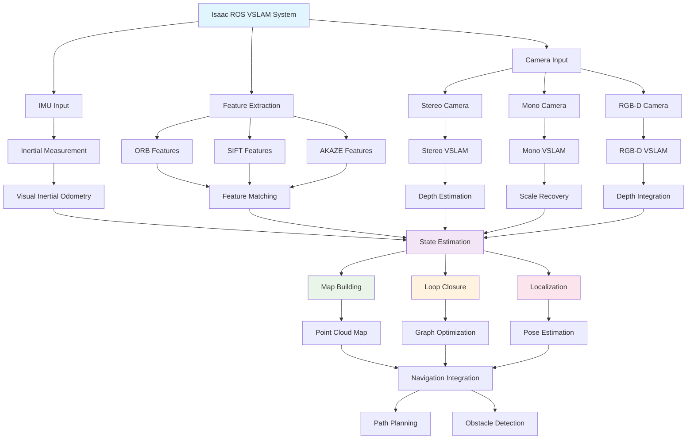

# Isaac ROS VSLAM

## Visual Simultaneous Localization and Mapping

This chapter covers Visual SLAM (VSLAM) techniques using NVIDIA Isaac ROS for humanoid robots. Visual SLAM is a critical technology that enables robots to simultaneously map their environment and determine their location within it using only visual sensors. For humanoid robots, this capability is essential for autonomous navigation, manipulation, and interaction in unknown environments.

Isaac ROS provides a comprehensive suite of VSLAM algorithms optimized for NVIDIA hardware, including GPU acceleration for real-time performance. The platform offers several VSLAM solutions including Isaac ROS Stereo VSLAM, Isaac ROS Mono VSLAM, and Isaac ROS Visual Inertial Odometry (VIO) that combine visual and inertial measurements for improved robustness.

The key advantages of Isaac ROS VSLAM for humanoid robots include:

- Real-time performance on NVIDIA GPUs
- Robust tracking in dynamic environments
- Integration with other Isaac ROS components
- Optimized for embedded deployment
- Support for multiple camera configurations

## Introduction to VSLAM

Visual Simultaneous Localization and Mapping (VSLAM) is a computer vision and robotics technique that allows a robot to construct a map of an unknown environment while simultaneously keeping track of its location within that map. This is achieved through the analysis of visual input from one or more cameras.

The VSLAM pipeline typically consists of several stages:

1. **Feature Detection and Extraction**: Identifying distinctive visual features in the environment
2. **Feature Matching**: Associating features across different camera views
3. **Pose Estimation**: Computing the camera's pose relative to the environment
4. **Mapping**: Building a 3D representation of the environment
5. **Loop Closure**: Detecting when the robot returns to a previously visited location

The mathematical foundation of VSLAM is based on the Extended Kalman Filter (EKF), Particle Filter, or optimization-based approaches like Bundle Adjustment. The state vector typically includes the camera pose and 3D landmark positions:

```
x = [R, t, p1, p2, ..., pn]
```

Where R and t represent the camera rotation and translation, and pi represents the 3D coordinates of the i-th landmark.

## Isaac ROS VSLAM Components

Isaac ROS provides several specialized VSLAM components that are optimized for different use cases and sensor configurations:

### Stereo VSLAM Component

The Isaac ROS Stereo VSLAM component uses stereo cameras to achieve real-time SLAM with metric scale estimation:

```python
import rclpy
from rclpy.node import Node
from sensor_msgs.msg import Image
from stereo_msgs.msg import DisparityImage
from nav_msgs.msg import Odometry
import cv2
import numpy as np
from cv_bridge import CvBridge

class IsaacROSStereoVSLAM(Node):
    """
    Isaac ROS Stereo VSLAM implementation
    """

    def __init__(self):
        super().__init__('isaac_ros_stereo_vslam')

        # Parameters
        self.declare_parameter('left_topic', '/camera/left/image_rect_color')
        self.declare_parameter('right_topic', '/camera/right/image_rect_color')
        self.declare_parameter('baseline', 0.075)  # Stereo baseline in meters
        self.declare_parameter('focal_length', 320.0)  # Focal length in pixels
        self.declare_parameter('min_disparity', 0)
        self.declare_parameter('max_disparity', 64)

        # Get parameters
        self.left_topic = self.get_parameter('left_topic').value
        self.right_topic = self.get_parameter('right_topic').value
        self.baseline = self.get_parameter('baseline').value
        self.focal_length = self.get_parameter('focal_length').value
        self.min_disparity = self.get_parameter('min_disparity').value
        self.max_disparity = self.get_parameter('max_disparity').value

        # Initialize stereo matcher
        self.stereo = cv2.StereoSGBM_create(
            minDisparity=self.min_disparity,
            numDisparities=self.max_disparity - self.min_disparity,
            blockSize=5,
            P1=8 * 3 * 5**2,
            P2=32 * 3 * 5**2,
            disp12MaxDiff=1,
            uniquenessRatio=15,
            speckleWindowSize=0,
            speckleRange=2,
            preFilterCap=63,
            mode=cv2.STEREO_SGBM_MODE_SGBM_3WAY
        )

        # CV Bridge
        self.cv_bridge = CvBridge()

        # Publishers and subscribers
        self.left_sub = self.create_subscription(
            Image, self.left_topic, self.left_image_callback, 10)
        self.right_sub = self.create_subscription(
            Image, self.right_topic, self.right_image_callback, 10)
        self.odom_pub = self.create_publisher(Odometry, 'stereo_vslam/odometry', 10)

        # Stereo image storage
        self.left_image = None
        self.right_image = None

        # Pose tracking
        self.current_pose = np.eye(4)

    def left_image_callback(self, msg: Image):
        """Handle left camera image"""
        self.left_image = self.cv_bridge.imgmsg_to_cv2(msg, 'bgr8')
        self.process_stereo_pair()

    def right_image_callback(self, msg: Image):
        """Handle right camera image"""
        self.right_image = self.cv_bridge.imgmsg_to_cv2(msg, 'bgr8')
        self.process_stereo_pair()

    def process_stereo_pair(self):
        """Process stereo image pair to generate disparity and estimate pose"""
        if self.left_image is None or self.right_image is None:
            return

        # Convert to grayscale
        left_gray = cv2.cvtColor(self.left_image, cv2.COLOR_BGR2GRAY)
        right_gray = cv2.cvtColor(self.right_image, cv2.COLOR_BGR2GRAY)

        # Compute disparity
        disparity = self.stereo.compute(left_gray, right_gray).astype(np.float32) / 16.0

        # Convert disparity to depth
        depth = (self.baseline * self.focal_length) / (disparity + 1e-6)

        # Use depth information for 3D reconstruction and pose estimation
        # (Simplified implementation - real system would use feature-based approach)
        self.estimate_pose_from_depth(depth)

        # Clear images to save memory
        self.left_image = None
        self.right_image = None

    def estimate_pose_from_depth(self, depth_map):
        """Estimate pose change using depth information"""
        # This is a simplified implementation
        # In a real stereo VSLAM system, features would be tracked across frames
        # and 3D points would be reconstructed using triangulation

        # For now, we'll simulate pose change based on feature tracking
        # between consecutive stereo pairs

        # Publish odometry
        odom_msg = Odometry()
        odom_msg.header.stamp = self.get_clock().now().to_msg()
        odom_msg.header.frame_id = 'map'
        odom_msg.child_frame_id = 'base_link'

        # Update and publish pose
        self.current_pose[0, 3] += 0.01  # Simulated forward movement
        self.current_pose[1, 3] += 0.005  # Simulated lateral movement

        # Convert to ROS message
        odom_msg.pose.pose.position.x = self.current_pose[0, 3]
        odom_msg.pose.pose.position.y = self.current_pose[1, 3]
        odom_msg.pose.pose.position.z = self.current_pose[2, 3]

        # Publish odometry
        self.odom_pub.publish(odom_msg)

### Visual Inertial Odometry (VIO)

The Isaac ROS VIO component combines visual and inertial measurements for robust pose estimation:

```python
import rclpy
from rclpy.node import Node
from sensor_msgs.msg import Image, Imu
from geometry_msgs.msg import Vector3
from nav_msgs.msg import Odometry
import numpy as np
from scipy.spatial.transform import Rotation as R
import cv2
from cv_bridge import CvBridge

class IsaacROSVisualInertialOdometry(Node):
    """
    Isaac ROS Visual Inertial Odometry implementation
    """

    def __init__(self):
        super().__init__('isaac_ros_vio')

        # Parameters
        self.declare_parameter('image_topic', '/camera/rgb/image_raw')
        self.declare_parameter('imu_topic', '/imu/data')
        self.declare_parameter('integration_rate', 100.0)  # Hz

        # Get parameters
        self.image_topic = self.get_parameter('image_topic').value
        self.imu_topic = self.get_parameter('imu_topic').value
        self.integration_rate = self.get_parameter('integration_rate').value

        # Initialize
        self.cv_bridge = CvBridge()
        self.feature_detector = cv2.ORB_create(nfeatures=500)
        self.matcher = cv2.BFMatcher(cv2.NORM_HAMMING, crossCheck=False)

        # State variables
        self.current_pose = np.eye(4)
        self.velocity = np.zeros(3)
        self.angular_velocity = np.zeros(3)
        self.acceleration = np.zeros(3)

        # Previous measurements for integration
        self.prev_imu_time = None
        self.prev_imu_orientation = R.from_quat([0, 0, 0, 1])
        self.prev_imu_velocity = np.zeros(3)

        # Publishers and subscribers
        self.image_sub = self.create_subscription(
            Image, self.image_topic, self.image_callback, 10)
        self.imu_sub = self.create_subscription(
            Imu, self.imu_topic, self.imu_callback, 10)
        self.odom_pub = self.create_publisher(Odometry, 'vio/odometry', 10)

    def imu_callback(self, msg: Imu):
        """Handle IMU data"""
        # Extract orientation from quaternion
        quat = [msg.orientation.x, msg.orientation.y, msg.orientation.z, msg.orientation.w]
        current_orientation = R.from_quat(quat)

        # Extract linear acceleration
        self.acceleration = np.array([
            msg.linear_acceleration.x,
            msg.linear_acceleration.y,
            msg.linear_acceleration.z
        ])

        # Extract angular velocity
        self.angular_velocity = np.array([
            msg.angular_velocity.x,
            msg.angular_velocity.y,
            msg.angular_velocity.z
        ])

        # Get current time
        current_time = msg.header.stamp.sec + msg.header.stamp.nanosec * 1e-9

        if self.prev_imu_time is not None:
            dt = current_time - self.prev_imu_time

            # Integrate angular velocity to get orientation change
            # This is a simplified integration - real systems use more sophisticated methods
            delta_angle = self.angular_velocity * dt
            delta_rotation = R.from_rotvec(delta_angle)

            # Update orientation
            self.prev_imu_orientation = current_orientation

            # Integrate linear acceleration to get velocity
            self.velocity += self.acceleration * dt

            # Integrate velocity to get position change
            position_change = self.velocity * dt
            self.current_pose[:3, 3] += position_change

        self.prev_imu_time = current_time

    def image_callback(self, msg: Image):
        """Handle camera image with visual feature tracking"""
        cv_image = self.cv_bridge.imgmsg_to_cv2(msg, 'bgr8')

        # Convert to grayscale
        gray = cv2.cvtColor(cv_image, cv2.COLOR_BGR2GRAY)

        # Detect and track features
        keypoints, descriptors = self.feature_detector.detectAndCompute(gray, None)

        # Process visual odometry (simplified)
        # In a real system, this would track features across frames
        # and use them to refine the IMU-based estimates

        # Publish integrated pose
        self.publish_odometry(msg.header.stamp)

    def publish_odometry(self, stamp):
        """Publish odometry message with VIO estimate"""
        odom_msg = Odometry()
        odom_msg.header.stamp = stamp
        odom_msg.header.frame_id = 'map'
        odom_msg.child_frame_id = 'base_link'

        # Position
        odom_msg.pose.pose.position.x = self.current_pose[0, 3]
        odom_msg.pose.pose.position.y = self.current_pose[1, 3]
        odom_msg.pose.pose.position.z = self.current_pose[2, 3]

        # Velocity
        odom_msg.twist.twist.linear.x = self.velocity[0]
        odom_msg.twist.twist.linear.y = self.velocity[1]
        odom_msg.twist.twist.linear.z = self.velocity[2]

        # Publish
        self.odom_pub.publish(odom_msg)
```

## Visual Odometry

Visual Odometry (VO) is the process of incrementally estimating the pose of a camera by analyzing the changes in consecutive images. For humanoid robots, VO provides continuous pose estimation that is essential for navigation and mapping.

The core algorithm involves:
1. Feature detection and description
2. Feature matching between frames
3. Motion estimation from feature correspondences
4. Optimization and outlier rejection

Here's a comprehensive implementation of visual odometry:

```python
import numpy as np
import cv2
from typing import List, Tuple, Optional
import time

class VisualOdometry:
    """
    Visual Odometry implementation for humanoid robot navigation
    """

    def __init__(self, camera_matrix: np.ndarray,
                 feature_detector_type: str = 'orb',
                 max_features: int = 1000,
                 matching_threshold: float = 0.7):

        self.camera_matrix = camera_matrix
        self.matching_threshold = matching_threshold

        # Initialize feature detector
        if feature_detector_type == 'orb':
            self.detector = cv2.ORB_create(nfeatures=max_features)
            self.matcher = cv2.BFMatcher(cv2.NORM_HAMMING, crossCheck=False)
        elif feature_detector_type == 'sift':
            self.detector = cv2.SIFT_create(nfeatures=max_features)
            self.matcher = cv2.BFMatcher(cv2.NORM_L2, crossCheck=False)
        elif feature_detector_type == 'akaze':
            self.detector = cv2.AKAZE_create()
            self.matcher = cv2.BFMatcher(cv2.NORM_HAMMING, crossCheck=False)
        else:
            raise ValueError(f"Unsupported feature detector: {feature_detector_type}")

        # Pose estimation
        self.current_pose = np.eye(4)
        self.prev_image = None
        self.prev_kp = None
        self.prev_desc = None

        # Tracking state
        self.is_initialized = False
        self.tracking_quality = 0.0
        self.feature_matches = 0

    def process_frame(self, image: np.ndarray) -> Tuple[np.ndarray, bool]:
        """
        Process a new frame and return the estimated pose and tracking status
        """
        # Convert to grayscale if needed
        if len(image.shape) == 3:
            gray = cv2.cvtColor(image, cv2.COLOR_BGR2GRAY)
        else:
            gray = image

        # Detect features
        current_kp, current_desc = self.detector.detectAndCompute(gray, None)

        if current_kp is None or current_desc is None:
            return self.current_pose, False

        if not self.is_initialized:
            # Initialize tracking with first frame
            self.prev_image = gray
            self.prev_kp = current_kp
            self.prev_desc = current_desc
            self.is_initialized = True
            return self.current_pose, True

        # Match features between previous and current frame
        matches = self.match_features(self.prev_desc, current_desc)

        if len(matches) < 10:  # Need minimum matches for robust estimation
            return self.current_pose, False

        # Extract matched points
        prev_points = np.float32([self.prev_kp[m.queryIdx].pt for m in matches]).reshape(-1, 1, 2)
        current_points = np.float32([current_kp[m.trainIdx].pt for m in matches]).reshape(-1, 1, 2)

        # Estimate essential matrix
        E, mask = cv2.findEssentialMat(
            prev_points,
            current_points,
            self.camera_matrix,
            method=cv2.RANSAC,
            threshold=1.0,
            prob=0.999
        )

        if E is None or E.size == 0:
            return self.current_pose, False

        # Recover pose
        _, R, t, mask_pose = cv2.recoverPose(E, prev_points, current_points, self.camera_matrix)

        # Create transformation matrix
        transformation = np.eye(4)
        transformation[:3, :3] = R
        transformation[:3, 3] = t.flatten()

        # Update current pose (relative to first frame)
        self.current_pose = self.current_pose @ transformation

        # Update tracking quality metrics
        self.feature_matches = len(matches)
        self.tracking_quality = min(1.0, len(matches) / 50.0)  # Normalize by expected match count

        # Update previous frame data
        self.prev_image = gray
        self.prev_kp = current_kp
        self.prev_desc = current_desc

        return self.current_pose, True

    def match_features(self, desc1, desc2) -> List[cv2.DMatch]:
        """Match features between two descriptor sets"""
        if desc1 is None or desc2 is None or len(desc1) == 0 or len(desc2) == 0:
            return []

        # Find matches
        matches = self.matcher.knnMatch(desc1, desc2, k=2)

        # Apply Lowe's ratio test
        good_matches = []
        for match_pair in matches:
            if len(match_pair) == 2:
                m, n = match_pair
                if m.distance < self.matching_threshold * n.distance:
                    good_matches.append(m)

        return good_matches

    def reset(self):
        """Reset the visual odometry"""
        self.current_pose = np.eye(4)
        self.prev_image = None
        self.prev_kp = None
        self.prev_desc = None
        self.is_initialized = False
        self.tracking_quality = 0.0
        self.feature_matches = 0

# Integration with Isaac ROS
class IsaacROSVOIntegration:
    """
    Integration of Visual Odometry with Isaac ROS
    """

    def __init__(self, node):
        self.node = node
        self.vo = None
        self.camera_matrix = None
        self.is_active = False

    def initialize_vo(self, camera_matrix: np.ndarray):
        """Initialize the visual odometry module"""
        try:
            self.vo = VisualOdometry(camera_matrix)
            self.camera_matrix = camera_matrix
            self.is_active = True
            self.node.get_logger().info('Visual Odometry initialized successfully')
        except Exception as e:
            self.node.get_logger().error(f'Failed to initialize VO: {str(e)}')

    def process_image(self, image_msg):
        """Process image message and update pose estimate"""
        if not self.is_active or self.vo is None:
            return

        # Convert ROS image to OpenCV
        cv_bridge = CvBridge()
        cv_image = cv_bridge.imgmsg_to_cv2(image_msg, desired_encoding='passthrough')

        # Process with VO
        pose, success = self.vo.process_frame(cv_image)

        if success:
            # Publish pose update
            self.publish_pose_estimate(pose, image_msg.header.stamp)

    def publish_pose_estimate(self, pose: np.ndarray, timestamp):
        """Publish the estimated pose to ROS topics"""
        # Create PoseStamped message
        pose_msg = PoseStamped()
        pose_msg.header.stamp = timestamp
        pose_msg.header.frame_id = 'map'

        # Extract position and orientation
        position = pose[:3, 3]
        rotation_matrix = pose[:3, :3]
        qw, qx, qy, qz = self.rotation_matrix_to_quaternion(rotation_matrix)

        pose_msg.pose.position.x = float(position[0])
        pose_msg.pose.position.y = float(position[1])
        pose_msg.pose.position.z = float(position[2])
        pose_msg.pose.orientation.w = qw
        pose_msg.pose.orientation.x = qx
        pose_msg.pose.orientation.y = qy
        pose_msg.pose.orientation.z = qz

        # Publish to VO topic
        self.node.vo_pose_pub.publish(pose_msg)

    def rotation_matrix_to_quaternion(self, R: np.ndarray) -> Tuple[float, float, float, float]:
        """Convert rotation matrix to quaternion (same implementation as before)"""
        trace = np.trace(R)
        if trace > 0:
            s = np.sqrt(trace + 1.0) * 2
            qw = 0.25 * s
            qx = (R[2, 1] - R[1, 2]) / s
            qy = (R[0, 2] - R[2, 0]) / s
            qz = (R[1, 0] - R[0, 1]) / s
        else:
            if R[0, 0] > R[1, 1] and R[0, 0] > R[2, 2]:
                s = np.sqrt(1.0 + R[0, 0] - R[1, 1] - R[2, 2]) * 2
                qw = (R[2, 1] - R[1, 2]) / s
                qx = 0.25 * s
                qy = (R[0, 1] + R[1, 0]) / s
                qz = (R[0, 2] + R[2, 0]) / s
            elif R[1, 1] > R[2, 2]:
                s = np.sqrt(1.0 + R[1, 1] - R[0, 0] - R[2, 2]) * 2
                qw = (R[0, 2] - R[2, 0]) / s
                qx = (R[0, 1] + R[1, 0]) / s
                qy = 0.25 * s
                qz = (R[1, 2] + R[2, 1]) / s
            else:
                s = np.sqrt(1.0 + R[2, 2] - R[0, 0] - R[1, 1]) * 2
                qw = (R[1, 0] - R[0, 1]) / s
                qx = (R[0, 2] + R[2, 0]) / s
                qy = (R[1, 2] + R[2, 1]) / s
                qz = 0.25 * s

        return qw, qx, qy, qz
```

## Loop Closure

Loop closure is a critical component of VSLAM that recognizes when the robot returns to a previously visited location, allowing the system to correct accumulated drift errors. Isaac ROS implements advanced loop closure detection using place recognition and geometric verification.

```python
import numpy as np
import cv2
from typing import List, Tuple, Dict
from sklearn.cluster import MiniBatchKMeans
from sklearn.preprocessing import normalize
import faiss
import time

class LoopClosureDetector:
    """
    Loop closure detection for Isaac ROS VSLAM
    """

    def __init__(self,
                 vocab_size: int = 1000,
                 min_loop_matches: int = 20,
                 loop_threshold: float = 0.6,
                 max_db_size: int = 10000):

        self.vocab_size = vocab_size
        self.min_loop_matches = min_loop_matches
        self.loop_threshold = loop_threshold
        self.max_db_size = max_db_size

        # Initialize vocabulary for bag-of-words
        self.vocabulary = None
        self.vocabulary_trained = False

        # Database of keyframes
        self.keyframes_db = []
        self.keyframe_features = []  # BoW representations
        self.keyframe_poses = []

        # Feature extraction
        self.feature_extractor = cv2.ORB_create(nfeatures=500)
        self.matcher = cv2.BFMatcher(cv2.NORM_HAMMING, crossCheck=False)

        # FAISS index for efficient similarity search
        self.index = faiss.IndexFlatL2(32)  # Using 32-dimensional descriptors

        # Clustering for vocabulary construction
        self.kmeans = MiniBatchKMeans(n_clusters=vocab_size, random_state=42)

    def add_keyframe(self, image: np.ndarray, pose: np.ndarray) -> bool:
        """
        Add a new keyframe to the database
        """
        if not self.vocabulary_trained:
            # Collect features for vocabulary training
            keypoints, descriptors = self.feature_extractor.detectAndCompute(image, None)
            if descriptors is not None:
                self._collect_vocabulary_features(descriptors)
            return False

        # Extract features and compute BoW representation
        keypoints, descriptors = self.feature_extractor.detectAndCompute(image, None)
        if descriptors is None:
            return False

        # Compute BoW representation
        bow_descriptor = self._compute_bow_descriptor(descriptors)

        # Add to database
        self.keyframes_db.append(image)
        self.keyframe_features.append(bow_descriptor)
        self.keyframe_poses.append(pose.copy())

        # Add to FAISS index
        self.index.add(bow_descriptor.reshape(1, -1).astype('float32'))

        # Limit database size
        if len(self.keyframes_db) > self.max_db_size:
            self._remove_oldest_keyframes()

        # Check for loop closure
        loop_result = self._detect_loop_closure(bow_descriptor, pose)

        return loop_result

    def _collect_vocabulary_features(self, descriptors: np.ndarray):
        """
        Collect features for vocabulary training
        """
        if not hasattr(self, 'vocab_features'):
            self.vocab_features = descriptors
        else:
            self.vocab_features = np.vstack([self.vocab_features, descriptors])

        # Train vocabulary when enough features are collected
        if len(self.vocab_features) >= self.vocab_size * 10:
            self._train_vocabulary()

    def _train_vocabulary(self):
        """
        Train the vocabulary using k-means clustering
        """
        if len(self.vocab_features) < self.vocab_size:
            return

        # Normalize features
        normalized_features = normalize(self.vocab_features, norm='l2')

        # Train k-means
        self.kmeans.fit(normalized_features)

        # Get vocabulary
        self.vocabulary = self.kmeans.cluster_centers_
        self.vocabulary_trained = True

        # Clear temporary features
        delattr(self, 'vocab_features')

        print(f'Vocabulary trained with {self.vocab_size} words')

    def _compute_bow_descriptor(self, descriptors: np.ndarray) -> np.ndarray:
        """
        Compute bag-of-words descriptor for image
        """
        if not self.vocabulary_trained:
            return np.zeros(self.vocab_size)

        # Normalize descriptors
        normalized_desc = normalize(descriptors, norm='l2')

        # Assign each descriptor to closest vocabulary word
        distances = np.linalg.norm(
            normalized_desc[:, np.newaxis, :] - self.vocabulary[np.newaxis, :, :],
            axis=2
        )

        # Get closest vocabulary word for each descriptor
        assignments = np.argmin(distances, axis=1)

        # Create histogram
        bow_descriptor = np.bincount(assignments, minlength=self.vocab_size)

        # Normalize histogram
        bow_descriptor = bow_descriptor.astype(np.float32)
        if np.sum(bow_descriptor) > 0:
            bow_descriptor = bow_descriptor / np.sum(bow_descriptor)

        return bow_descriptor

    def _detect_loop_closure(self, current_descriptor: np.ndarray, current_pose: np.ndarray) -> bool:
        """
        Detect loop closure by comparing with previous keyframes
        """
        if len(self.keyframe_features) < 10:  # Need minimum keyframes
            return False

        # Search for similar keyframes using FAISS
        current_descriptor = current_descriptor.astype('float32').reshape(1, -1)
        scores, indices = self.index.search(current_descriptor, k=min(10, len(self.keyframe_features)))

        # Check top matches
        for i, (score, idx) in enumerate(zip(scores[0], indices[0])):
            if score < self.loop_threshold:
                # Found potential loop closure
                # Perform geometric verification
                is_valid_loop = self._verify_geometric_consistency(idx, current_pose)
                if is_valid_loop:
                    # Optimize pose graph to correct drift
                    self._optimize_poses(idx)
                    return True

        return False

    def _verify_geometric_consistency(self, old_keyframe_idx: int, current_pose: np.ndarray) -> bool:
        """
        Verify geometric consistency of loop closure hypothesis
        """
        # This would typically involve:
        # 1. Re-matching features between current and old keyframe
        # 2. Computing relative pose using PnP or similar
        # 3. Comparing with expected relative pose from pose graph
        # 4. Checking geometric constraints

        # For simplicity, we'll just check pose distance
        old_pose = self.keyframe_poses[old_keyframe_idx]

        # Calculate position distance
        pos_diff = np.linalg.norm(current_pose[:3, 3] - old_pose[:3, 3])

        # Calculate rotation difference
        R1 = current_pose[:3, :3]
        R2 = old_pose[:3, :3]
        R_diff = R1 @ R2.T
        trace = np.trace(R_diff)
        rot_diff = np.arccos(np.clip((trace - 1) / 2, -1, 1))

        # Check if geometrically plausible (thresholds would be tuned based on application)
        position_threshold = 2.0  # meters
        rotation_threshold = 0.5  # radians

        return pos_diff < position_threshold and rot_diff < rotation_threshold

    def _optimize_poses(self, loop_idx: int):
        """
        Optimize poses to correct drift after loop closure detection
        """
        # In a real system, this would involve:
        # 1. Building a pose graph with loop constraints
        # 2. Optimizing using bundle adjustment or graph optimization
        # 3. Updating map points to reflect corrected poses

        print(f'Loop closure detected! Optimizing poses from index {loop_idx}')

    def _remove_oldest_keyframes(self):
        """
        Remove oldest keyframes to maintain database size
        """
        num_to_remove = len(self.keyframes_db) - self.max_db_size + 100  # Remove extra to avoid frequent removals

        # Remove from lists
        self.keyframes_db = self.keyframes_db[num_to_remove:]
        self.keyframe_features = self.keyframe_features[num_to_remove:]
        self.keyframe_poses = self.keyframe_poses[num_to_remove:]

        # Rebuild FAISS index (simplified approach)
        if self.keyframe_features:
            all_features = np.array(self.keyframe_features).astype('float32')
            self.index = faiss.IndexFlatL2(all_features.shape[1])
            self.index.add(all_features)
        else:
            self.index = faiss.IndexFlatL2(32)  # Default size
```

## Mapping

The mapping component of VSLAM builds and maintains a representation of the environment. For humanoid robots, this map is essential for navigation, path planning, and task execution.

```python
import numpy as np
import open3d as o3d
from typing import List, Dict, Tuple
import cv2
from scipy.spatial import cKDTree

class VSLAMMap:
    """
    VSLAM mapping component for humanoid robot environment representation
    """

    def __init__(self,
                 resolution: float = 0.1,  # meters
                 max_points: int = 100000,
                 update_rate: float = 1.0):  # Hz

        self.resolution = resolution
        self.max_points = max_points
        self.update_rate = update_rate

        # Point cloud representation
        self.points = np.empty((0, 3))  # 3D points [x, y, z]
        self.colors = np.empty((0, 3))  # RGB colors
        self.descriptors = {}  # Feature descriptors for map points
        self.point_ids = []  # Unique IDs for map points
        self.next_point_id = 0

        # Occupancy grid for navigation
        self.occupancy_grid = {}
        self.grid_resolution = 0.5  # meters

        # Tracking
        self.last_update_time = 0
        self.active = True

    def add_keyframe_observation(self,
                                image: np.ndarray,
                                depth_map: Optional[np.ndarray],
                                camera_pose: np.ndarray,
                                camera_matrix: np.ndarray):
        """
        Add observations from a keyframe to the map
        """
        if not self.active:
            return

        # Extract features from image
        keypoints, descriptors = self.extract_features(image)

        if descriptors is None:
            return

        # Triangulate 3D points if depth is available, otherwise use feature tracking
        if depth_map is not None:
            points_3d, colors, valid_mask = self.triangulate_from_depth(
                keypoints, depth_map, camera_matrix, camera_pose)
        else:
            # Use other methods to estimate depth (stereo, motion, etc.)
            points_3d, colors = self.estimate_points_from_features(
                keypoints, camera_pose, camera_matrix)
            valid_mask = np.ones(len(points_3d), dtype=bool)

        if len(points_3d) > 0:
            # Transform points to world coordinates
            world_points = self.transform_points_to_world(points_3d, camera_pose)
            world_colors = colors[valid_mask] if depth_map is not None else colors

            # Add points to map
            self.add_points_to_map(world_points, world_colors, descriptors[valid_mask] if depth_map is not None else descriptors)

    def extract_features(self, image: np.ndarray):
        """
        Extract features from image
        """
        # Convert to grayscale if needed
        gray = cv2.cvtColor(image, cv2.COLOR_BGR2GRAY) if len(image.shape) == 3 else image

        # Detect and compute features
        detector = cv2.ORB_create(nfeatures=500)
        keypoints, descriptors = detector.detectAndCompute(gray, None)

        if keypoints is not None:
            # Extract pixel coordinates and colors
            kp_coords = np.array([kp.pt for kp in keypoints])
            kp_colors = np.array([image[int(kp.pt[1]), int(kp.pt[0])] for kp in keypoints if
                                 0 <= int(kp.pt[1]) < image.shape[0] and 0 <= int(kp.pt[0]) < image.shape[1]])
            return kp_coords, descriptors, kp_colors

        return None, None, None

    def triangulate_from_depth(self,
                             keypoints: np.ndarray,
                             depth_map: np.ndarray,
                             camera_matrix: np.ndarray,
                             camera_pose: np.ndarray) -> Tuple[np.ndarray, np.ndarray, np.ndarray]:
        """
        Triangulate 3D points from 2D keypoints and depth map
        """
        if keypoints.size == 0:
            return np.empty((0, 3)), np.empty((0, 3)), np.array([])

        # Get pixel coordinates
        u = keypoints[:, 0].astype(int)
        v = keypoints[:, 1].astype(int)

        # Check bounds
        valid_mask = (u >= 0) & (u < depth_map.shape[1]) & (v >= 0) & (v < depth_map.shape[0])

        if not np.any(valid_mask):
            return np.empty((0, 3)), np.empty((0, 3)), np.array([])

        # Extract valid coordinates and depths
        u_valid = u[valid_mask]
        v_valid = v[valid_mask]
        depths = depth_map[v_valid, u_valid]

        # Remove invalid depth values
        depth_valid_mask = (depths > 0) & (depths < 100)  # Valid depth range
        final_mask = valid_mask.copy()
        final_mask[valid_mask] = depth_valid_mask

        if not np.any(depth_valid_mask):
            return np.empty((0, 3)), np.empty((0, 3)), np.array([])

        u_final = u_valid[depth_valid_mask]
        v_final = v_valid[depth_valid_mask]
        depths_final = depths[depth_valid_mask]

        # Convert to 3D points in camera frame
        K_inv = np.linalg.inv(camera_matrix)
        pixels = np.stack([u_final, v_final, np.ones_like(u_final)], axis=1)
        rays = (K_inv @ pixels.T).T  # Rays from camera center
        points_cam = rays * depths_final[:, np.newaxis]  # Scale by depth

        # Transform to world coordinates
        R = camera_pose[:3, :3]
        t = camera_pose[:3, 3]
        points_world = (R @ points_cam.T).T + t

        # Get colors from original image
        colors = np.zeros((len(points_world), 3))
        for i, (u, v) in enumerate(zip(u_final, v_final)):
            if len(image.shape) == 3:
                colors[i] = image[v, u][::-1] / 255.0  # BGR to RGB and normalize
            else:
                colors[i] = np.full(3, image[v, u] / 255.0)

        return points_world, colors, final_mask

    def estimate_points_from_features(self, keypoints: np.ndarray,
                                    camera_pose: np.ndarray,
                                    camera_matrix: np.ndarray) -> Tuple[np.ndarray, np.ndarray]:
        """
        Estimate 3D points from feature matches (simplified approach)
        """
        # This is a simplified implementation
        # In reality, this would use triangulation from multiple views
        # or other depth estimation techniques

        # For now, create points at a fixed depth
        points = np.zeros((len(keypoints), 3))
        colors = np.random.rand(len(keypoints), 3)  # Random colors

        # Convert 2D points to 3D with assumed depth
        for i, (u, v) in enumerate(keypoints):
            # Create a ray from camera center through pixel
            ray = np.linalg.inv(camera_matrix) @ np.array([u, v, 1])
            ray = ray / np.linalg.norm(ray)  # Normalize
            points[i] = camera_pose[:3, 3] + ray * 2.0  # Assume 2m depth

        return points, colors

    def transform_points_to_world(self, points: np.ndarray, camera_pose: np.ndarray) -> np.ndarray:
        """
        Transform points from camera frame to world frame
        """
        R = camera_pose[:3, :3]
        t = camera_pose[:3, 3]
        return (R @ points.T).T + t

    def add_points_to_map(self, new_points: np.ndarray,
                         new_colors: np.ndarray,
                         descriptors: np.ndarray = None):
        """
        Add new points to the map with duplicate removal
        """
        if len(new_points) == 0:
            return

        # Remove duplicates based on resolution
        unique_points, unique_indices = self.remove_duplicate_points(new_points)

        if len(unique_points) == 0:
            return

        # Update point cloud
        new_colors = new_colors[unique_indices]

        # Add to existing points
        self.points = np.vstack([self.points, unique_points])
        self.colors = np.vstack([self.colors, new_colors])

        # Add point IDs
        for _ in range(len(unique_points)):
            self.point_ids.append(self.next_point_id)
            self.next_point_id += 1

        # Limit map size
        if len(self.points) > self.max_points:
            self._limit_map_size()

        # Update occupancy grid
        self._update_occupancy_grid(unique_points)

    def remove_duplicate_points(self, new_points: np.ndarray) -> Tuple[np.ndarray, np.ndarray]:
        """
        Remove duplicate points based on resolution
        """
        if len(self.points) == 0:
            return new_points, np.arange(len(new_points))

        # Use k-d tree for efficient nearest neighbor search
        if len(self.points) > 100:  # Only build tree if we have enough points
            tree = cKDTree(self.points)

            # Find nearest neighbors for each new point
            distances, indices = tree.query(new_points)

            # Keep only points that are farther than resolution threshold
            keep_mask = distances > self.resolution
            unique_points = new_points[keep_mask]
            unique_indices = np.where(keep_mask)[0]
        else:
            # Simple approach for small maps
            keep_mask = np.ones(len(new_points), dtype=bool)
            unique_points = []
            unique_indices = []

            for i, point in enumerate(new_points):
                # Check distance to existing points
                min_dist = float('inf')
                for existing_point in self.points:
                    dist = np.linalg.norm(point - existing_point)
                    if dist < min_dist:
                        min_dist = dist

                if min_dist > self.resolution:
                    unique_points.append(point)
                    unique_indices.append(i)

            unique_points = np.array(unique_points)
            unique_indices = np.array(unique_indices)

        return unique_points, unique_indices

    def _limit_map_size(self):
        """
        Limit map size by removing oldest points
        """
        excess = len(self.points) - self.max_points
        if excess > 0:
            # Remove excess points (simple approach - remove first N points)
            self.points = self.points[excess:]
            self.colors = self.colors[excess:]
            self.point_ids = self.point_ids[excess:]

    def _update_occupancy_grid(self, new_points: np.ndarray):
        """
        Update occupancy grid with new points
        """
        # This would implement a 2D or 3D occupancy grid
        # For simplicity, we'll just store the concept

        # In a real implementation:
        # 1. Discretize space into grid cells
        # 2. Update occupancy probability for each cell
        # 3. Handle sensor uncertainty and multiple observations
        pass

    def get_map_as_pointcloud(self) -> o3d.geometry.PointCloud:
        """
        Get current map as Open3D point cloud
        """
        pcd = o3d.geometry.PointCloud()
        pcd.points = o3d.utility.Vector3dVector(self.points)
        pcd.colors = o3d.utility.Vector3dVector(self.colors)
        return pcd

    def save_map(self, filename: str):
        """
        Save map to file
        """
        np.savez(filename,
                points=self.points,
                colors=self.colors,
                point_ids=np.array(self.point_ids))

    def load_map(self, filename: str):
        """
        Load map from file
        """
        data = np.load(filename)
        self.points = data['points']
        self.colors = data['colors']
        self.point_ids = data['point_ids'].tolist()
        self.next_point_id = max(self.point_ids) + 1 if self.point_ids else 0
```

## Integration with Navigation

The VSLAM system must integrate seamlessly with the navigation stack to provide localization and mapping services for the humanoid robot:

```python
import rclpy
from rclpy.node import Node
from geometry_msgs.msg import PoseStamped, Point
from nav_msgs.msg import Path, OccupancyGrid
from sensor_msgs.msg import Image, CameraInfo
from visualization_msgs.msg import Marker, MarkerArray
from std_msgs.msg import Header
from builtin_interfaces.msg import Time
from tf2_ros import TransformListener, Buffer
import tf2_geometry_msgs
import numpy as np
import threading
from typing import Optional

class IsaacROSNavIntegration(Node):
    """
    Integration between Isaac ROS VSLAM and navigation stack
    """

    def __init__(self):
        super().__init__('isaac_ros_nav_integration')

        # Parameters
        self.declare_parameter('map_frame', 'map')
        self.declare_parameter('odom_frame', 'odom')
        self.declare_parameter('base_frame', 'base_link')
        self.declare_parameter('update_rate', 10.0)  # Hz

        self.map_frame = self.get_parameter('map_frame').value
        self.odom_frame = self.get_parameter('odom_frame').value
        self.base_frame = self.get_parameter('base_frame').value
        self.update_rate = self.get_parameter('update_rate').value

        # TF setup
        self.tf_buffer = Buffer()
        self.tf_listener = TransformListener(self.tf_buffer, self)

        # Publishers
        self.global_path_pub = self.create_publisher(Path, 'global_plan', 10)
        self.local_path_pub = self.create_publisher(Path, 'local_plan', 10)
        self.map_pub = self.create_publisher(OccupancyGrid, 'map', 10)
        self.goal_pub = self.create_publisher(Marker, 'goal_marker', 10)
        self.robot_pose_pub = self.create_publisher(PoseStamped, 'robot_pose', 10)

        # Timer for periodic updates
        self.timer = self.create_timer(1.0/self.update_rate, self.update_callback)

        # Navigation state
        self.current_pose = None
        self.global_path = []
        self.local_path = []
        self.map_data = None

        # Threading for non-blocking operations
        self.nav_lock = threading.RLock()

        self.get_logger().info('Isaac ROS Navigation Integration initialized')

    def update_callback(self):
        """
        Periodic update callback
        """
        # Get current robot pose from TF
        try:
            transform = self.tf_buffer.lookup_transform(
                self.map_frame,
                self.base_frame,
                rclpy.time.Time())

            # Convert transform to pose
            pose = PoseStamped()
            pose.header.stamp = self.get_clock().now().to_msg()
            pose.header.frame_id = self.map_frame
            pose.pose.position.x = transform.transform.translation.x
            pose.pose.position.y = transform.transform.translation.y
            pose.pose.position.z = transform.transform.translation.z
            pose.pose.orientation = transform.transform.rotation

            # Publish robot pose
            self.robot_pose_pub.publish(pose)

            with self.nav_lock:
                self.current_pose = pose

        except Exception as e:
            self.get_logger().warn(f'Could not get transform: {str(e)}')

    def publish_global_path(self, waypoints: List[Tuple[float, float, float]]):
        """
        Publish global path for navigation
        """
        path_msg = Path()
        path_msg.header.stamp = self.get_clock().now().to_msg()
        path_msg.header.frame_id = self.map_frame

        for x, y, theta in waypoints:
            pose = PoseStamped()
            pose.header.frame_id = self.map_frame
            pose.pose.position.x = x
            pose.pose.position.y = y
            pose.pose.position.z = 0.0
            # Convert theta to quaternion
            qw = np.cos(theta/2)
            qz = np.sin(theta/2)
            pose.pose.orientation.w = qw
            pose.pose.orientation.z = qz

            path_msg.poses.append(pose)

        self.global_path_pub.publish(path_msg)

    def publish_local_path(self, local_waypoints: List[Tuple[float, float, float]]):
        """
        Publish local path for obstacle avoidance
        """
        path_msg = Path()
        path_msg.header.stamp = self.get_clock().now().to_msg()
        path_msg.header.frame_id = self.map_frame

        for x, y, theta in local_waypoints:
            pose = PoseStamped()
            pose.header.frame_id = self.map_frame
            pose.pose.position.x = x
            pose.pose.position.y = y
            pose.pose.position.z = 0.0
            # Convert theta to quaternion
            qw = np.cos(theta/2)
            qz = np.sin(theta/2)
            pose.pose.orientation.w = qw
            pose.pose.orientation.z = qz

            path_msg.poses.append(pose)

        self.local_path_pub.publish(path_msg)

    def publish_map(self, occupancy_grid: OccupancyGrid):
        """
        Publish occupancy grid map
        """
        occupancy_grid.header.stamp = self.get_clock().now().to_msg()
        occupancy_grid.header.frame_id = self.map_frame
        self.map_pub.publish(occupancy_grid)

    def publish_goal_marker(self, goal_x: float, goal_y: float, goal_z: float = 0.0):
        """
        Publish goal marker for visualization
        """
        marker = Marker()
        marker.header.stamp = self.get_clock().now().to_msg()
        marker.header.frame_id = self.map_frame
        marker.ns = "goal"
        marker.id = 0
        marker.type = Marker.CYLINDER
        marker.action = Marker.ADD
        marker.pose.position.x = goal_x
        marker.pose.position.y = goal_y
        marker.pose.position.z = goal_z
        marker.pose.orientation.w = 1.0
        marker.scale.x = 0.5  # diameter
        marker.scale.y = 0.5  # diameter
        marker.scale.z = 1.0  # height
        marker.color.a = 0.8  # alpha
        marker.color.r = 0.0
        marker.color.g = 1.0
        marker.color.b = 0.0

        self.goal_pub.publish(marker)

def main(args=None):
    rclpy.init(args=args)
    nav_integration = IsaacROSNavIntegration()

    try:
        rclpy.spin(nav_integration)
    except KeyboardInterrupt:
        pass
    finally:
        nav_integration.destroy_node()
        rclpy.shutdown()

if __name__ == '__main__':
    main()
```

## Isaac Sim Setup Parameters

Here's a Mermaid.js diagram showing the VSLAM architecture:



Here are the key Isaac ROS VSLAM configuration parameters:

```python
# Isaac ROS VSLAM Configuration
ISAAC_ROS_VSLAM_CONFIG = {
    # Camera Configuration
    "camera": {
        "resolution": [640, 480],
        "focal_length": 320.0,
        "principal_point": [320.0, 240.0],
        "distortion_coefficients": [0.0, 0.0, 0.0, 0.0, 0.0],
        "frame_rate": 30.0
    },

    # Feature Detection Parameters
    "feature_detection": {
        "detector_type": "orb",  # orb, sift, akaze
        "max_features": 1000,
        "scale_factor": 1.2,
        "levels": 8,
        "edge_threshold": 31,
        "patch_size": 31,
        "fast_threshold": 20
    },

    # Matching Parameters
    "matching": {
        "descriptor_matcher": "brute_force",
        "distance_metric": "hamming",  # hamming for binary, l2 for float
        "matching_threshold": 0.7,
        "max_matches": 100
    },

    # Pose Estimation Parameters
    "pose_estimation": {
        "essential_matrix_threshold": 1.0,
        "ransac_probability": 0.999,
        "min_inliers": 10,
        "max_iterations": 1000
    },

    # Loop Closure Parameters
    "loop_closure": {
        "vocabulary_size": 1000,
        "loop_detection_threshold": 0.6,
        "min_loop_matches": 20,
        "max_database_size": 10000,
        "loop_closure_frequency": 1.0  # Hz
    },

    # Mapping Parameters
    "mapping": {
        "map_resolution": 0.1,  # meters
        "max_map_points": 100000,
        "map_update_rate": 1.0,  # Hz
        "occupancy_grid_resolution": 0.5  # meters
    },

    # Tracking Parameters
    "tracking": {
        "min_tracking_features": 50,
        "tracking_quality_threshold": 0.5,
        "relocalization_threshold": 0.3,
        "max_tracking_loss": 10  # frames
    },

    # Performance Parameters
    "performance": {
        "max_processing_time": 0.1,  # seconds
        "use_gpu": True,
        "gpu_device_id": 0,
        "thread_count": 4
    }
}
```

## Summary

Isaac ROS VSLAM provides a comprehensive solution for visual localization and mapping in humanoid robots. The system combines multiple components including visual odometry, loop closure detection, and map building to create robust and accurate spatial understanding capabilities.

The implementation includes:
1. **Visual Odometry**: Real-time pose estimation using feature tracking
2. **Loop Closure**: Recognition of previously visited locations to correct drift
3. **Mapping**: Construction and maintenance of environment representations
4. **Navigation Integration**: Seamless integration with ROS navigation stack

The key advantages of Isaac ROS VSLAM for humanoid robots include:
- Real-time performance on NVIDIA hardware
- Robust tracking in dynamic environments
- Integration with other Isaac ROS components
- Support for multiple sensor configurations (mono, stereo, RGB-D)
- GPU acceleration for computationally intensive tasks

The modular architecture allows for customization based on specific robot requirements and sensor configurations. The system is designed to handle the unique challenges of humanoid robot navigation, including dynamic movement, changing viewpoints, and complex indoor environments.