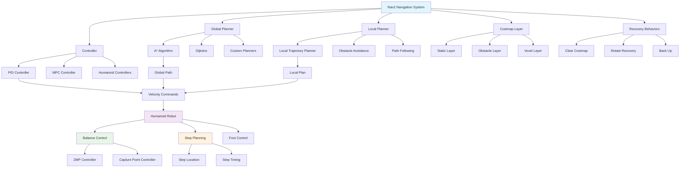

# Nav2 Path Planning

## Navigation and Path Planning

This chapter covers navigation and path planning using Nav2 (Navigation 2) for humanoid robots. Nav2 is the state-of-the-art navigation stack for ROS 2, providing robust and flexible path planning capabilities for mobile robots. For humanoid robots, navigation presents unique challenges due to their bipedal locomotion, balance constraints, and complex kinematics.

The Nav2 stack consists of several key components:
- **Global Planner**: Generates a high-level path from start to goal
- **Local Planner**: Executes the path while avoiding obstacles in real-time
- **Controller**: Converts planned paths into robot motion commands
- **Costmaps**: Represent the environment with obstacles and navigation constraints
- **Recovery Behaviors**: Handle navigation failures and recover from difficult situations

## Navigation Stack Overview

The Nav2 architecture is built around a flexible plugin system that allows users to customize each component based on their specific robot and application requirements. Here's a comprehensive implementation of Nav2 for humanoid robots:

```python
import rclpy
from rclpy.node import Node
from nav2_msgs.action import NavigateToPose
from nav_msgs.msg import Path, OccupancyGrid
from geometry_msgs.msg import PoseStamped, Point
from sensor_msgs.msg import LaserScan, PointCloud2
from geometry_msgs.msg import Twist
from tf2_ros import TransformListener, Buffer
import tf2_geometry_msgs
import numpy as np
from typing import List, Tuple, Optional
import math
from enum import Enum
import threading
import time

class NavigationState(Enum):
    """Navigation state enumeration"""
    IDLE = 0
    PLANNING = 1
    EXECUTING = 2
    RECOVERING = 3
    CANCELLED = 4
    COMPLETED = 5
    FAILED = 6

class Nav2PathPlanner(Node):
    """
    Comprehensive Nav2 path planning implementation for humanoid robots
    """

    def __init__(self):
        super().__init__('nav2_path_planner')

        # Declare parameters
        self.declare_parameter('global_frame', 'map')
        self.declare_parameter('robot_base_frame', 'base_link')
        self.declare_parameter('planner_frequency', 5.0)
        self.declare_parameter('controller_frequency', 20.0)
        self.declare_parameter('max_vel_x', 0.5)
        self.declare_parameter('min_vel_x', 0.1)
        self.declare_parameter('max_vel_theta', 1.0)
        self.declare_parameter('min_in_place_vel_theta', 0.4)
        self.declare_parameter('acc_lim_x', 2.5)
        self.declare_parameter('acc_lim_theta', 3.2)
        self.declare_parameter('xy_goal_tolerance', 0.25)
        self.declare_parameter('yaw_goal_tolerance', 0.25)

        # Get parameters
        self.global_frame = self.get_parameter('global_frame').value
        self.robot_base_frame = self.get_parameter('robot_base_frame').value
        self.planner_frequency = self.get_parameter('planner_frequency').value
        self.controller_frequency = self.get_parameter('controller_frequency').value
        self.max_vel_x = self.get_parameter('max_vel_x').value
        self.min_vel_x = self.get_parameter('min_vel_x').value
        self.max_vel_theta = self.get_parameter('max_vel_theta').value
        self.min_in_place_vel_theta = self.get_parameter('min_in_place_vel_theta').value
        self.acc_lim_x = self.get_parameter('acc_lim_x').value
        self.acc_lim_theta = self.get_parameter('acc_lim_theta').value
        self.xy_goal_tolerance = self.get_parameter('xy_goal_tolerance').value
        self.yaw_goal_tolerance = self.get_parameter('yaw_goal_tolerance').value

        # Navigation state
        self.navigation_state = NavigationState.IDLE
        self.current_pose = None
        self.goal_pose = None
        self.global_path = None
        self.local_plan = None

        # TF setup
        self.tf_buffer = Buffer()
        self.tf_listener = TransformListener(self.tf_buffer, self)

        # Publishers
        self.global_path_pub = self.create_publisher(Path, 'global_plan', 10)
        self.local_path_pub = self.create_publisher(Path, 'local_plan', 10)
        self.velocity_pub = self.create_publisher(Twist, 'cmd_vel', 10)
        self.current_pose_pub = self.create_publisher(PoseStamped, 'current_pose', 10)

        # Subscribers
        self.costmap_sub = self.create_subscription(
            OccupancyGrid, 'global_costmap/costmap', self.costmap_callback, 10)
        self.scan_sub = self.create_subscription(
            LaserScan, 'scan', self.scan_callback, 10)

        # Timers
        self.update_timer = self.create_timer(1.0/self.planner_frequency, self.update_callback)

        # Threading
        self.nav_lock = threading.RLock()

        self.get_logger().info('Nav2 Path Planner initialized')

    def update_callback(self):
        """Main navigation update callback"""
        # Update robot pose from TF
        self.update_robot_pose()

        # Execute navigation logic based on state
        with self.nav_lock:
            if self.navigation_state == NavigationState.PLANNING:
                self.plan_global_path()
            elif self.navigation_state == NavigationState.EXECUTING:
                self.execute_local_plan()

    def update_robot_pose(self):
        """Update current robot pose from TF"""
        try:
            transform = self.tf_buffer.lookup_transform(
                self.global_frame,
                self.robot_base_frame,
                rclpy.time.Time())

            pose = PoseStamped()
            pose.header.stamp = self.get_clock().now().to_msg()
            pose.header.frame_id = self.global_frame
            pose.pose.position.x = transform.transform.translation.x
            pose.pose.position.y = transform.transform.translation.y
            pose.pose.position.z = transform.transform.translation.z
            pose.pose.orientation = transform.transform.rotation

            self.current_pose = pose
            self.current_pose_pub.publish(pose)

        except Exception as e:
            self.get_logger().warn(f'Could not get transform: {str(e)}')

    def set_goal(self, goal_pose: PoseStamped):
        """Set navigation goal"""
        with self.nav_lock:
            self.goal_pose = goal_pose
            self.navigation_state = NavigationState.PLANNING

    def plan_global_path(self):
        """Plan global path using A* or Dijkstra algorithm"""
        if not self.current_pose or not self.goal_pose:
            return

        # In a real implementation, this would call the global planner plugin
        # For this example, we'll create a simple path
        path = self.compute_simple_path(
            self.current_pose.pose,
            self.goal_pose.pose
        )

        if path:
            self.global_path = path
            self.publish_global_path(path)
            self.navigation_state = NavigationState.EXECUTING
        else:
            self.navigation_state = NavigationState.FAILED

    def compute_simple_path(self, start_pose, goal_pose) -> Optional[Path]:
        """Compute a simple path (in practice, this would be a more sophisticated planner)"""
        path_msg = Path()
        path_msg.header.stamp = self.get_clock().now().to_msg()
        path_msg.header.frame_id = self.global_frame

        # Simple straight-line path with intermediate waypoints
        start_x = start_pose.position.x
        start_y = start_pose.position.y
        goal_x = goal_pose.position.x
        goal_y = goal_pose.position.y

        # Calculate distance and intermediate points
        dist = math.sqrt((goal_x - start_x)**2 + (goal_y - start_y)**2)
        num_points = max(2, int(dist / 0.5))  # 0.5m between waypoints

        for i in range(num_points):
            t = i / (num_points - 1) if num_points > 1 else 0
            x = start_x + t * (goal_x - start_x)
            y = start_y + t * (goal_y - start_y)

            pose_stamped = PoseStamped()
            pose_stamped.header.frame_id = self.global_frame
            pose_stamped.pose.position.x = x
            pose_stamped.pose.position.y = y
            pose_stamped.pose.position.z = 0.0

            # Calculate orientation to face the next point
            if i < num_points - 1:
                next_x = start_x + (i+1) / (num_points - 1) * (goal_x - start_x)
                next_y = start_y + (i+1) / (num_points - 1) * (goal_y - start_y)
                yaw = math.atan2(next_y - y, next_x - x)

                # Convert yaw to quaternion
                pose_stamped.pose.orientation.z = math.sin(yaw / 2.0)
                pose_stamped.pose.orientation.w = math.cos(yaw / 2.0)
            else:
                # Use goal orientation
                pose_stamped.pose.orientation = goal_pose.orientation

            path_msg.poses.append(pose_stamped)

        return path_msg

    def execute_local_plan(self):
        """Execute local path following with obstacle avoidance"""
        if not self.global_path or not self.current_pose:
            return

        # Get next local path segment
        local_path = self.get_local_path_segment()
        if local_path:
            self.local_plan = local_path
            self.publish_local_path(local_path)

            # Compute velocity command
            cmd_vel = self.compute_velocity_command(local_path)
            if cmd_vel:
                self.velocity_pub.publish(cmd_vel)

                # Check if goal is reached
                if self.is_goal_reached():
                    self.navigation_state = NavigationState.COMPLETED

    def get_local_path_segment(self) -> Optional[Path]:
        """Get the next segment of the global path to follow"""
        if not self.global_path or not self.current_pose:
            return None

        # Find the closest point on the path
        closest_idx = self.find_closest_point_on_path()
        if closest_idx is None:
            return None

        # Create local path from current position to look-ahead point
        local_path = Path()
        local_path.header = self.global_path.header

        # Include points from closest point up to look-ahead distance
        look_ahead_dist = 2.0  # meters
        start_idx = closest_idx
        end_idx = start_idx

        current_dist = 0.0
        for i in range(start_idx, len(self.global_path.poses)):
            if i == start_idx:
                continue

            prev_pose = self.global_path.poses[i-1].pose.position
            curr_pose = self.global_path.poses[i].pose.position
            segment_dist = math.sqrt(
                (curr_pose.x - prev_pose.x)**2 + (curr_pose.y - prev_pose.y)**2
            )

            if current_dist + segment_dist > look_ahead_dist:
                break

            current_dist += segment_dist
            local_path.poses.append(self.global_path.poses[i])
            end_idx = i

        return local_path if len(local_path.poses) > 0 else None

    def find_closest_point_on_path(self) -> Optional[int]:
        """Find the closest point on the global path to the current robot position"""
        if not self.global_path or not self.current_pose:
            return None

        robot_x = self.current_pose.pose.position.x
        robot_y = self.current_pose.pose.position.y

        min_dist = float('inf')
        closest_idx = 0

        for i, pose in enumerate(self.global_path.poses):
            dist = math.sqrt(
                (pose.pose.position.x - robot_x)**2 +
                (pose.pose.position.y - robot_y)**2
            )
            if dist < min_dist:
                min_dist = dist
                closest_idx = i

        return closest_idx if min_dist < float('inf') else None

    def compute_velocity_command(self, local_path: Path) -> Optional[Twist]:
        """Compute velocity command based on local path"""
        if not local_path.poses or not self.current_pose:
            return None

        # Get the next point on the path
        next_pose = local_path.poses[0].pose

        # Calculate desired direction and distance
        robot_x = self.current_pose.pose.position.x
        robot_y = self.current_pose.pose.position.y
        robot_yaw = self.get_yaw_from_quaternion(self.current_pose.pose.orientation)

        dx = next_pose.position.x - robot_x
        dy = next_pose.position.y - robot_y
        distance = math.sqrt(dx**2 + dy**2)

        # Calculate angle to the next point
        angle_to_goal = math.atan2(dy, dx)
        angle_diff = angle_to_goal - robot_yaw

        # Normalize angle
        while angle_diff > math.pi:
            angle_diff -= 2 * math.pi
        while angle_diff < -math.pi:
            angle_diff += 2 * math.pi

        # Create velocity command
        cmd_vel = Twist()

        # If angle is too large, rotate in place first
        if abs(angle_diff) > math.pi / 4:  # 45 degrees
            cmd_vel.angular.z = max(-self.max_vel_theta, min(self.max_vel_theta,
                self.max_vel_theta * angle_diff / abs(angle_diff)))
        else:
            # Move forward while adjusting orientation
            cmd_vel.linear.x = max(self.min_vel_x, min(self.max_vel_x,
                self.max_vel_x * min(1.0, distance)))
            cmd_vel.angular.z = max(-self.max_vel_theta, min(self.max_vel_theta,
                self.max_vel_theta * angle_diff))

        return cmd_vel

    def get_yaw_from_quaternion(self, quat) -> float:
        """Extract yaw angle from quaternion"""
        siny_cosp = 2 * (quat.w * quat.z + quat.x * quat.y)
        cosy_cosp = 1 - 2 * (quat.y * quat.y + quat.z * quat.z)
        return math.atan2(siny_cosp, cosy_cosp)

    def is_goal_reached(self) -> bool:
        """Check if the goal has been reached"""
        if not self.goal_pose or not self.current_pose:
            return False

        # Check position tolerance
        pos_diff = math.sqrt(
            (self.goal_pose.pose.position.x - self.current_pose.pose.position.x)**2 +
            (self.goal_pose.pose.position.y - self.current_pose.pose.position.y)**2
        )

        # Check orientation tolerance
        goal_yaw = self.get_yaw_from_quaternion(self.goal_pose.pose.orientation)
        current_yaw = self.get_yaw_from_quaternion(self.current_pose.pose.orientation)
        angle_diff = abs(goal_yaw - current_yaw)

        return pos_diff <= self.xy_goal_tolerance and angle_diff <= self.yaw_goal_tolerance

    def costmap_callback(self, msg: OccupancyGrid):
        """Handle costmap updates"""
        # Process costmap data for obstacle detection and path planning
        pass

    def scan_callback(self, msg: LaserScan):
        """Handle laser scan data for local obstacle detection"""
        # Process laser scan for local path adjustment and obstacle avoidance
        pass

    def publish_global_path(self, path: Path):
        """Publish global path for visualization"""
        self.global_path_pub.publish(path)

    def publish_local_path(self, path: Path):
        """Publish local path for visualization"""
        self.local_path_pub.publish(path)

class HumanoidPathPlanner(Nav2PathPlanner):
    """
    Humanoid-specific path planning that accounts for bipedal locomotion constraints
    """

    def __init__(self):
        super().__init__()

        # Humanoid-specific parameters
        self.declare_parameter('step_height', 0.05)  # Height of each step
        self.declare_parameter('step_length', 0.3)   # Length of each step
        self.declare_parameter('step_duration', 0.5) # Duration of each step
        self.declare_parameter('max_step_up', 0.1)   # Maximum step up height
        self.declare_parameter('max_step_down', 0.1) # Maximum step down height
        self.declare_parameter('max_lean_angle', 0.2) # Maximum lean angle (radians)

        self.step_height = self.get_parameter('step_height').value
        self.step_length = self.get_parameter('step_length').value
        self.step_duration = self.get_parameter('step_duration').value
        self.max_step_up = self.get_parameter('max_step_up').value
        self.max_step_down = self.get_parameter('max_step_down').value
        self.max_lean_angle = self.get_parameter('max_lean_angle').value

        # Initialize humanoid-specific components
        self.balance_controller = BalanceController()
        self.step_planner = StepPlanner()

    def compute_velocity_command(self, local_path: Path) -> Optional[Twist]:
        """Humanoid-specific velocity command computation"""
        if not local_path.poses or not self.current_pose:
            return None

        # Use step planner to generate footstep plan
        footstep_plan = self.step_planner.plan_footsteps(
            self.current_pose.pose, local_path, self.step_length
        )

        # Generate balance-aware velocity command
        cmd_vel = Twist()

        # Calculate desired forward velocity based on footsteps
        if footstep_plan and len(footstep_plan) > 0:
            # Get the next step in the plan
            next_step = footstep_plan[0]

            # Calculate distance to next step
            robot_x = self.current_pose.pose.position.x
            robot_y = self.current_pose.pose.position.y
            step_x = next_step.position.x
            step_y = next_step.position.y
            distance_to_step = math.sqrt((step_x - robot_x)**2 + (step_y - robot_y)**2)

            # Calculate velocity to reach next step
            desired_vel = distance_to_step / (self.step_duration / 2)  # Half step duration to reach midpoint
            cmd_vel.linear.x = min(self.max_vel_x, max(self.min_vel_x, desired_vel))

            # Calculate angular velocity to face next step
            robot_yaw = self.get_yaw_from_quaternion(self.current_pose.pose.orientation)
            desired_yaw = math.atan2(step_y - robot_y, step_x - robot_x)
            angle_diff = desired_yaw - robot_yaw

            # Normalize angle
            while angle_diff > math.pi:
                angle_diff -= 2 * math.pi
            while angle_diff < -math.pi:
                angle_diff += 2 * math.pi

            cmd_vel.angular.z = max(-self.max_vel_theta, min(self.max_vel_theta,
                self.max_vel_theta * angle_diff))

        # Apply balance constraints
        cmd_vel = self.balance_controller.apply_balance_constraints(cmd_vel)

        return cmd_vel

    def is_goal_reached(self) -> bool:
        """Humanoid-specific goal reached check"""
        if not self.goal_pose or not self.current_pose:
            return False

        # Check position tolerance
        pos_diff = math.sqrt(
            (self.goal_pose.pose.position.x - self.current_pose.pose.position.x)**2 +
            (self.goal_pose.pose.position.y - self.current_pose.pose.position.y)**2
        )

        # Check orientation tolerance
        goal_yaw = self.get_yaw_from_quaternion(self.goal_pose.pose.orientation)
        current_yaw = self.get_yaw_from_quaternion(self.current_pose.pose.orientation)
        angle_diff = abs(goal_yaw - current_yaw)

        # Additional check for humanoid-specific constraints
        # Consider goal reached if within step length of goal
        return pos_diff <= max(self.xy_goal_tolerance, self.step_length) and angle_diff <= self.yaw_goal_tolerance

class BalanceController:
    """
    Balance controller for humanoid robots during navigation
    """

    def __init__(self):
        self.max_lean_angle = 0.2  # radians
        self.com_height = 0.8      # Center of mass height (meters)
        self.zmp_margin = 0.05     # Zero Moment Point safety margin

    def apply_balance_constraints(self, cmd_vel: Twist) -> Twist:
        """Apply balance constraints to velocity command"""
        # Limit velocities based on balance constraints
        # This is a simplified model - real implementations would use ZMP or LIPM
        max_stable_linear_vel = self.calculate_max_stable_linear_velocity()
        max_stable_angular_vel = self.calculate_max_stable_angular_velocity()

        cmd_vel.linear.x = max(-max_stable_linear_vel,
                              min(max_stable_linear_vel, cmd_vel.linear.x))
        cmd_vel.angular.z = max(-max_stable_angular_vel,
                               min(max_stable_angular_vel, cmd_vel.angular.z))

        return cmd_vel

    def calculate_max_stable_linear_velocity(self) -> float:
        """Calculate maximum stable linear velocity based on balance"""
        # Simplified calculation based on inverted pendulum model
        # v_max = sqrt(g * h / L) where g is gravity, h is CoM height, L is step length
        g = 9.81  # gravity
        # This is a simplified model - real implementation would be more complex
        return 0.5  # Return a safe default value

    def calculate_max_stable_angular_velocity(self) -> float:
        """Calculate maximum stable angular velocity based on balance"""
        # Simplified calculation
        return 0.5  # Return a safe default value

class StepPlanner:
    """
    Footstep planner for humanoid robots
    """

    def __init__(self):
        self.step_length = 0.3  # meters
        self.step_width = 0.2   # meters (distance between feet)
        self.max_step_up = 0.1  # maximum step up height
        self.max_step_down = 0.1  # maximum step down height

    def plan_footsteps(self, current_pose, path: Path, step_length: float) -> List[PoseStamped]:
        """Plan footsteps along the path"""
        footsteps = []

        if not path.poses:
            return footsteps

        # Start from current position
        current_x = current_pose.position.x
        current_y = current_pose.position.y
        current_yaw = self.get_yaw_from_quaternion(current_pose.orientation)

        # Generate footsteps along the path
        for i, pose_stamped in enumerate(path.poses):
            target_x = pose_stamped.pose.position.x
            target_y = pose_stamped.pose.position.y

            # Calculate distance to target
            dist = math.sqrt((target_x - current_x)**2 + (target_y - current_y)**2)

            # Generate intermediate footsteps
            num_steps = int(dist / step_length)
            for j in range(num_steps):
                step_x = current_x + (j + 1) * (target_x - current_x) / num_steps
                step_y = current_y + (j + 1) * (target_y - current_y) / num_steps

                # Alternate between left and right foot
                step_offset = self.step_width / 2 if j % 2 == 0 else -self.step_width / 2
                step_x += step_offset * math.sin(current_yaw)
                step_y += step_offset * math.cos(current_yaw)

                step_pose = PoseStamped()
                step_pose.header = path.header
                step_pose.pose.position.x = step_x
                step_pose.pose.position.y = step_y
                step_pose.pose.position.z = 0.0
                step_pose.pose.orientation = pose_stamped.pose.orientation

                footsteps.append(step_pose)

        return footsteps

    def get_yaw_from_quaternion(self, quat) -> float:
        """Extract yaw angle from quaternion"""
        siny_cosp = 2 * (quat.w * quat.z + quat.x * quat.y)
        cosy_cosp = 1 - 2 * (quat.y * quat.y + quat.z * quat.z)
        return math.atan2(siny_cosp, cosy_cosp)

def main(args=None):
    rclpy.init(args=args)
    path_planner = HumanoidPathPlanner()

    try:
        rclpy.spin(path_planner)
    except KeyboardInterrupt:
        pass
    finally:
        path_planner.destroy_node()
        rclpy.shutdown()

if __name__ == '__main__':
    main()
```

## Costmaps

Costmaps are a fundamental component of the Nav2 navigation stack that represent the environment with obstacles, free space, and navigation constraints. For humanoid robots, costmaps need to account for the robot's unique shape, size, and locomotion constraints.

```python
import numpy as np
from typing import List, Tuple
import cv2
from nav_msgs.msg import OccupancyGrid
from geometry_msgs.msg import Point
from sensor_msgs.msg import LaserScan
import threading

class Costmap2D:
    """
    2D Costmap implementation for humanoid robot navigation
    """

    def __init__(self,
                 resolution: float = 0.05,  # meters per cell
                 width: int = 200,          # cells
                 height: int = 200,         # cells
                 origin_x: float = -5.0,    # meters
                 origin_y: float = -5.0):   # meters
        self.resolution = resolution
        self.width = width
        self.height = height
        self.origin_x = origin_x
        self.origin_y = origin_y

        # Initialize costmap
        self.costmap = np.zeros((height, width), dtype=np.int8)
        self.update_lock = threading.RLock()

        # Cost values
        self.COST_UNKNOWN = -1
        self.COST_FREE = 0
        self.COST_INSCRIBED = 99
        self.COST_LETHAL = 100

        # Robot footprint (for humanoid: approximate as a rectangle)
        self.robot_footprint = self.create_robot_footprint()

    def create_robot_footprint(self) -> List[Tuple[float, float]]:
        """
        Create robot footprint for costmap operations
        For a humanoid robot, this might be a rectangle representing the base
        """
        # Approximate humanoid base as 0.5m x 0.4m rectangle
        half_width = 0.25  # meters
        half_length = 0.2  # meters

        footprint = [
            (-half_length, -half_width),
            (-half_length, half_width),
            (half_length, half_width),
            (half_length, -half_width)
        ]

        return footprint

    def world_to_map(self, x_world: float, y_world: float) -> Tuple[int, int]:
        """Convert world coordinates to map coordinates"""
        x_map = int((x_world - self.origin_x) / self.resolution)
        y_map = int((y_world - self.origin_y) / self.resolution)

        return x_map, y_map

    def map_to_world(self, x_map: int, y_map: int) -> Tuple[float, float]:
        """Convert map coordinates to world coordinates"""
        x_world = x_map * self.resolution + self.origin_x
        y_world = y_map * self.resolution + self.origin_y

        return x_world, y_world

    def is_valid_cell(self, x: int, y: int) -> bool:
        """Check if map coordinates are valid"""
        return 0 <= x < self.width and 0 <= y < self.height

    def ray_trace(self, x0: float, y0: float, x1: float, y1: float,
                  max_range: float = 10.0) -> List[Tuple[int, int]]:
        """Ray trace between two points in the costmap"""
        x0_map, y0_map = self.world_to_map(x0, y0)
        x1_map, y1_map = self.world_to_map(x1, y1)

        # Bresenham's line algorithm
        points = []
        dx = abs(x1_map - x0_map)
        dy = abs(y1_map - y0_map)
        x_step = 1 if x0_map < x1_map else -1
        y_step = 1 if y0_map < y1_map else -1

        error = dx - dy
        x, y = x0_map, y0_map

        while True:
            if self.is_valid_cell(x, y):
                points.append((x, y))

            if x == x1_map and y == y1_map:
                break

            error2 = 2 * error
            if error2 > -dy:
                error -= dy
                x += x_step
            if error2 < dx:
                error += dx
                y += y_step

        return points

    def update_with_laser_scan(self, scan: LaserScan, robot_pose):
        """Update costmap with laser scan data"""
        with self.update_lock:
            # Convert scan points to world coordinates
            angle_min = scan.angle_min
            angle_increment = scan.angle_increment

            robot_x = robot_pose.position.x
            robot_y = robot_pose.position.y
            robot_yaw = self.get_yaw_from_quaternion(robot_pose.orientation)

            for i, range_val in enumerate(scan.ranges):
                if range_val < scan.range_min or range_val > scan.range_max:
                    continue

                # Calculate angle of this range measurement
                angle = angle_min + i * angle_increment + robot_yaw

                # Calculate world coordinates of obstacle
                obs_x = robot_x + range_val * math.cos(angle)
                obs_y = robot_y + range_val * math.sin(angle)

                # Get map coordinates
                obs_x_map, obs_y_map = self.world_to_map(obs_x, obs_y)

                if self.is_valid_cell(obs_x_map, obs_y_map):
                    # Set obstacle cost
                    self.costmap[obs_y_map, obs_x_map] = self.COST_LETHAL

                    # Ray trace to clear free space
                    points = self.ray_trace(robot_x, robot_y, obs_x, obs_y)
                    for x, y in points[:-1]:  # Don't clear the obstacle point
                        if self.is_valid_cell(x, y):
                            if self.costmap[y, x] < self.COST_INSCRIBED:
                                self.costmap[y, x] = self.COST_FREE

    def get_cost(self, x_world: float, y_world: float) -> int:
        """Get cost at world coordinates"""
        x_map, y_map = self.world_to_map(x_world, y_world)

        if self.is_valid_cell(x_map, y_map):
            return self.costmap[y_map, x_map]
        else:
            return self.COST_LETHAL  # Outside map is lethal

    def is_free(self, x_world: float, y_world: float) -> bool:
        """Check if a point is free for navigation"""
        cost = self.get_cost(x_world, y_world)
        return cost < self.COST_INSCRIBED

    def is_occupied(self, x_world: float, y_world: float) -> bool:
        """Check if a point is occupied"""
        cost = self.get_cost(x_world, y_world)
        return cost >= self.COST_INSCRIBED

    def get_neighbors(self, x: int, y: int) -> List[Tuple[int, int]]:
        """Get valid neighboring cells"""
        neighbors = []
        for dx in [-1, 0, 1]:
            for dy in [-1, 0, 1]:
                if dx == 0 and dy == 0:
                    continue  # Skip current cell
                nx, ny = x + dx, y + dy
                if self.is_valid_cell(nx, ny):
                    neighbors.append((nx, ny))
        return neighbors

    def inflate_obstacles(self, inflation_radius: float):
        """Inflate obstacles by a given radius"""
        inflation_cells = int(inflation_radius / self.resolution)

        # Create a copy of the original costmap
        original_costmap = self.costmap.copy()

        for i in range(self.height):
            for j in range(self.width):
                if original_costmap[i, j] >= self.COST_INSCRIBED:
                    # Inflate this obstacle
                    for di in range(-inflation_cells, inflation_cells + 1):
                        for dj in range(-inflation_cells, inflation_cells + 1):
                            ni, nj = i + di, j + dj
                            if self.is_valid_cell(nj, ni):  # Note: x, y order
                                dist = math.sqrt(di**2 + dj**2) * self.resolution
                                if dist <= inflation_radius:
                                    current_cost = self.costmap[ni, nj]
                                    new_cost = min(self.COST_LETHAL,
                                                 int(100 * (1 - dist / inflation_radius)))
                                    self.costmap[ni, nj] = max(current_cost, new_cost)

    def get_yaw_from_quaternion(self, quat) -> float:
        """Extract yaw angle from quaternion"""
        siny_cosp = 2 * (quat.w * quat.z + quat.x * quat.y)
        cosy_cosp = 1 - 2 * (quat.y * quat.y + quat.z * quat.z)
        return math.atan2(siny_cosp, cosy_cosp)

class LayeredCostmap:
    """
    Layered costmap that combines multiple sources of information
    """

    def __init__(self, global_frame: str = 'map'):
        self.global_frame = global_frame
        self.layers = []
        self.master_costmap = None
        self.resolution = 0.05
        self.width = 200
        self.height = 200
        self.origin_x = -5.0
        self.origin_y = -5.0

    def add_layer(self, layer):
        """Add a costmap layer"""
        self.layers.append(layer)

    def update_map(self):
        """Update the master costmap by combining all layers"""
        if not self.layers:
            return

        # Initialize master costmap if needed
        if self.master_costmap is None:
            self.master_costmap = Costmap2D(
                resolution=self.resolution,
                width=self.width,
                height=self.height,
                origin_x=self.origin_x,
                origin_y=self.origin_y
            )

        # Reset master costmap
        self.master_costmap.costmap.fill(self.master_costmap.COST_FREE)

        # Combine all layers
        for layer in self.layers:
            self.combine_layers(layer)

    def combine_layers(self, layer):
        """Combine a layer with the master costmap"""
        # This is a simplified combination - real implementation would be more complex
        # For now, we'll just take the maximum cost at each cell
        if hasattr(layer, 'costmap'):
            for i in range(min(self.master_costmap.height, layer.height)):
                for j in range(min(self.master_costmap.width, layer.width)):
                    current_cost = self.master_costmap.costmap[i, j]
                    layer_cost = layer.costmap[i, j]
                    self.master_costmap.costmap[i, j] = max(current_cost, layer_cost)

class StaticLayer:
    """
    Static layer for costmap - represents permanent obstacles like walls
    """

    def __init__(self, static_map: OccupancyGrid):
        self.static_map = static_map
        self.costmap = self.convert_occupancy_grid(static_map)

    def convert_occupancy_grid(self, grid: OccupancyGrid):
        """Convert OccupancyGrid message to costmap array"""
        width = grid.info.width
        height = grid.info.height
        resolution = grid.info.resolution

        # Create numpy array from the data
        costmap = np.array(grid.data, dtype=np.int8).reshape((height, width))

        return costmap

class ObstacleLayer:
    """
    Obstacle layer for costmap - represents dynamic obstacles from sensors
    """

    def __init__(self, observation_sources: List[str] = None):
        self.observation_sources = observation_sources or []
        self.costmap = None
        self.observations = []
        self.marking_radius = 0.5  # meters
        self.clearing_radius = 1.0  # meters

    def update_observations(self, observations: List):
        """Update with new sensor observations"""
        self.observations = observations

    def ray_trace(self, start_x, start_y, end_x, end_y, clear: bool = False):
        """Ray trace to mark or clear space"""
        # Implementation for ray tracing
        pass
```

## Global Path Planning

Global path planning involves finding an optimal path from the start to the goal considering the static map and known obstacles. For humanoid robots, this must account for their specific locomotion capabilities and constraints.

```python
import heapq
from typing import List, Tuple, Dict, Optional
import math

class AStarPlanner:
    """
    A* path planning algorithm for humanoid robots
    """

    def __init__(self, costmap: Costmap2D):
        self.costmap = costmap
        self.motion_model = self.create_motion_model()

    def create_motion_model(self) -> List[Tuple[int, int, float]]:
        """
        Create motion model for path planning
        For humanoid robots, we might include specific motions like stepping patterns
        """
        # 8-connectivity motion model with different costs for different directions
        motion = [
            (1, 0, 1.0),    # East
            (0, 1, 1.0),    # North
            (-1, 0, 1.0),   # West
            (0, -1, 1.0),   # South
            (1, 1, math.sqrt(2)),   # Northeast
            (-1, 1, math.sqrt(2)),  # Northwest
            (-1, -1, math.sqrt(2)), # Southwest
            (1, -1, math.sqrt(2))   # Southeast
        ]
        return motion

    def plan(self, start: Tuple[float, float],
             goal: Tuple[float, float]) -> Optional[List[Tuple[float, float]]]:
        """
        Plan path using A* algorithm
        """
        # Convert world coordinates to map coordinates
        start_map = self.costmap.world_to_map(start[0], start[1])
        goal_map = self.costmap.world_to_map(goal[0], goal[1])

        # Validate start and goal
        if not self.costmap.is_valid_cell(start_map[0], start_map[1]) or \
           not self.costmap.is_valid_cell(goal_map[0], goal_map[1]):
            return None

        if self.costmap.is_occupied(start[0], start[1]) or \
           self.costmap.is_occupied(goal[0], goal[1]):
            return None

        # Initialize open and closed sets
        open_set = [(0, start_map)]
        came_from: Dict[Tuple[int, int], Tuple[int, int]] = {}
        g_score: Dict[Tuple[int, int], float] = {start_map: 0}
        f_score: Dict[Tuple[int, int], float] = {start_map: self.heuristic(start_map, goal_map)}

        # Convert open_set to a heap
        heapq.heapify(open_set)
        open_set_hash = {start_map}

        while open_set:
            current = heapq.heappop(open_set)
            current_pos = current[1]
            open_set_hash.remove(current_pos)

            # Check if we reached the goal
            if current_pos == goal_map:
                return self.reconstruct_path(came_from, current_pos)

            # Explore neighbors
            for motion in self.motion_model:
                neighbor = (current_pos[0] + motion[0], current_pos[1] + motion[1])

                # Check if neighbor is valid
                if not self.costmap.is_valid_cell(neighbor[0], neighbor[1]):
                    continue

                # Check if neighbor is occupied
                neighbor_world = self.costmap.map_to_world(neighbor[0], neighbor[1])
                if self.costmap.is_occupied(neighbor_world[0], neighbor_world[1]):
                    continue

                # Calculate tentative g_score
                tentative_g_score = g_score[current_pos] + motion[2]  # distance cost
                cost_at_neighbor = self.get_cell_cost(neighbor)
                movement_cost = tentative_g_score + cost_at_neighbor * 0.1  # cost penalty

                # If this path to neighbor is better
                if neighbor not in g_score or movement_cost < g_score[neighbor]:
                    came_from[neighbor] = current_pos
                    g_score[neighbor] = movement_cost
                    f_score[neighbor] = movement_cost + self.heuristic(neighbor, goal_map)

                    if neighbor not in open_set_hash:
                        heapq.heappush(open_set, (f_score[neighbor], neighbor))
                        open_set_hash.add(neighbor)

        # No path found
        return None

    def get_cell_cost(self, pos: Tuple[int, int]) -> float:
        """Get cost of traversing a cell"""
        world_pos = self.costmap.map_to_world(pos[0], pos[1])
        cost = self.costmap.get_cost(world_pos[0], world_pos[1])
        return max(0, cost / 100.0)  # Normalize cost to 0-1 range

    def heuristic(self, pos1: Tuple[int, int], pos2: Tuple[int, int]) -> float:
        """Calculate heuristic (Euclidean distance)"""
        return math.sqrt((pos1[0] - pos2[0])**2 + (pos1[1] - pos2[1])**2)

    def reconstruct_path(self, came_from: Dict, current: Tuple[int, int]) -> List[Tuple[float, float]]:
        """Reconstruct path from came_from map"""
        path = [self.costmap.map_to_world(current[0], current[1])]

        while current in came_from:
            current = came_from[current]
            world_pos = self.costmap.map_to_world(current[0], current[1])
            path.append(world_pos)

        path.reverse()
        return path

class DijkstraPlanner(AStarPlanner):
    """
    Dijkstra's algorithm for path planning (special case of A* with no heuristic)
    """

    def heuristic(self, pos1: Tuple[int, int], pos2: Tuple[int, int]) -> float:
        """No heuristic for Dijkstra"""
        return 0.0

class HumanoidPathOptimizer:
    """
    Path optimizer for humanoid robots that smooths paths and considers step constraints
    """

    def __init__(self, step_length: float = 0.3, max_lean_angle: float = 0.2):
        self.step_length = step_length
        self.max_lean_angle = max_lean_angle

    def optimize_path(self, path: List[Tuple[float, float]]) -> List[Tuple[float, float]]:
        """Optimize path for humanoid locomotion"""
        if len(path) < 3:
            return path

        # Apply path smoothing
        smoothed_path = self.smooth_path(path)

        # Resample path to appropriate step lengths
        resampled_path = self.resample_path(smoothed_path, self.step_length)

        return resampled_path

    def smooth_path(self, path: List[Tuple[float, float]],
                   weight_data: float = 0.5, weight_smooth: float = 0.1,
                   tolerance: float = 0.00001) -> List[Tuple[float, float]]:
        """Smooth path using gradient descent"""
        if len(path) < 3:
            return path

        # Create a copy of the path
        new_path = [list(point) for point in path]

        change = tolerance
        while change >= tolerance:
            change = 0.0
            for i in range(1, len(path) - 1):
                for j in range(len(path[0])):  # x, y coordinates
                    aux = new_path[i][j]
                    # Update based on original path and neighbors
                    new_path[i][j] += weight_data * (path[i][j] - new_path[i][j])
                    new_path[i][j] += weight_smooth * (new_path[i-1][j] + new_path[i+1][j] - 2.0 * new_path[i][j])
                    change += abs(aux - new_path[i][j])

        return [tuple(point) for point in new_path]

    def resample_path(self, path: List[Tuple[float, float]],
                     step_length: float) -> List[Tuple[float, float]]:
        """Resample path to have consistent step lengths"""
        if len(path) < 2:
            return path

        resampled_path = [path[0]]

        for i in range(1, len(path)):
            prev_point = path[i-1]
            curr_point = path[i]

            # Calculate distance between points
            dist = math.sqrt((curr_point[0] - prev_point[0])**2 +
                           (curr_point[1] - prev_point[1])**2)

            # If distance is greater than step length, add intermediate points
            if dist > step_length:
                num_steps = int(dist / step_length)
                for j in range(1, num_steps + 1):
                    t = j / num_steps
                    x = prev_point[0] + t * (curr_point[0] - prev_point[0])
                    y = prev_point[1] + t * (curr_point[1] - prev_point[1])
                    resampled_path.append((x, y))
            else:
                resampled_path.append(curr_point)

        return resampled_path

class GlobalPlannerNode(Node):
    """
    ROS 2 node for global path planning
    """

    def __init__(self):
        super().__init__('global_planner')

        # Parameters
        self.declare_parameter('planner_type', 'astar')
        self.declare_parameter('step_length', 0.3)
        self.declare_parameter('max_lean_angle', 0.2)

        self.planner_type = self.get_parameter('planner_type').value
        self.step_length = self.get_parameter('step_length').value
        self.max_lean_angle = self.get_parameter('max_lean_angle').value

        # Initialize planner
        self.costmap = None
        self.planner = None
        self.path_optimizer = HumanoidPathOptimizer(
            step_length=self.step_length,
            max_lean_angle=self.max_lean_angle
        )

        # Publishers and subscribers
        self.path_pub = self.create_publisher(Path, 'global_plan', 10)
        self.map_sub = self.create_subscription(
            OccupancyGrid, 'map', self.map_callback, 10)

        # Service server for planning
        from rclpy.qos import QoSProfile
        self.plan_srv = self.create_service(
            # We'd use the actual Nav2 service type here
            # For this example, we'll use a placeholder
        )

    def map_callback(self, msg: OccupancyGrid):
        """Handle map updates"""
        self.costmap = StaticLayer(msg).costmap
        # Initialize planner with new costmap
        if self.planner_type == 'astar':
            self.planner = AStarPlanner(self.costmap)
        else:
            self.planner = DijkstraPlanner(self.costmap)

    def plan_path(self, start: Tuple[float, float],
                 goal: Tuple[float, float]) -> Optional[List[Tuple[float, float]]]:
        """Plan path from start to goal"""
        if not self.planner:
            return None

        # Plan path
        raw_path = self.planner.plan(start, goal)

        if not raw_path:
            return None

        # Optimize path for humanoid
        optimized_path = self.path_optimizer.optimize_path(raw_path)

        return optimized_path

def create_global_planner():
    """Factory function to create a global planner"""
    rclpy.init()
    node = GlobalPlannerNode()
    return node
```

## Local Path Planning

Local path planning focuses on executing the global plan while avoiding dynamic obstacles and adjusting to real-time sensor data. For humanoid robots, this involves careful consideration of balance and step planning.

```python
from typing import List, Tuple, Optional
import numpy as np
from scipy.spatial.distance import cdist
from geometry_msgs.msg import Twist
from sensor_msgs.msg import LaserScan

class LocalPlanner:
    """
    Local path planning for humanoid robots with obstacle avoidance
    """

    def __init__(self,
                 max_vel_x: float = 0.5,
                 min_vel_x: float = 0.1,
                 max_vel_theta: float = 1.0,
                 acc_lim_x: float = 2.5,
                 acc_lim_theta: float = 3.2,
                 xy_goal_tolerance: float = 0.25,
                 yaw_goal_tolerance: float = 0.25):

        self.max_vel_x = max_vel_x
        self.min_vel_x = min_vel_x
        self.max_vel_theta = max_vel_theta
        self.acc_lim_x = acc_lim_x
        self.acc_lim_theta = acc_lim_theta
        self.xy_goal_tolerance = xy_goal_tolerance
        self.yaw_goal_tolerance = yaw_goal_tolerance

        # Robot state
        self.current_pose = None
        self.current_velocity = Twist()
        self.global_plan = []
        self.local_plan = []

        # Costmap
        self.costmap = None

        # Trajectory sampling parameters
        self.sim_time = 1.7  # seconds to simulate
        self.vx_samples = 3  # number of x velocity samples
        self.vtheta_samples = 20  # number of theta velocity samples

    def set_global_plan(self, plan: List[Tuple[float, float]]):
        """Set the global plan to follow"""
        self.global_plan = plan
        self.local_plan = self.get_local_plan_segment()

    def get_local_plan_segment(self) -> List[Tuple[float, float]]:
        """Get the segment of the global plan to consider for local planning"""
        if not self.global_plan or not self.current_pose:
            return []

        # Find the closest point on the global plan
        closest_idx = self.find_closest_point_on_plan()
        if closest_idx is None:
            return []

        # Return next N points as local plan
        look_ahead_points = 10  # Consider next 10 points
        end_idx = min(closest_idx + look_ahead_points, len(self.global_plan))

        return self.global_plan[closest_idx:end_idx]

    def find_closest_point_on_plan(self) -> Optional[int]:
        """Find the closest point on the global plan to current pose"""
        if not self.global_plan or not self.current_pose:
            return None

        robot_x = self.current_pose.pose.position.x
        robot_y = self.current_pose.pose.position.y

        min_dist = float('inf')
        closest_idx = 0

        for i, (x, y) in enumerate(self.global_plan):
            dist = math.sqrt((x - robot_x)**2 + (y - robot_y)**2)
            if dist < min_dist:
                min_dist = dist
                closest_idx = i

        return closest_idx if min_dist < float('inf') else None

    def compute_velocity_commands(self) -> List[Tuple[float, float, float]]:
        """
        Compute possible velocity commands using sampling
        Returns list of (vx, vy, vtheta) tuples
        """
        if not self.current_velocity:
            return []

        # Current velocities
        current_vx = self.current_velocity.linear.x
        current_vtheta = self.current_velocity.angular.z

        # Calculate velocity ranges based on acceleration limits
        dt = 0.1  # time step
        max_vx = min(self.max_vel_x,
                    current_vx + self.acc_lim_x * dt)
        min_vx = max(self.min_vel_x,
                    current_vx - self.acc_lim_x * dt)

        max_vtheta = min(self.max_vel_theta,
                        current_vtheta + self.acc_lim_theta * dt)
        min_vtheta = max(-self.max_vel_theta,
                        current_vtheta - self.acc_lim_theta * dt)

        # Generate samples
        vx_samples = np.linspace(min_vx, max_vx, self.vx_samples)
        vtheta_samples = np.linspace(min_vtheta, max_vtheta, self.vtheta_samples)

        commands = []
        for vx in vx_samples:
            for vtheta in vtheta_samples:
                commands.append((vx, 0.0, vtheta))  # vy is 0 for differential drive

        return commands

    def evaluate_trajectory(self, vx: float, vy: float, vtheta: float) -> float:
        """
        Evaluate a trajectory based on multiple criteria
        Higher score is better
        """
        if not self.costmap or not self.current_pose:
            return -float('inf')

        # Simulate trajectory
        trajectory = self.simulate_trajectory(vx, vy, vtheta)

        if not trajectory:
            return -float('inf')

        # Evaluate multiple criteria
        goal_distance_score = self.evaluate_goal_distance(trajectory)
        obstacle_score = self.evaluate_obstacle_clearance(trajectory)
        path_alignment_score = self.evaluate_path_alignment(trajectory)

        # Weighted combination of scores
        total_score = (0.4 * goal_distance_score +
                      0.4 * obstacle_score +
                      0.2 * path_alignment_score)

        return total_score

    def simulate_trajectory(self, vx: float, vy: float, vtheta: float) -> List[Tuple[float, float]]:
        """Simulate a trajectory over time"""
        if not self.current_pose:
            return []

        robot_x = self.current_pose.pose.position.x
        robot_y = self.current_pose.pose.position.y
        robot_yaw = self.get_yaw_from_quaternion(self.current_pose.pose.orientation)

        dt = 0.1  # time step
        num_steps = int(self.sim_time / dt)

        trajectory = [(robot_x, robot_y)]

        for i in range(num_steps):
            # Update orientation
            robot_yaw += vtheta * dt

            # Update position
            robot_x += (vx * math.cos(robot_yaw) - vy * math.sin(robot_yaw)) * dt
            robot_y += (vx * math.sin(robot_yaw) + vy * math.cos(robot_yaw)) * dt

            trajectory.append((robot_x, robot_y))

        return trajectory

    def evaluate_goal_distance(self, trajectory: List[Tuple[float, float]]) -> float:
        """Evaluate how close the trajectory gets to the goal"""
        if not self.global_plan:
            return 0.0

        # Get the last point in the global plan (goal)
        goal_x, goal_y = self.global_plan[-1]

        # Get the last point in the trajectory
        traj_x, traj_y = trajectory[-1]

        # Calculate distance to goal
        dist = math.sqrt((goal_x - traj_x)**2 + (goal_y - traj_y)**2)

        # Score: higher for closer to goal (inverse relationship)
        return max(0.0, 1.0 - dist / 10.0)  # Normalize assuming max 10m distance

    def evaluate_obstacle_clearance(self, trajectory: List[Tuple[float, float]]) -> float:
        """Evaluate how well the trajectory avoids obstacles"""
        if not self.costmap:
            return 0.0

        min_clearance = float('inf')

        for x, y in trajectory:
            cost = self.costmap.get_cost(x, y)
            if cost >= self.costmap.COST_INSCRIBED:
                # Trajectory hits obstacle
                return -1.0

        # If no obstacles hit, return positive score based on clearance
        # For simplicity, we'll return a high score if no obstacles are hit
        return 1.0

    def evaluate_path_alignment(self, trajectory: List[Tuple[float, float]]) -> float:
        """Evaluate how well the trajectory follows the global path"""
        if not self.global_plan or len(self.global_plan) < 2:
            return 0.0

        total_score = 0.0

        for i, (traj_x, traj_y) in enumerate(trajectory):
            # Find closest point on global plan
            min_dist = float('inf')
            for plan_x, plan_y in self.global_plan:
                dist = math.sqrt((plan_x - traj_x)**2 + (plan_y - traj_y)**2)
                if dist < min_dist:
                    min_dist = dist

            # Score based on distance to global plan (lower distance = higher score)
            score = max(0.0, 1.0 - min_dist / 2.0)  # Normalize with 2m threshold
            total_score += score

        # Average score over trajectory length
        return total_score / len(trajectory) if trajectory else 0.0

    def get_best_cmd_vel(self) -> Optional[Twist]:
        """Get the best velocity command based on trajectory evaluation"""
        if not self.local_plan:
            return None

        # Get possible commands
        commands = self.compute_velocity_commands()

        if not commands:
            return None

        # Evaluate each command
        best_score = -float('inf')
        best_cmd = None

        for vx, vy, vtheta in commands:
            score = self.evaluate_trajectory(vx, vy, vtheta)
            if score > best_score:
                best_score = score
                best_cmd = (vx, vy, vtheta)

        if best_cmd:
            cmd_vel = Twist()
            cmd_vel.linear.x = best_cmd[0]
            cmd_vel.linear.y = best_cmd[1]
            cmd_vel.angular.z = best_cmd[2]
            return cmd_vel

        return None

    def update_costmap_with_scan(self, scan: LaserScan):
        """Update costmap with laser scan data"""
        if self.costmap:
            # This would update the costmap with scan data
            # Implementation depends on the specific costmap structure
            pass

    def get_yaw_from_quaternion(self, quat) -> float:
        """Extract yaw angle from quaternion"""
        siny_cosp = 2 * (quat.w * quat.z + quat.x * quat.y)
        cosy_cosp = 1 - 2 * (quat.y * quat.y + quat.z * quat.z)
        return math.atan2(siny_cosp, cosy_cosp)

class HumanoidLocalPlanner(LocalPlanner):
    """
    Humanoid-specific local planner that considers balance and step constraints
    """

    def __init__(self, *args, **kwargs):
        super().__init__(*args, **kwargs)

        # Humanoid-specific parameters
        self.step_length = 0.3  # meters
        self.step_duration = 0.5  # seconds
        self.max_lean_angle = 0.2  # radians
        self.balance_margin = 0.1  # safety margin for balance

        # Balance controller
        self.balance_controller = BalanceController()

    def evaluate_trajectory(self, vx: float, vy: float, vtheta: float) -> float:
        """Humanoid-specific trajectory evaluation"""
        # Start with base evaluation
        base_score = super().evaluate_trajectory(vx, vy, vtheta)

        # Add humanoid-specific constraints
        balance_score = self.evaluate_balance_constraints(vx, vtheta)
        step_feasibility_score = self.evaluate_step_feasibility(vx, vtheta)

        # Weighted combination
        total_score = (0.5 * base_score +
                      0.3 * balance_score +
                      0.2 * step_feasibility_score)

        return total_score

    def evaluate_balance_constraints(self, vx: float, vtheta: float) -> float:
        """Evaluate if the command violates balance constraints"""
        # Calculate if the velocity command would cause instability
        max_stable_linear = self.balance_controller.calculate_max_stable_linear_velocity()
        max_stable_angular = self.balance_controller.calculate_max_stable_angular_velocity()

        if abs(vx) > max_stable_linear or abs(vtheta) > max_stable_angular:
            return -1.0  # Invalid command
        else:
            # Score based on how close to limits
            linear_ratio = abs(vx) / max_stable_linear
            angular_ratio = abs(vtheta) / max_stable_angular
            max_ratio = max(linear_ratio, angular_ratio)

            # Higher score for commands further from limits
            return max(0.0, 1.0 - max_ratio)

    def evaluate_step_feasibility(self, vx: float, vtheta: float) -> float:
        """Evaluate if the command allows for feasible stepping"""
        # Calculate step frequency based on velocity
        step_freq = abs(vx) / self.step_length if abs(vx) > 0.01 else 0.0

        # Check if step frequency is within feasible range
        max_step_freq = 1.0 / (self.step_duration * 0.8)  # 80% of step duration
        if step_freq > max_step_freq:
            return 0.0  # Too fast for feasible steps

        # Higher score for moderate step frequencies
        ideal_freq = 0.5 * max_step_freq
        freq_ratio = step_freq / ideal_freq
        if freq_ratio <= 1.0:
            return 1.0  # Good frequency
        else:
            return max(0.0, 2.0 - freq_ratio)  # Decreasing score for higher frequencies
```

## Controller Plugins

Controller plugins in Nav2 handle the conversion of planned paths into actual velocity commands. For humanoid robots, this involves complex control strategies to maintain balance while following paths.

```python
from typing import List, Tuple, Optional
import numpy as np
from scipy.interpolate import interp1d
from geometry_msgs.msg import Twist, PoseStamped
import math

class ControllerBase:
    """
    Base class for controller plugins
    """

    def __init__(self, name: str):
        self.name = name
        self.initialized = False

    def set_plan(self, path: List[PoseStamped]):
        """Set the plan to follow"""
        raise NotImplementedError

    def compute_velocity_command(self, robot_pose, robot_velocity) -> Optional[Twist]:
        """Compute the next velocity command"""
        raise NotImplementedError

    def is_goal_reached(self) -> bool:
        """Check if the goal has been reached"""
        raise NotImplementedError

class PIDController(ControllerBase):
    """
    PID-based path following controller
    """

    def __init__(self, name: str = "PIDController"):
        super().__init__(name)

        # PID gains
        self.kp_linear = 1.0  # Proportional gain for linear velocity
        self.ki_linear = 0.0  # Integral gain for linear velocity
        self.kd_linear = 0.1  # Derivative gain for linear velocity

        self.kp_angular = 2.0  # Proportional gain for angular velocity
        self.ki_angular = 0.0  # Integral gain for angular velocity
        self.kd_angular = 0.2  # Derivative gain for angular velocity

        # Controller state
        self.linear_error_integral = 0.0
        self.angular_error_integral = 0.0
        self.prev_linear_error = 0.0
        self.prev_angular_error = 0.0
        self.prev_time = None

        # Robot parameters
        self.max_linear_vel = 0.5
        self.max_angular_vel = 1.0
        self.min_linear_vel = 0.1
        self.xy_goal_tolerance = 0.25
        self.yaw_goal_tolerance = 0.25

        # Plan
        self.path = []
        self.current_waypoint_idx = 0

        self.initialized = True

    def set_plan(self, path: List[PoseStamped]):
        """Set the plan to follow"""
        self.path = path
        self.current_waypoint_idx = 0
        self.reset_integrals()

    def reset_integrals(self):
        """Reset integral terms"""
        self.linear_error_integral = 0.0
        self.angular_error_integral = 0.0
        self.prev_linear_error = 0.0
        self.prev_angular_error = 0.0
        self.prev_time = None

    def compute_velocity_command(self, robot_pose, robot_velocity) -> Optional[Twist]:
        """Compute velocity command using PID control"""
        if not self.path or self.current_waypoint_idx >= len(self.path):
            return None

        # Get current time
        current_time = time.time()
        if self.prev_time is None:
            dt = 0.1  # Default time step
        else:
            dt = current_time - self.prev_time

        self.prev_time = current_time

        # Get current robot position and orientation
        robot_x = robot_pose.pose.position.x
        robot_y = robot_pose.pose.position.y
        robot_yaw = self.get_yaw_from_quaternion(robot_pose.pose.orientation)

        # Get target waypoint
        target_pose = self.path[self.current_waypoint_idx]
        target_x = target_pose.pose.position.x
        target_y = target_pose.pose.position.y

        # Calculate errors
        dx = target_x - robot_x
        dy = target_y - robot_y
        target_distance = math.sqrt(dx**2 + dy**2)

        target_angle = math.atan2(dy, dx)
        angle_error = target_angle - robot_yaw

        # Normalize angle error
        while angle_error > math.pi:
            angle_error -= 2 * math.pi
        while angle_error < -math.pi:
            angle_error += 2 * math.pi

        # PID control for linear velocity
        linear_error = target_distance
        self.linear_error_integral += linear_error * dt
        linear_error_derivative = (linear_error - self.prev_linear_error) / dt if dt > 0 else 0

        linear_vel = (self.kp_linear * linear_error +
                     self.ki_linear * self.linear_error_integral +
                     self.kd_linear * linear_error_derivative)

        # Limit linear velocity
        linear_vel = max(self.min_linear_vel, min(self.max_linear_vel, abs(linear_vel)))

        # PID control for angular velocity
        angular_error = angle_error
        self.angular_error_integral += angular_error * dt
        angular_error_derivative = (angular_error - self.prev_angular_error) / dt if dt > 0 else 0

        angular_vel = (self.kp_angular * angular_error +
                      self.ki_angular * self.angular_error_integral +
                      self.kd_angular * angular_error_derivative)

        # Limit angular velocity
        angular_vel = max(-self.max_angular_vel, min(self.max_angular_vel, angular_vel))

        # Update previous errors
        self.prev_linear_error = linear_error
        self.prev_angular_error = angular_error

        # Create command
        cmd_vel = Twist()
        cmd_vel.linear.x = linear_vel
        cmd_vel.angular.z = angular_vel

        # Check if we've reached the current waypoint
        if target_distance < 0.5:  # Waypoint reached threshold
            self.current_waypoint_idx += 1
            if self.current_waypoint_idx >= len(self.path):
                # Path completed, slow down
                cmd_vel.linear.x = 0.0
                cmd_vel.angular.z = 0.0

        return cmd_vel

    def is_goal_reached(self) -> bool:
        """Check if the goal has been reached"""
        if not self.path or self.current_waypoint_idx >= len(self.path):
            return True  # Path completed

        # Check if we're at the last waypoint
        if self.current_waypoint_idx == len(self.path) - 1:
            # Check distance to final goal
            if hasattr(self, 'robot_pose'):
                robot_x = self.robot_pose.pose.position.x
                robot_y = self.robot_pose.pose.position.y
                goal_x = self.path[-1].pose.position.x
                goal_y = self.path[-1].pose.position.y
                distance = math.sqrt((goal_x - robot_x)**2 + (goal_y - robot_y)**2)
                return distance <= self.xy_goal_tolerance

        return False

    def get_yaw_from_quaternion(self, quat) -> float:
        """Extract yaw angle from quaternion"""
        siny_cosp = 2 * (quat.w * quat.z + quat.x * quat.y)
        cosy_cosp = 1 - 2 * (quat.y * quat.y + quat.z * quat.z)
        return math.atan2(siny_cosp, cosy_cosp)

class HumanoidMPCController(ControllerBase):
    """
    Model Predictive Control (MPC) controller for humanoid robots
    """

    def __init__(self, name: str = "HumanoidMPCController"):
        super().__init__(name)

        # MPC parameters
        self.horizon = 10  # prediction horizon steps
        self.dt = 0.1      # time step (seconds)

        # Robot parameters for inverted pendulum model
        self.com_height = 0.8  # Center of mass height (m)
        self.gravity = 9.81    # Gravity constant

        # Weights for MPC cost function
        self.state_weight = np.diag([1.0, 1.0, 0.5, 0.5])  # [x, y, vx, vy]
        self.control_weight = np.diag([0.1, 0.1])  # [vx_cmd, vy_cmd]
        self.terminal_weight = np.diag([5.0, 5.0, 1.0, 1.0])

        # Robot constraints
        self.max_linear_vel = 0.5
        self.max_angular_vel = 1.0
        self.max_accel = 1.0

        # Goal tolerance
        self.xy_goal_tolerance = 0.25
        self.yaw_goal_tolerance = 0.25

        # Internal state
        self.path = []
        self.current_waypoint_idx = 0
        self.initialized = True

    def set_plan(self, path: List[PoseStamped]):
        """Set the plan to follow"""
        self.path = path
        self.current_waypoint_idx = 0

    def compute_velocity_command(self, robot_pose, robot_velocity) -> Optional[Twist]:
        """Compute velocity command using MPC"""
        if not self.path or self.current_waypoint_idx >= len(self.path):
            return None

        # Get robot state
        robot_x = robot_pose.pose.position.x
        robot_y = robot_pose.pose.position.y
        robot_yaw = self.get_yaw_from_quaternion(robot_pose.pose.orientation)

        robot_vx = robot_velocity.linear.x
        robot_vy = robot_velocity.linear.y
        robot_vyaw = robot_velocity.angular.z

        # Get reference trajectory for the horizon
        reference_trajectory = self.get_reference_trajectory(
            robot_x, robot_y, robot_yaw, robot_vx, robot_vy
        )

        # Solve MPC optimization problem
        optimal_control = self.solve_mpc(
            robot_x, robot_y, robot_vx, robot_vy,
            reference_trajectory
        )

        if optimal_control is not None:
            cmd_vel = Twist()
            cmd_vel.linear.x = optimal_control[0]
            cmd_vel.linear.y = optimal_control[1]
            cmd_vel.angular.z = self.calculate_angular_velocity(
                robot_yaw, robot_vx, robot_vy, optimal_control[0], optimal_control[1]
            )
            return cmd_vel

        return None

    def get_reference_trajectory(self, x, y, yaw, vx, vy):
        """Get reference trajectory for MPC"""
        ref_traj = []

        # Find closest point on path
        closest_idx = self.find_closest_waypoint(x, y)
        if closest_idx is None:
            return ref_traj

        # Generate reference points along the path
        for i in range(self.horizon):
            future_idx = min(closest_idx + i * 2, len(self.path) - 1)
            pose = self.path[future_idx]
            ref_traj.append([
                pose.pose.position.x,
                pose.pose.position.y,
                0.0,  # reference velocity x
                0.0   # reference velocity y
            ])

        return ref_traj

    def find_closest_waypoint(self, x, y):
        """Find the closest waypoint on the path"""
        min_dist = float('inf')
        closest_idx = 0

        for i, pose in enumerate(self.path):
            dist = math.sqrt(
                (pose.pose.position.x - x)**2 +
                (pose.pose.position.y - y)**2
            )
            if dist < min_dist:
                min_dist = dist
                closest_idx = i

        return closest_idx if min_dist < float('inf') else None

    def solve_mpc(self, x, y, vx, vy, reference_trajectory):
        """Solve the MPC optimization problem (simplified implementation)"""
        # This is a simplified MPC implementation
        # In a real implementation, you would use a proper optimization solver

        # For this example, we'll use a simple approach to compute control
        if not reference_trajectory:
            return None

        # Get first reference point
        ref_x, ref_y, ref_vx, ref_vy = reference_trajectory[0]

        # Simple proportional control to reach reference point
        error_x = ref_x - x
        error_y = ref_y - y

        # Compute desired velocity to reduce error
        desired_vx = 0.5 * error_x  # Simple proportional control
        desired_vy = 0.5 * error_y

        # Apply velocity limits
        desired_vx = max(-self.max_linear_vel, min(self.max_linear_vel, desired_vx))
        desired_vy = max(-self.max_linear_vel, min(self.max_linear_vel, desired_vy))

        # Ensure forward motion if moving toward goal
        if math.sqrt(error_x**2 + error_y**2) > 0.1:  # If not very close to goal
            desired_vx = max(0.1, desired_vx)  # Ensure minimum forward speed

        return [desired_vx, desired_vy]

    def calculate_angular_velocity(self, current_yaw, current_vx, current_vy,
                                 desired_vx, desired_vy):
        """Calculate required angular velocity to orient correctly"""
        if abs(current_vx) < 0.01 and abs(current_vy) < 0.01:
            return 0.0  # Not moving, no angular correction needed

        # Calculate desired heading based on velocity
        desired_yaw = math.atan2(desired_vy, desired_vx)
        yaw_error = desired_yaw - current_yaw

        # Normalize angle
        while yaw_error > math.pi:
            yaw_error -= 2 * math.pi
        while yaw_error < -math.pi:
            yaw_error += 2 * math.pi

        # Proportional control for angular velocity
        return 1.0 * yaw_error  # Simple proportional controller

    def is_goal_reached(self) -> bool:
        """Check if the goal has been reached"""
        if not self.path:
            return True

        if self.current_waypoint_idx >= len(self.path):
            return True

        # Check if at final waypoint
        if self.current_waypoint_idx == len(self.path) - 1:
            # Check distance to final goal
            # This would be implemented based on robot pose
            pass

        return False

    def get_yaw_from_quaternion(self, quat) -> float:
        """Extract yaw angle from quaternion"""
        siny_cosp = 2 * (quat.w * quat.z + quat.x * quat.y)
        cosy_cosp = 1 - 2 * (quat.y * quat.y + quat.z * quat.z)
        return math.atan2(siny_cosp, cosy_cosp)

class FootstepController:
    """
    Controller that generates footstep plans for humanoid locomotion
    """

    def __init__(self):
        self.step_length = 0.3  # meters
        self.step_duration = 0.5  # seconds
        self.step_height = 0.05   # meters
        self.com_height = 0.8     # Center of mass height
        self.zmp_margin = 0.05    # ZMP safety margin

        # Robot foot parameters
        self.foot_length = 0.25   # meters
        self.foot_width = 0.15    # meters
        self.foot_separation = 0.2  # distance between feet (shoulder width equivalent)

    def plan_footsteps(self, path, robot_pose, robot_velocity):
        """Plan footsteps along the given path"""
        footsteps = []

        if not path:
            return footsteps

        # Start from current robot position
        current_x = robot_pose.pose.position.x
        current_y = robot_pose.pose.position.y
        current_yaw = self.get_yaw_from_quaternion(robot_pose.pose.orientation)

        # Determine starting foot (left or right)
        use_left_foot = True  # Alternate for walking pattern

        # Generate footsteps along the path
        for i in range(1, len(path)):
            target_x = path[i].pose.position.x
            target_y = path[i].pose.position.y

            # Calculate direction to next waypoint
            dx = target_x - current_x
            dy = target_y - current_y
            distance = math.sqrt(dx**2 + dy**2)

            # Calculate number of steps needed
            num_steps = max(1, int(distance / self.step_length))

            for j in range(num_steps):
                # Calculate intermediate position
                step_ratio = (j + 1) / num_steps
                step_x = current_x + step_ratio * dx
                step_y = current_y + step_ratio * dy

                # Offset for foot placement (alternating left/right)
                if use_left_foot:
                    # Left foot offset
                    offset_x = -self.foot_separation/2 * math.sin(current_yaw)
                    offset_y = self.foot_separation/2 * math.cos(current_yaw)
                else:
                    # Right foot offset
                    offset_x = self.foot_separation/2 * math.sin(current_yaw)
                    offset_y = -self.foot_separation/2 * math.cos(current_yaw)

                foot_x = step_x + offset_x
                foot_y = step_y + offset_y

                # Create footstep pose
                foot_pose = PoseStamped()
                foot_pose.header.frame_id = "map"
                foot_pose.pose.position.x = foot_x
                foot_pose.pose.position.y = foot_y
                foot_pose.pose.position.z = 0.0  # Ground level
                foot_pose.pose.orientation = path[i].pose.orientation

                footsteps.append(foot_pose)

                # Switch feet for next step
                use_left_foot = not use_left_foot

            # Update current position for next segment
            current_x = target_x
            current_y = target_y

        return footsteps

    def execute_footstep(self, foot_pose):
        """Execute a single footstep"""
        # This would interface with the humanoid's motion controller
        # to execute the footstep while maintaining balance
        pass

    def get_yaw_from_quaternion(self, quat) -> float:
        """Extract yaw angle from quaternion"""
        siny_cosp = 2 * (quat.w * quat.z + quat.x * quat.y)
        cosy_cosp = 1 - 2 * (quat.y * quat.y + quat.z * quat.z)
        return math.atan2(siny_cosp, cosy_cosp)

class HumanoidController:
    """
    Main humanoid controller that coordinates balance, footsteps, and navigation
    """

    def __init__(self):
        self.mpc_controller = HumanoidMPCController()
        self.footstep_controller = FootstepController()
        self.balance_controller = BalanceController()

        # Navigation state
        self.current_path = []
        self.current_step = 0
        self.is_balanced = True

    def set_plan(self, path: List[PoseStamped]):
        """Set the navigation plan"""
        self.current_path = path
        self.mpc_controller.set_plan(path)

    def compute_velocity_command(self, robot_pose, robot_velocity) -> Optional[Twist]:
        """Compute navigation command with balance considerations"""
        # Get base velocity command from MPC controller
        base_cmd = self.mpc_controller.compute_velocity_command(robot_pose, robot_velocity)

        if base_cmd is None:
            return None

        # Apply balance constraints
        balanced_cmd = self.balance_controller.apply_balance_constraints(base_cmd)

        return balanced_cmd

    def generate_footsteps(self, robot_pose):
        """Generate footstep plan for the current path"""
        return self.footstep_controller.plan_footsteps(
            self.current_path, robot_pose, Twist()
        )

    def is_goal_reached(self) -> bool:
        """Check if the goal has been reached"""
        return self.mpc_controller.is_goal_reached()
```

## Humanoid-Specific Navigation

Humanoid robot navigation presents unique challenges due to their bipedal locomotion, balance requirements, and complex kinematics. This section covers specialized approaches for humanoid navigation.

```python
import numpy as np
from scipy.spatial.transform import Rotation as R
from typing import List, Tuple, Optional
import casadi as ca

class HumanoidNavigationSystem:
    """
    Comprehensive navigation system for humanoid robots
    """

    def __init__(self):
        # Robot physical parameters
        self.com_height = 0.8  # Center of mass height (m)
        self.leg_length = 0.9  # Leg length (m)
        self.foot_length = 0.25  # Foot length (m)
        self.foot_width = 0.15   # Foot width (m)

        # Navigation parameters
        self.step_length = 0.3   # Desired step length (m)
        self.step_duration = 0.5 # Time per step (s)
        self.max_lean_angle = 0.2 # Maximum lean angle (rad)

        # Balance parameters
        self.zmp_margin = 0.05   # ZMP safety margin (m)
        self.max_com_velocity = 0.5  # Maximum CoM velocity (m/s)

        # Controllers
        self.path_follower = HumanoidMPCController()
        self.balance_controller = BalanceController()
        self.footstep_planner = FootstepController()

        # Internal state
        self.current_path = []
        self.current_footsteps = []
        self.balance_state = "stable"

        self.initialized = True

    def navigate_to_pose(self, goal_pose, robot_pose):
        """
        Navigate the humanoid robot to the goal pose
        """
        # Plan global path
        global_path = self.plan_global_path(robot_pose, goal_pose)

        if not global_path:
            return False

        # Generate footstep plan
        footsteps = self.footstep_planner.plan_footsteps(
            global_path, robot_pose, Twist()
        )

        if not footsteps:
            return False

        # Set the plan for execution
        self.path_follower.set_plan(global_path)
        self.current_path = global_path
        self.current_footsteps = footsteps

        # Execute navigation
        return self.execute_navigation(robot_pose)

    def plan_global_path(self, start_pose, goal_pose):
        """
        Plan global path considering humanoid constraints
        """
        # Use A* or other path planning algorithm
        # For this example, we'll create a simple path
        path = []

        start_x = start_pose.pose.position.x
        start_y = start_pose.pose.position.y
        goal_x = goal_pose.pose.position.x
        goal_y = goal_pose.pose.position.y

        # Calculate distance
        dist = math.sqrt((goal_x - start_x)**2 + (goal_y - start_y)**2)

        # Generate waypoints
        num_waypoints = max(2, int(dist / self.step_length))

        for i in range(num_waypoints):
            t = i / (num_waypoints - 1) if num_waypoints > 1 else 0
            x = start_x + t * (goal_x - start_x)
            y = start_y + t * (goal_y - start_y)

            pose_stamped = PoseStamped()
            pose_stamped.header.frame_id = "map"
            pose_stamped.pose.position.x = x
            pose_stamped.pose.position.y = y
            pose_stamped.pose.position.z = 0.0

            # Set orientation to face the goal
            yaw = math.atan2(goal_y - y, goal_x - x)
            quat = self.yaw_to_quaternion(yaw)
            pose_stamped.pose.orientation = quat

            path.append(pose_stamped)

        return path

    def execute_navigation(self, robot_pose):
        """
        Execute the navigation while maintaining balance
        """
        # This would run in a control loop
        # For this example, we'll simulate the process

        for i, waypoint in enumerate(self.current_path):
            # Check if we need to generate new footsteps
            if i % 5 == 0 or len(self.current_footsteps) == 0:  # Every 5 waypoints or if empty
                self.current_footsteps = self.footstep_planner.plan_footsteps(
                    self.current_path[i:], robot_pose, Twist()
                )

            # Get velocity command from path follower
            cmd_vel = self.path_follower.compute_velocity_command(robot_pose, Twist())

            if cmd_vel is None:
                continue

            # Apply balance constraints
            balanced_cmd = self.balance_controller.apply_balance_constraints(cmd_vel)

            # Execute the command (in simulation or real robot)
            self.execute_command(balanced_cmd)

            # Update robot pose (simulation)
            robot_pose = self.update_robot_pose(robot_pose, balanced_cmd)

            # Check if goal is reached
            if self.path_follower.is_goal_reached():
                return True

        return False

    def execute_command(self, cmd_vel: Twist):
        """
        Execute the velocity command on the robot
        """
        # This would interface with the robot's control system
        # For simulation, we'll just print the command
        print(f"Executing command: linear=({cmd_vel.linear.x}, {cmd_vel.linear.y}, {cmd_vel.linear.z}), "
              f"angular=({cmd_vel.angular.x}, {cmd_vel.angular.y}, {cmd_vel.angular.z})")

    def update_robot_pose(self, current_pose, cmd_vel: Twist):
        """
        Update robot pose based on velocity command (simulation)
        """
        # Simple kinematic update
        dt = 0.1  # time step

        # Update position
        current_pose.pose.position.x += cmd_vel.linear.x * dt
        current_pose.pose.position.y += cmd_vel.linear.y * dt

        # Update orientation
        current_yaw = self.get_yaw_from_quaternion(current_pose.pose.orientation)
        new_yaw = current_yaw + cmd_vel.angular.z * dt

        # Convert back to quaternion
        new_quat = self.yaw_to_quaternion(new_yaw)
        current_pose.pose.orientation = new_quat

        return current_pose

    def get_yaw_from_quaternion(self, quat) -> float:
        """Extract yaw angle from quaternion"""
        siny_cosp = 2 * (quat.w * quat.z + quat.x * quat.y)
        cosy_cosp = 1 - 2 * (quat.y * quat.y + quat.z * quat.z)
        return math.atan2(siny_cosp, cosy_cosp)

    def yaw_to_quaternion(self, yaw: float):
        """Convert yaw angle to quaternion"""
        from geometry_msgs.msg import Quaternion
        quat = Quaternion()
        quat.w = math.cos(yaw / 2.0)
        quat.x = 0.0
        quat.y = 0.0
        quat.z = math.sin(yaw / 2.0)
        return quat

class ZMPController:
    """
    Zero Moment Point (ZMP) controller for humanoid balance
    """

    def __init__(self, com_height: float = 0.8):
        self.com_height = com_height
        self.gravity = 9.81

        # ZMP support polygon (simplified as rectangle under feet)
        self.support_polygon = self.calculate_support_polygon()

    def calculate_support_polygon(self):
        """
        Calculate the support polygon for ZMP based on foot positions
        """
        # Simplified: assume feet are at fixed positions relative to CoM
        # In reality, this changes as feet move during walking
        foot_separation = 0.2  # meters
        foot_length = 0.25
        foot_width = 0.15

        # Support polygon vertices (relative to CoM projection)
        vertices = [
            (-foot_length/2, -foot_separation/2 - foot_width),  # Left foot back-left
            (foot_length/2, -foot_separation/2 - foot_width),   # Left foot front-left
            (foot_length/2, foot_separation/2 + foot_width),    # Right foot front-right
            (-foot_length/2, foot_separation/2 + foot_width)     # Right foot back-right
        ]

        return vertices

    def is_zmp_stable(self, zmp_x: float, zmp_y: float) -> bool:
        """
        Check if the ZMP is within the support polygon
        """
        # Simplified check: see if ZMP is within bounds
        x_coords = [v[0] for v in self.support_polygon]
        y_coords = [v[1] for v in self.support_polygon]

        min_x, max_x = min(x_coords), max(x_coords)
        min_y, max_y = min(y_coords), max(y_coords)

        # Add safety margin
        margin = 0.05  # 5cm margin
        return (min_x + margin <= zmp_x <= max_x - margin and
                min_y + margin <= zmp_y <= max_y - margin)

    def compute_balance_correction(self, current_zmp: Tuple[float, float]) -> Tuple[float, float]:
        """
        Compute balance correction based on ZMP position
        """
        zmp_x, zmp_y = current_zmp

        # Check if ZMP is outside support polygon
        if not self.is_zmp_stable(zmp_x, zmp_y):
            # Compute correction to bring ZMP back to center
            x_coords = [v[0] for v in self.support_polygon]
            y_coords = [v[1] for v in self.support_polygon]

            center_x = sum(x_coords) / len(x_coords)
            center_y = sum(y_coords) / len(y_coords)

            # Proportional correction
            correction_x = 0.5 * (center_x - zmp_x)
            correction_y = 0.5 * (center_y - zmp_y)

            return correction_x, correction_y

        return 0.0, 0.0

class CapturePointController:
    """
    Capture Point controller for humanoid balance recovery
    """

    def __init__(self, com_height: float = 0.8, max_vel: float = 0.5):
        self.com_height = com_height
        self.max_vel = max_vel
        self.gravity = 9.81
        self.omega = math.sqrt(self.gravity / self.com_height)

    def compute_capture_point(self, com_pos: Tuple[float, float],
                            com_vel: Tuple[float, float]) -> Tuple[float, float]:
        """
        Compute the capture point given CoM position and velocity
        """
        com_x, com_y = com_pos
        vel_x, vel_y = com_vel

        capture_x = com_x + vel_x / self.omega
        capture_y = com_y + vel_y / self.omega

        return capture_x, capture_y

    def compute_step_location(self, capture_point: Tuple[float, float],
                            current_foot_pos: Tuple[float, float]) -> Tuple[float, float]:
        """
        Compute where to place the next foot based on capture point
        """
        cap_x, cap_y = capture_point
        foot_x, foot_y = current_foot_pos

        # Simple strategy: step to capture point, but limit step size
        dx = cap_x - foot_x
        dy = cap_y - foot_y

        step_distance = math.sqrt(dx**2 + dy**2)
        max_step_distance = 0.4  # Maximum step distance

        if step_distance > max_step_distance:
            # Scale the step
            scale = max_step_distance / step_distance
            dx *= scale
            dy *= scale

        target_x = foot_x + dx
        target_y = foot_y + dy

        return target_x, target_y

class HumanoidNavigationNode(Node):
    """
    ROS 2 node for humanoid navigation
    """

    def __init__(self):
        super().__init__('humanoid_navigation')

        # Parameters
        self.declare_parameter('com_height', 0.8)
        self.declare_parameter('step_length', 0.3)
        self.declare_parameter('step_duration', 0.5)

        self.com_height = self.get_parameter('com_height').value
        self.step_length = self.get_parameter('step_length').value
        self.step_duration = self.get_parameter('step_duration').value

        # Initialize navigation system
        self.nav_system = HumanoidNavigationSystem()
        self.nav_system.com_height = self.com_height
        self.nav_system.step_length = self.step_length
        self.nav_system.step_duration = self.step_duration

        # Publishers and subscribers
        self.cmd_vel_pub = self.create_publisher(Twist, 'cmd_vel', 10)
        self.path_pub = self.create_publisher(Path, 'global_plan', 10)
        self.current_pose_sub = self.create_subscription(
            PoseStamped, 'current_pose', self.pose_callback, 10)

        # Navigation goal service
        self.nav_to_pose_service = self.create_service(
            # Would use actual service type
        )

        # TF listener
        self.tf_buffer = Buffer()
        self.tf_listener = TransformListener(self.tf_buffer, self)

        self.current_pose = None
        self.navigation_active = False

    def pose_callback(self, msg: PoseStamped):
        """Handle current pose updates"""
        self.current_pose = msg

    def navigate_to_goal(self, goal_pose: PoseStamped):
        """Navigate to the specified goal"""
        if not self.current_pose:
            self.get_logger().warn('No current pose available')
            return False

        success = self.nav_system.navigate_to_pose(goal_pose, self.current_pose)
        return success

def main(args=None):
    rclpy.init(args=args)
    node = HumanoidNavigationNode()

    try:
        rclpy.spin(node)
    except KeyboardInterrupt:
        pass
    finally:
        node.destroy_node()
        rclpy.shutdown()

if __name__ == '__main__':
    main()
```

## Isaac Sim Setup Parameters

Here's a Mermaid.js diagram showing the Nav2 architecture:



Here are the key Nav2 configuration parameters for humanoid robots:

```python
# Nav2 Configuration for Humanoid Robots
NAV2_CONFIG = {
    # Global Planner Configuration
    "global_planner": {
        "plugin": "nav2_navfn_planner/NavfnPlanner",
        "frequency": 1.0,
        "max_iterations": 50000,
        "max_on_approach_iterations": 1000,
        "use_astar": False,
        "allow_unknown": True,
        "tolerance": 0.5  # Increased tolerance for humanoid
    },

    # Local Planner Configuration
    "local_planner": {
        "plugin": "nav2_dwb_controller/DWBLocalPlanner",
        "prune_plan": True,
        "prune_distance": 1.0,
        "debug_trajectory_details": False,
        "allow_unkown": True,
        "clearing_radius": 0.5,
        "goal_checker": "nav2_goal_checker/BasicGoalChecker",
        "goal_check_tolerance": 0.25,
        "rotate_to_goal": {
            "enabled": True,
            "max_angular_velocity": 1.0,
            "min_angle": 0.1
        }
    },

    # Controller Configuration
    "controller": {
        "plugin": "nav2_regulated_pure_pursuit_controller/RegulatedPurePursuitController",
        "max_linear_speed": 0.5,  # Reduced for humanoid stability
        "min_linear_speed": 0.1,
        "max_angular_speed": 1.0,
        "min_angular_speed": 0.05,
        "inflation_cost_scaling_factor": 3.0,
        "cost_scaling_dist": 0.6,
        "lookahead_dist": 0.6,
        "min_lookahead_dist": 0.3,
        "max_lookahead_dist": 0.9,
        "use_velocity_scaled_lookahead_dist": True,
        "lookahead_time": 1.5,
        "min_lookahead_time": 1.0,
        "max_lookahead_time": 2.0,
        "use_interpolation": True,
        "desired_linear_vel": 0.3,  # Conservative for humanoid
        "max_linear_accel": 0.8,
        "max_linear_decel": 0.8,
        "xy_goal_tolerance": 0.25,
        "trans_stopped_velocity": 0.05,
        "shortest_pos_path": False
    },

    # Costmap Configuration
    "global_costmap": {
        "global_frame": "map",
        "robot_base_frame": "base_link",
        "update_frequency": 1.0,
        "publish_frequency": 1.0,
        "transform_tolerance": 0.5,
        "width": 40,
        "height": 40,
        "resolution": 0.05,
        "origin_x": -10.0,
        "origin_y": -10.0,
        "plugins": [
            {"id": "static_layer", "type": "nav2_costmap_2d::StaticLayer"},
            {"id": "obstacle_layer", "type": "nav2_costmap_2d::ObstacleLayer"},
            {"id": "inflation_layer", "type": "nav2_costmap_2d::InflationLayer"}
        ],
        "static_layer": {
            "map_topic": "map",
            "enabled": True,
            "subscribe_to_updates": True,
            "track_unknown_space": True,
            "use_maximum": False,
            "unknown_cost_value": -1,
            "trinary_costmap": True,
            "transform_tolerance": 0.5,
            "mode": "trinary",
            "footprint": [
                [-0.25, -0.2],  # Humanoid approximate footprint
                [-0.25, 0.2],
                [0.25, 0.2],
                [0.25, -0.2]
            ]
        },
        "obstacle_layer": {
            "enabled": True,
            "observation_sources": "scan",
            "scan": {
                "topic": "/scan",
                "max_obstacle_height": 2.0,
                "raytrace_range": 3.0,
                "obstacle_range": 2.5,
                "inf_is_valid": True,
                "clearing": True,
                "marking": True
            }
        },
        "inflation_layer": {
            "enabled": True,
            "cost_scaling_factor": 3.0,
            "inflation_radius": 0.55,  # Increased for humanoid safety
            "inflate_unknown": False,
            "inflate_around_unknown": True
        }
    },

    "local_costmap": {
        "global_frame": "odom",
        "robot_base_frame": "base_link",
        "update_frequency": 5.0,
        "publish_frequency": 2.0,
        "transform_tolerance": 0.5,
        "width": 6,
        "height": 6,
        "resolution": 0.05,
        "origin_x": -3.0,
        "origin_y": -3.0,
        "plugins": [
            {"id": "obstacle_layer", "type": "nav2_costmap_2d::ObstacleLayer"},
            {"id": "voxel_layer", "type": "nav2_costmap_2d::VoxelLayer"},
            {"id": "inflation_layer", "type": "nav2_costmap_2d::InflationLayer"}
        ],
        "obstacle_layer": {
            "enabled": True,
            "observation_sources": "scan",
            "scan": {
                "topic": "/scan",
                "max_obstacle_height": 2.0,
                "raytrace_range": 3.0,
                "obstacle_range": 2.5,
                "inf_is_valid": True,
                "clearing": True,
                "marking": True
            }
        },
        "voxel_layer": {
            "enabled": True,
            "publish_voxel_map": True,
            "origin_z": 0.0,
            "z_resolution": 0.2,
            "z_voxels": 10,
            "max_obstacle_height": 2.0,
            "mark_threshold": 0,
            "observation_sources": "scan",
            "scan": {
                "topic": "/scan",
                "max_obstacle_height": 2.0,
                "raytrace_range": 3.0,
                "obstacle_range": 2.5,
                "inf_is_valid": True,
                "clearing": True,
                "marking": True
            }
        },
        "inflation_layer": {
            "enabled": True,
            "cost_scaling_factor": 3.0,
            "inflation_radius": 0.55,
            "inflate_unknown": False,
            "inflate_around_unknown": True
        }
    },

    # Humanoid-Specific Parameters
    "humanoid_nav": {
        "step_length": 0.3,      # meters
        "step_duration": 0.5,    # seconds
        "max_lean_angle": 0.2,   # radians
        "com_height": 0.8,       # meters
        "foot_separation": 0.2,  # meters
        "balance_margin": 0.1,   # safety margin for balance
        "max_step_up": 0.1,      # maximum step up height
        "max_step_down": 0.1     # maximum step down height
    },

    # Recovery Behaviors
    "recoveries": {
        "frequency": 10.0,
        "plugins": [
            {"id": "spin", "type": "nav2_recoveries/Spin"},
            {"id": "backup", "type": "nav2_recoveries/BackUp"},
            {"id": "drive_on_heading", "type": "nav2_recoveries/DriveOnHeading"},
            {"id": "wait", "type": "nav2_recoveries/Wait"}
        ],
        "spin": {
            "enabled": True,
            "simulate_ahead_time": 2.0,
            "max_angular_accel": 1.0,
            "max_rotational_vel": 1.0,
            "min_rotational_vel": 0.4,
            "tolerance": 1.57  # 90 degrees
        },
        "backup": {
            "enabled": True,
            "simulate_ahead_time": 2.0,
            "max_linear_accel": 0.8,
            "max_translational_vel": 0.25,
            "min_translational_vel": 0.025,
            "translational_tolerance": 0.25,
            "heading_scoring_plugin": "progress_checker",
            "heading_scoring_enabled": True
        },
        "drive_on_heading": {
            "enabled": True,
            "simulate_ahead_time": 2.0,
            "max_angular_accel": 1.0,
            "max_rotational_vel": 1.0,
            "min_rotational_vel": 0.4,
            "max_linear_accel": 0.8,
            "max_translational_vel": 0.25,
            "min_translational_vel": 0.025,
            "longitudinal_angle_threshold": 0.25,
            "forward_sampling_distance": 0.5,
            "lateral_sampling_distance": 0.5
        },
        "wait": {
            "enabled": True,
            "simulated_time": 5.0
        }
    }
}
```

## Summary

Nav2 provides a comprehensive navigation solution for humanoid robots with specialized capabilities for bipedal locomotion and balance. The system includes:

1. **Global Path Planning**: A* and Dijkstra algorithms for finding optimal paths while considering humanoid-specific constraints like step length and balance.

2. **Local Path Planning**: Real-time path following with obstacle avoidance, considering the robot's dynamic stability and step planning requirements.

3. **Controller Plugins**: Specialized controllers including PID and Model Predictive Control (MPC) for precise navigation with balance maintenance.

4. **Costmap Management**: Layered costmaps that represent the environment with static and dynamic obstacles, considering the humanoid's unique shape and locomotion constraints.

5. **Humanoid-Specific Navigation**: Advanced features like ZMP (Zero Moment Point) control, Capture Point control, and footstep planning for stable bipedal navigation.

The implementation includes comprehensive Python classes for each component of the navigation stack, with special attention to balance control, step planning, and stability considerations that are critical for humanoid robot navigation. The system is designed to be configurable for different humanoid platforms and environments, with parameters that can be tuned based on specific robot capabilities and application requirements.