# Synthetic Data

## Generating Training Data with NVIDIA Isaac

This chapter covers generating synthetic data using NVIDIA Isaac for training AI models for humanoid robots. Synthetic data generation is a critical component of modern AI development, particularly for robotics applications where real-world data collection is expensive, time-consuming, and potentially dangerous. NVIDIA Isaac provides powerful tools for creating realistic synthetic datasets that can be used to train perception, navigation, and control systems for humanoid robots.

The synthetic data pipeline combines high-fidelity physics simulation, realistic sensor models, and domain randomization techniques to create diverse training datasets that transfer effectively to real-world applications. This approach enables rapid development of robust AI models without requiring extensive real-world data collection.

## Introduction to Synthetic Data

Synthetic data generation is the process of creating artificial data that mimics real-world observations. In robotics, this typically involves simulating sensors, environments, and robot behaviors to generate training data for machine learning models. For humanoid robots, synthetic data can include:

- RGB images and depth maps
- LiDAR point clouds
- IMU readings
- Joint position and velocity data
- Force/torque sensor readings
- Semantic segmentation masks
- Instance segmentation annotations
- Object detection bounding boxes
- Human pose estimation data

The advantages of synthetic data for humanoid robot development include:

- **Safety**: Training can occur without physical robots
- **Cost efficiency**: No need for expensive real-world data collection
- **Repeatability**: Exact same scenarios can be reproduced
- **Control**: Environmental conditions can be precisely controlled
- **Scalability**: Thousands of scenarios can be generated quickly
- **Safety scenarios**: Dangerous situations can be safely simulated

The key challenge in synthetic data generation is ensuring that the synthetic data is realistic enough to enable good transfer learning to real-world applications. This is achieved through domain randomization, high-fidelity physics simulation, and accurate sensor modeling.

## Isaac Sim for Data Generation

NVIDIA Isaac Sim provides a comprehensive platform for synthetic data generation with built-in tools for creating diverse, high-quality training datasets. The platform includes:

- High-fidelity physics simulation using PhysX
- Realistic sensor models (cameras, LiDAR, IMU, etc.)
- Domain randomization capabilities
- Synthetic data generation tools
- Integration with Omniverse for collaborative workflows

Here's an example of setting up synthetic data generation in Isaac Sim:

```python
import omni
import carb
import omni.graph.core as og
from omni.isaac.core import World
from omni.isaac.core.utils.stage import add_reference_to_stage
from omni.isaac.synthetic_utils import SyntheticDataHelper
from omni.isaac.core.utils.prims import get_prim_at_path
from pxr import Gf, Sdf, UsdGeom
import numpy as np
import cv2
from PIL import Image
import json
import os

class IsaacSyntheticDataGenerator:
    def __init__(self, world: World):
        self.world = world
        self.sd_helper = SyntheticDataHelper()
        self.camera = None
        self.data_buffer = []

    def setup_camera(self, prim_path="/World/Camera", position=[0, 0, 1.5], rotation=[0, 0, 0]):
        """Setup a camera for synthetic data capture"""
        from omni.isaac.sensor import Camera

        self.camera = Camera(
            prim_path=prim_path,
            frequency=30,
            resolution=(640, 480)
        )

        # Set camera pose
        self.camera.set_world_pose(position, rotation)

        return self.camera

    def setup_lidar(self, prim_path="/World/Lidar", translation=[0, 0, 1.0]):
        """Setup a LiDAR sensor for synthetic data capture"""
        from omni.isaac.range_sensor import _range_sensor

        lidar_interface = _range_sensor.acquire_lidar_sensor_interface()

        # Create LiDAR sensor
        lidar_config = {
            "rotation_frequency": 20,
            "number_of_channels": 16,
            "points_per_second": 240000,
            "horizontal_resolution": 4,
            "vertical_resolution": 1,
            "horizontal_lasers": 800,
            "vertical_lasers": 16,
            "range": [0.1, 25.0],
            "rotation": [0, 0, 0]
        }

        lidar_interface.create_lidar_sensor(
            prim_path,
            translation,
            lidar_config
        )

        return lidar_interface

    def capture_rgb_data(self):
        """Capture RGB image data from the camera"""
        if self.camera:
            rgb_data = self.camera.get_rgb()
            return rgb_data
        return None

    def capture_depth_data(self):
        """Capture depth data from the camera"""
        if self.camera:
            depth_data = self.camera.get_depth()
            return depth_data
        return None

    def capture_segmentation_data(self):
        """Capture semantic segmentation data"""
        if self.camera:
            segmentation_data = self.camera.get_semantic_segmentation()
            return segmentation_data
        return None

    def capture_instance_data(self):
        """Capture instance segmentation data"""
        if self.camera:
            instance_data = self.camera.get_instance_segmentation()
            return instance_data
        return None

    def generate_training_data(self, num_samples=1000, output_dir="synthetic_data"):
        """Generate synthetic training data"""
        os.makedirs(output_dir, exist_ok=True)

        for i in range(num_samples):
            # Randomize environment
            self.randomize_environment()

            # Capture all sensor data
            rgb = self.capture_rgb_data()
            depth = self.capture_depth_data()
            segmentation = self.capture_segmentation_data()
            instance = self.capture_instance_data()

            # Create sample data dictionary
            sample = {
                "sample_id": i,
                "rgb": rgb,
                "depth": depth,
                "segmentation": segmentation,
                "instance": instance,
                "robot_state": self.get_robot_state(),
                "environment_state": self.get_environment_state()
            }

            # Save sample to buffer
            self.data_buffer.append(sample)

            # Save individual files
            self.save_sample(sample, os.path.join(output_dir, f"sample_{i:05d}"))

            # Step simulation
            self.world.step(render=True)

            print(f"Generated sample {i+1}/{num_samples}")

    def save_sample(self, sample, path):
        """Save a single sample to disk"""
        os.makedirs(path, exist_ok=True)

        # Save RGB image
        if sample["rgb"] is not None:
            rgb_img = Image.fromarray(sample["rgb"])
            rgb_img.save(os.path.join(path, "rgb.png"))

        # Save depth image
        if sample["depth"] is not None:
            depth_img = Image.fromarray((sample["depth"] * 255).astype(np.uint8))
            depth_img.save(os.path.join(path, "depth.png"))

        # Save segmentation
        if sample["segmentation"] is not None:
            seg_img = Image.fromarray(sample["segmentation"])
            seg_img.save(os.path.join(path, "segmentation.png"))

        # Save instance segmentation
        if sample["instance"] is not None:
            inst_img = Image.fromarray(sample["instance"])
            inst_img.save(os.path.join(path, "instance.png"))

        # Save metadata
        metadata = {
            "sample_id": sample["sample_id"],
            "robot_state": sample["robot_state"],
            "environment_state": sample["environment_state"]
        }

        with open(os.path.join(path, "metadata.json"), "w") as f:
            json.dump(metadata, f, indent=2)

    def randomize_environment(self):
        """Apply domain randomization to the environment"""
        # Randomize lighting
        self.randomize_lighting()

        # Randomize object positions
        self.randomize_object_positions()

        # Randomize material properties
        self.randomize_materials()

        # Randomize camera parameters
        self.randomize_camera_parameters()

    def randomize_lighting(self):
        """Randomize lighting conditions"""
        # Get all lights in the scene
        lights = self.world.scene.get_lights()

        for light in lights:
            # Randomize intensity
            intensity = np.random.uniform(500, 2000)
            light.set_attribute("intensity", intensity)

            # Randomize color temperature
            color_temp = np.random.uniform(3000, 8000)
            light.set_attribute("color", self.color_temperature_to_rgb(color_temp))

    def randomize_object_positions(self):
        """Randomize positions of objects in the environment"""
        # Get all rigid bodies in the scene
        rigid_bodies = self.world.scene.get_rigid_bodies()

        for body in rigid_bodies:
            # Randomize position within bounds
            pos = body.get_world_pose()[0]
            new_pos = [
                pos[0] + np.random.uniform(-0.5, 0.5),
                pos[1] + np.random.uniform(-0.5, 0.5),
                pos[2] + np.random.uniform(0, 0.5)
            ]
            body.set_world_pose(new_pos)

    def randomize_materials(self):
        """Randomize material properties"""
        # This would involve changing material properties like albedo, roughness, etc.
        # Implementation depends on the specific materials in the scene
        pass

    def randomize_camera_parameters(self):
        """Randomize camera intrinsic and extrinsic parameters"""
        if self.camera:
            # Randomize camera pose
            pos = self.camera.get_world_pose()[0]
            new_pos = [
                pos[0] + np.random.uniform(-0.1, 0.1),
                pos[1] + np.random.uniform(-0.1, 0.1),
                pos[2] + np.random.uniform(-0.1, 0.1)
            ]
            self.camera.set_world_pose(new_pos)

    def color_temperature_to_rgb(self, color_temp):
        """Convert color temperature to RGB values"""
        temp = color_temp / 100
        red = 0
        green = 0
        blue = 0

        if temp <= 66:
            red = 255
        else:
            red = temp - 60
            red = 329.698727446 * (red ** -0.1332047592)
            red = max(0, min(255, red))

        if temp <= 66:
            green = temp
            green = 99.4708025861 * np.log(green) - 161.1195681661
        else:
            green = temp - 60
            green = 288.1221695283 * (green ** -0.0755148492)

        green = max(0, min(255, green))

        if temp >= 66:
            blue = 255
        elif temp <= 19:
            blue = 0
        else:
            blue = temp - 10
            blue = 138.5177312231 * np.log(blue) - 305.0447927307
            blue = max(0, min(255, blue))

        return [red/255, green/255, blue/255]

    def get_robot_state(self):
        """Get current robot state"""
        # This would return the current state of the robot
        # including joint positions, velocities, etc.
        return {}

    def get_environment_state(self):
        """Get current environment state"""
        # This would return the current state of the environment
        # including object positions, lighting, etc.
        return {}

# Example usage
def setup_synthetic_data_pipeline():
    """Setup and run the synthetic data pipeline"""
    # Initialize Isaac Sim world
    world = World(stage_units_in_meters=1.0)

    # Add a simple environment
    world.scene.add_default_ground_plane()

    # Create synthetic data generator
    generator = IsaacSyntheticDataGenerator(world)

    # Setup camera
    camera = generator.setup_camera(
        prim_path="/World/Camera",
        position=[2.0, 0.0, 1.5],
        rotation=[0, 0, 0]
    )

    # Run the simulation
    world.reset()

    # Generate synthetic data
    generator.generate_training_data(
        num_samples=100,
        output_dir="synthetic_humanoid_data"
    )

    return generator
```

## Domain Randomization

Domain randomization is a technique used in synthetic data generation to improve the transfer of models trained on synthetic data to real-world applications. The core idea is to randomize various aspects of the simulation environment to make the model robust to variations in real-world conditions.

The key aspects of domain randomization include:

1. **Visual Domain Randomization**: Randomizing colors, textures, lighting, and camera parameters
2. **Physical Domain Randomization**: Randomizing physical properties like friction, mass, and dynamics
3. **Geometric Domain Randomization**: Randomizing object shapes, sizes, and positions
4. **Temporal Domain Randomization**: Randomizing timing and dynamics

Here's an implementation of domain randomization for humanoid robot synthetic data:

```python
import numpy as np
import random
from dataclasses import dataclass
from typing import Dict, List, Tuple, Optional
import omni
from pxr import Gf, Sdf, UsdGeom

@dataclass
class DomainRandomizationConfig:
    """Configuration for domain randomization parameters"""
    # Visual domain randomization
    lighting_intensity_range: Tuple[float, float] = (500, 2000)
    color_temperature_range: Tuple[float, float] = (3000, 8000)
    albedo_range: Tuple[float, float] = (0.1, 1.0)
    roughness_range: Tuple[float, float] = (0.0, 1.0)
    metallic_range: Tuple[float, float] = (0.0, 1.0)

    # Physical domain randomization
    friction_range: Tuple[float, float] = (0.1, 1.0)
    mass_multiplier_range: Tuple[float, float] = (0.8, 1.2)
    gravity_range: Tuple[float, float] = (-9.9, -9.7)

    # Geometric domain randomization
    object_position_jitter: float = 0.5
    object_rotation_jitter: float = 0.2
    object_scale_range: Tuple[float, float] = (0.8, 1.2)

    # Camera domain randomization
    camera_position_jitter: float = 0.1
    camera_rotation_jitter: float = 0.05
    camera_fov_jitter: float = 0.1

    # Sensor domain randomization
    sensor_noise_range: Tuple[float, float] = (0.0, 0.01)
    sensor_bias_range: Tuple[float, float] = (-0.01, 0.01)

class DomainRandomizer:
    """Handles domain randomization for synthetic data generation"""

    def __init__(self, config: DomainRandomizationConfig):
        self.config = config
        self.random_state = np.random.RandomState()

    def randomize_lighting(self, light_prims: List[str]):
        """Randomize lighting conditions"""
        for prim_path in light_prims:
            # Randomize intensity
            intensity = self.random_state.uniform(
                self.config.lighting_intensity_range[0],
                self.config.lighting_intensity_range[1]
            )

            # Randomize color temperature
            color_temp = self.random_state.uniform(
                self.config.color_temperature_range[0],
                self.config.color_temperature_range[1]
            )

            # Convert color temperature to RGB
            color_rgb = self.color_temperature_to_rgb(color_temp)

            # Apply changes to the light
            light_prim = omni.usd.get_context().get_stage().GetPrimAtPath(prim_path)
            if light_prim:
                light_prim.GetAttribute("inputs:intensity").Set(intensity)
                light_prim.GetAttribute("inputs:color").Set(Gf.Vec3f(*color_rgb))

    def randomize_materials(self, material_prims: List[str]):
        """Randomize material properties"""
        for prim_path in material_prims:
            # Randomize albedo
            albedo = self.random_state.uniform(
                self.config.albedo_range[0],
                self.config.albedo_range[1]
            )

            # Randomize roughness
            roughness = self.random_state.uniform(
                self.config.roughness_range[0],
                self.config.roughness_range[1]
            )

            # Randomize metallic
            metallic = self.random_state.uniform(
                self.config.metallic_range[0],
                self.config.metallic_range[1]
            )

            # Apply changes to the material
            material_prim = omni.usd.get_context().get_stage().GetPrimAtPath(prim_path)
            if material_prim:
                # This is pseudocode - actual implementation depends on material setup
                if material_prim.HasAttribute("albedo"):
                    material_prim.GetAttribute("albedo").Set(albedo)
                if material_prim.HasAttribute("roughness"):
                    material_prim.GetAttribute("roughness").Set(roughness)
                if material_prim.HasAttribute("metallic"):
                    material_prim.GetAttribute("metallic").Set(metallic)

    def randomize_physics(self, rigid_body_prims: List[str]):
        """Randomize physical properties"""
        for prim_path in rigid_body_prims:
            # Randomize friction
            friction = self.random_state.uniform(
                self.config.friction_range[0],
                self.config.friction_range[1]
            )

            # Randomize mass
            mass_multiplier = self.random_state.uniform(
                self.config.mass_multiplier_range[0],
                self.config.mass_multiplier_range[1]
            )

            # Apply changes to the rigid body
            rigid_body_prim = omni.usd.get_context().get_stage().GetPrimAtPath(prim_path)
            if rigid_body_prim:
                # Apply friction
                if rigid_body_prim.HasAttribute("friction"):
                    rigid_body_prim.GetAttribute("friction").Set(friction)

                # Apply mass multiplier
                if rigid_body_prim.HasAttribute("mass"):
                    current_mass = rigid_body_prim.GetAttribute("mass").Get()
                    new_mass = current_mass * mass_multiplier
                    rigid_body_prim.GetAttribute("mass").Set(new_mass)

    def randomize_geometry(self, object_prims: List[str]):
        """Randomize geometric properties"""
        for prim_path in object_prims:
            # Get current position
            current_pos = self.get_current_position(prim_path)

            # Add random jitter to position
            new_pos = [
                current_pos[0] + self.random_state.uniform(
                    -self.config.object_position_jitter,
                    self.config.object_position_jitter
                ),
                current_pos[1] + self.random_state.uniform(
                    -self.config.object_position_jitter,
                    self.config.object_position_jitter
                ),
                current_pos[2] + self.random_state.uniform(
                    0,  # Only allow upward jitter for stability
                    self.config.object_position_jitter
                )
            ]

            # Add random rotation
            rotation = [
                self.random_state.uniform(
                    -self.config.object_rotation_jitter,
                    self.config.object_rotation_jitter
                ),
                self.random_state.uniform(
                    -self.config.object_rotation_jitter,
                    self.config.object_rotation_jitter
                ),
                self.random_state.uniform(
                    -self.config.object_rotation_jitter,
                    self.config.object_rotation_jitter
                )
            ]

            # Apply random scale
            scale = self.random_state.uniform(
                self.config.object_scale_range[0],
                self.config.object_scale_range[1]
            )

            # Apply changes to the object
            self.set_object_transform(prim_path, new_pos, rotation, scale)

    def randomize_camera(self, camera_prim_path: str):
        """Randomize camera parameters"""
        # Get current camera position
        current_pos = self.get_current_position(camera_prim_path)

        # Add random jitter to position
        new_pos = [
            current_pos[0] + self.random_state.uniform(
                -self.config.camera_position_jitter,
                self.config.camera_position_jitter
            ),
            current_pos[1] + self.random_state.uniform(
                -self.config.camera_position_jitter,
                self.config.camera_position_jitter
            ),
            current_pos[2] + self.random_state.uniform(
                -self.config.camera_position_jitter,
                self.config.camera_position_jitter
            )
        ]

        # Add random rotation
        rotation = [
            self.random_state.uniform(
                -self.config.camera_rotation_jitter,
                self.config.camera_rotation_jitter
            ),
            self.random_state.uniform(
                -self.config.camera_rotation_jitter,
                self.config.camera_rotation_jitter
            ),
            self.random_state.uniform(
                -self.config.camera_rotation_jitter,
                self.config.camera_rotation_jitter
            )
        ]

        # Apply changes to the camera
        self.set_camera_transform(camera_prim_path, new_pos, rotation)

        # Randomize field of view
        current_fov = self.get_camera_fov(camera_prim_path)
        new_fov = current_fov + self.random_state.uniform(
            -self.config.camera_fov_jitter,
            self.config.camera_fov_jitter
        )
        self.set_camera_fov(camera_prim_path, new_fov)

    def randomize_sensors(self, sensor_prims: List[str]):
        """Randomize sensor parameters"""
        for prim_path in sensor_prims:
            # Add random noise
            noise = self.random_state.uniform(
                self.config.sensor_noise_range[0],
                self.config.sensor_noise_range[1]
            )

            # Add random bias
            bias = self.random_state.uniform(
                self.config.sensor_bias_range[0],
                self.config.sensor_bias_range[1]
            )

            # Apply changes to the sensor
            sensor_prim = omni.usd.get_context().get_stage().GetPrimAtPath(prim_path)
            if sensor_prim:
                if sensor_prim.HasAttribute("noise"):
                    sensor_prim.GetAttribute("noise").Set(noise)
                if sensor_prim.HasAttribute("bias"):
                    sensor_prim.GetAttribute("bias").Set(bias)

    def get_current_position(self, prim_path: str) -> List[float]:
        """Get the current position of a prim"""
        prim = omni.usd.get_context().get_stage().GetPrimAtPath(prim_path)
        if prim:
            # This is pseudocode - actual implementation depends on prim type
            xform_api = UsdGeom.Xformable(prim)
            transform = xform_api.ComputeLocalToWorldTransform(0)
            pos = transform.ExtractTranslation()
            return [pos[0], pos[1], pos[2]]
        return [0.0, 0.0, 0.0]

    def set_object_transform(self, prim_path: str, position: List[float],
                           rotation: List[float], scale: float):
        """Set the transform of an object"""
        prim = omni.usd.get_context().get_stage().GetPrimAtPath(prim_path)
        if prim:
            xform_api = UsdGeom.Xformable(prim)
            xform_ops = xform_api.GetOrderedXformOps()

            # Apply position, rotation, and scale
            for op in xform_ops:
                if op.GetOpType() == UsdGeom.XformOp.TypeTranslate:
                    op.Set(Gf.Vec3d(*position))
                elif op.GetOpType() == UsdGeom.XformOp.TypeRotateXYZ:
                    op.Set(Gf.Vec3d(*rotation))
                elif op.GetOpType() == UsdGeom.XformOp.TypeScale:
                    op.Set(Gf.Vec3d(scale, scale, scale))

    def set_camera_transform(self, prim_path: str, position: List[float], rotation: List[float]):
        """Set the transform of a camera"""
        # Implementation similar to set_object_transform
        self.set_object_transform(prim_path, position, rotation, 1.0)

    def get_camera_fov(self, prim_path: str) -> float:
        """Get the field of view of a camera"""
        # This is pseudocode - actual implementation depends on camera setup
        return 60.0

    def set_camera_fov(self, prim_path: str, fov: float):
        """Set the field of view of a camera"""
        # This is pseudocode - actual implementation depends on camera setup
        pass

    def color_temperature_to_rgb(self, color_temp: float) -> List[float]:
        """Convert color temperature to RGB values"""
        temp = color_temp / 100
        red = 0
        green = 0
        blue = 0

        if temp <= 66:
            red = 255
        else:
            red = temp - 60
            red = 329.698727446 * (red ** -0.1332047592)
            red = max(0, min(255, red))

        if temp <= 66:
            green = temp
            green = 99.4708025861 * np.log(green) - 161.1195681661
        else:
            green = temp - 60
            green = 288.1221695283 * (green ** -0.0755148492)

        green = max(0, min(255, green))

        if temp >= 66:
            blue = 255
        elif temp <= 19:
            blue = 0
        else:
            blue = temp - 10
            blue = 138.5177312231 * np.log(blue) - 305.0447927307
            blue = max(0, min(255, blue))

        return [red/255, green/255, blue/255]

# Example usage of domain randomization
def apply_domain_randomization():
    """Apply domain randomization to the simulation"""
    # Create domain randomization configuration
    config = DomainRandomizationConfig(
        lighting_intensity_range=(300, 2500),
        color_temperature_range=(2500, 9000),
        object_position_jitter=0.8,
        object_rotation_jitter=0.3
    )

    # Create domain randomizer
    randomizer = DomainRandomizer(config)

    # Apply randomization to different aspects of the scene
    light_prims = ["/World/DirectionalLight", "/World/SpotLight"]
    material_prims = ["/World/Materials/RobotMaterial", "/World/Materials/EnvironmentMaterial"]
    rigid_body_prims = ["/World/Robot/Body", "/World/Environment/Object1"]
    object_prims = ["/World/Environment/Object1", "/World/Environment/Object2"]
    camera_prim = "/World/Camera"
    sensor_prims = ["/World/Sensors/IMU", "/World/Sensors/Camera"]

    # Apply domain randomization
    randomizer.randomize_lighting(light_prims)
    randomizer.randomize_materials(material_prims)
    randomizer.randomize_physics(rigid_body_prims)
    randomizer.randomize_geometry(object_prims)
    randomizer.randomize_camera(camera_prim)
    randomizer.randomize_sensors(sensor_prims)
```

## Data Pipeline

The synthetic data pipeline for humanoid robots involves several stages from simulation setup to final dataset generation. Here's a comprehensive implementation:

```python
import os
import json
import numpy as np
from PIL import Image
import cv2
from dataclasses import dataclass
from typing import Dict, List, Tuple, Optional, Callable
import threading
import queue
import time
from pathlib import Path

@dataclass
class DataSample:
    """Data structure for a single synthetic data sample"""
    sample_id: int
    rgb_image: np.ndarray
    depth_image: np.ndarray
    segmentation_mask: np.ndarray
    instance_mask: np.ndarray
    robot_state: Dict
    environment_state: Dict
    sensor_data: Dict
    metadata: Dict

class SyntheticDataPipeline:
    """Complete pipeline for generating synthetic data for humanoid robots"""

    def __init__(self, output_dir: str = "synthetic_data",
                 buffer_size: int = 100,
                 num_workers: int = 4):
        self.output_dir = Path(output_dir)
        self.buffer_size = buffer_size
        self.num_workers = num_workers

        # Create output directories
        self.rgb_dir = self.output_dir / "rgb"
        self.depth_dir = self.output_dir / "depth"
        self.seg_dir = self.output_dir / "segmentation"
        self.inst_dir = self.output_dir / "instance"
        self.meta_dir = self.output_dir / "metadata"

        for dir_path in [self.rgb_dir, self.depth_dir, self.seg_dir, self.inst_dir, self.meta_dir]:
            dir_path.mkdir(parents=True, exist_ok=True)

        # Queues for pipeline stages
        self.simulation_queue = queue.Queue(maxsize=buffer_size)
        self.processing_queue = queue.Queue(maxsize=buffer_size)
        self.save_queue = queue.Queue(maxsize=buffer_size)

        # Statistics
        self.stats = {
            "samples_generated": 0,
            "samples_processed": 0,
            "samples_saved": 0,
            "generation_rate": 0,
            "processing_rate": 0,
            "save_rate": 0
        }

        # Workers
        self.simulation_workers = []
        self.processing_workers = []
        self.save_workers = []

        # Control flags
        self.running = False

    def start_pipeline(self):
        """Start the synthetic data generation pipeline"""
        self.running = True

        # Start simulation workers
        for i in range(self.num_workers):
            worker = threading.Thread(
                target=self._simulation_worker,
                args=(i,),
                daemon=True
            )
            worker.start()
            self.simulation_workers.append(worker)

        # Start processing workers
        for i in range(self.num_workers):
            worker = threading.Thread(
                target=self._processing_worker,
                args=(i,),
                daemon=True
            )
            worker.start()
            self.processing_workers.append(worker)

        # Start save workers
        for i in range(self.num_workers):
            worker = threading.Thread(
                target=self._save_worker,
                args=(i,),
                daemon=True
            )
            worker.start()
            self.save_workers.append(worker)

        print("Synthetic data pipeline started")

    def stop_pipeline(self):
        """Stop the synthetic data generation pipeline"""
        self.running = False

        # Wait for all workers to finish
        for worker in self.simulation_workers:
            worker.join()

        for worker in self.processing_workers:
            worker.join()

        for worker in self.save_workers:
            worker.join()

        print("Synthetic data pipeline stopped")
        print(f"Statistics: {self.stats}")

    def _simulation_worker(self, worker_id: int):
        """Worker thread for simulation and data capture"""
        while self.running:
            try:
                # Simulate environment and capture raw data
                raw_data = self._simulate_environment()

                # Create data sample
                sample = DataSample(
                    sample_id=self.stats["samples_generated"],
                    rgb_image=raw_data["rgb"],
                    depth_image=raw_data["depth"],
                    segmentation_mask=raw_data["segmentation"],
                    instance_mask=raw_data["instance"],
                    robot_state=raw_data["robot_state"],
                    environment_state=raw_data["environment_state"],
                    sensor_data=raw_data["sensor_data"],
                    metadata=raw_data["metadata"]
                )

                # Add to processing queue
                self.simulation_queue.put(sample, timeout=1)

                # Update statistics
                self.stats["samples_generated"] += 1

            except queue.Full:
                continue
            except Exception as e:
                print(f"Simulation worker {worker_id} error: {e}")

    def _processing_worker(self, worker_id: int):
        """Worker thread for data processing and augmentation"""
        while self.running:
            try:
                # Get sample from simulation queue
                sample = self.simulation_queue.get(timeout=1)

                # Apply domain randomization
                processed_sample = self._apply_domain_randomization(sample)

                # Apply data augmentation
                augmented_sample = self._apply_augmentation(processed_sample)

                # Add to save queue
                self.processing_queue.put(augmented_sample, timeout=1)

                # Update statistics
                self.stats["samples_processed"] += 1

            except queue.Empty:
                continue
            except Exception as e:
                print(f"Processing worker {worker_id} error: {e}")

    def _save_worker(self, worker_id: int):
        """Worker thread for saving data to disk"""
        while self.running:
            try:
                # Get sample from processing queue
                sample = self.processing_queue.get(timeout=1)

                # Save sample to disk
                self._save_sample(sample)

                # Update statistics
                self.stats["samples_saved"] += 1

            except queue.Empty:
                continue
            except Exception as e:
                print(f"Save worker {worker_id} error: {e}")

    def _simulate_environment(self) -> Dict:
        """Simulate environment and capture sensor data"""
        # This would interface with Isaac Sim to capture real data
        # For now, we'll generate synthetic data

        # Generate synthetic RGB image
        rgb = np.random.randint(0, 255, (480, 640, 3), dtype=np.uint8)

        # Generate synthetic depth image
        depth = np.random.uniform(0.1, 10.0, (480, 640)).astype(np.float32)

        # Generate synthetic segmentation mask
        segmentation = np.random.randint(0, 10, (480, 640), dtype=np.uint8)

        # Generate synthetic instance mask
        instance = np.random.randint(0, 50, (480, 640), dtype=np.uint8)

        # Generate synthetic robot state
        robot_state = {
            "joint_positions": np.random.uniform(-np.pi, np.pi, 28).tolist(),  # 28 DOF humanoid
            "joint_velocities": np.random.uniform(-10, 10, 28).tolist(),
            "base_position": np.random.uniform(-1, 1, 3).tolist(),
            "base_orientation": np.random.uniform(-1, 1, 4).tolist(),  # quaternion
            "base_linear_velocity": np.random.uniform(-2, 2, 3).tolist(),
            "base_angular_velocity": np.random.uniform(-2, 2, 3).tolist()
        }

        # Generate synthetic environment state
        environment_state = {
            "object_positions": np.random.uniform(-5, 5, (10, 3)).tolist(),
            "object_orientations": np.random.uniform(-1, 1, (10, 4)).tolist(),  # quaternions
            "lighting_conditions": {
                "intensity": np.random.uniform(500, 2000),
                "color_temperature": np.random.uniform(3000, 8000)
            }
        }

        # Generate synthetic sensor data
        sensor_data = {
            "imu": {
                "linear_acceleration": np.random.uniform(-10, 10, 3).tolist(),
                "angular_velocity": np.random.uniform(-5, 5, 3).tolist(),
                "orientation": np.random.uniform(-1, 1, 4).tolist()
            },
            "force_torque": {
                "left_foot": np.random.uniform(-100, 100, 6).tolist(),
                "right_foot": np.random.uniform(-100, 100, 6).tolist(),
                "left_hand": np.random.uniform(-50, 50, 6).tolist(),
                "right_hand": np.random.uniform(-50, 50, 6).tolist()
            }
        }

        # Generate metadata
        metadata = {
            "timestamp": time.time(),
            "sample_id": self.stats["samples_generated"],
            "domain_randomization_params": self._get_current_dr_params()
        }

        return {
            "rgb": rgb,
            "depth": depth,
            "segmentation": segmentation,
            "instance": instance,
            "robot_state": robot_state,
            "environment_state": environment_state,
            "sensor_data": sensor_data,
            "metadata": metadata
        }

    def _apply_domain_randomization(self, sample: DataSample) -> DataSample:
        """Apply domain randomization to the sample"""
        # Apply visual domain randomization to RGB image
        rgb_dr = self._apply_visual_dr(sample.rgb_image)

        # Apply depth noise
        depth_dr = self._apply_depth_noise(sample.depth_image)

        # Update the sample
        return DataSample(
            sample_id=sample.sample_id,
            rgb_image=rgb_dr,
            depth_image=depth_dr,
            segmentation_mask=sample.segmentation_mask,
            instance_mask=sample.instance_mask,
            robot_state=sample.robot_state,
            environment_state=sample.environment_state,
            sensor_data=sample.sensor_data,
            metadata=sample.metadata
        )

    def _apply_visual_dr(self, rgb_image: np.ndarray) -> np.ndarray:
        """Apply visual domain randomization to RGB image"""
        # Convert to float for processing
        img = rgb_image.astype(np.float32) / 255.0

        # Apply color jitter
        color_jitter = np.random.uniform(0.8, 1.2, 3)
        img = img * color_jitter

        # Apply brightness adjustment
        brightness = np.random.uniform(0.8, 1.2)
        img = img * brightness

        # Apply contrast adjustment
        contrast = np.random.uniform(0.8, 1.2)
        img = np.clip((img - 0.5) * contrast + 0.5, 0, 1)

        # Apply noise
        noise = np.random.normal(0, 0.02, img.shape)
        img = np.clip(img + noise, 0, 1)

        # Convert back to uint8
        return (img * 255).astype(np.uint8)

    def _apply_depth_noise(self, depth_image: np.ndarray) -> np.ndarray:
        """Apply noise to depth image"""
        # Add Gaussian noise
        noise = np.random.normal(0, 0.01, depth_image.shape)
        noisy_depth = depth_image + noise

        # Ensure valid depth range
        return np.clip(noisy_depth, 0.1, 10.0)

    def _apply_augmentation(self, sample: DataSample) -> DataSample:
        """Apply data augmentation to the sample"""
        # Apply random rotation
        if np.random.random() < 0.5:
            angle = np.random.uniform(-5, 5)  # degrees
            sample = self._rotate_sample(sample, angle)

        # Apply random scaling
        if np.random.random() < 0.3:
            scale = np.random.uniform(0.9, 1.1)
            sample = self._scale_sample(sample, scale)

        # Apply random cropping and padding
        if np.random.random() < 0.2:
            sample = self._random_crop_pad(sample)

        return sample

    def _rotate_sample(self, sample: DataSample, angle: float) -> DataSample:
        """Rotate all images in the sample by the given angle"""
        # Create rotation matrix
        h, w = sample.rgb_image.shape[:2]
        center = (w // 2, h // 2)
        rotation_matrix = cv2.getRotationMatrix2D(center, angle, 1.0)

        # Rotate all images
        rgb_rotated = cv2.warpAffine(sample.rgb_image, rotation_matrix, (w, h))
        depth_rotated = cv2.warpAffine(sample.depth_image, rotation_matrix, (w, h))
        seg_rotated = cv2.warpAffine(sample.segmentation_mask, rotation_matrix, (w, h))
        inst_rotated = cv2.warpAffine(sample.instance_mask, rotation_matrix, (w, h))

        return DataSample(
            sample_id=sample.sample_id,
            rgb_image=rgb_rotated,
            depth_image=depth_rotated,
            segmentation_mask=seg_rotated,
            instance_mask=inst_rotated,
            robot_state=sample.robot_state,
            environment_state=sample.environment_state,
            sensor_data=sample.sensor_data,
            metadata=sample.metadata
        )

    def _scale_sample(self, sample: DataSample, scale: float) -> DataSample:
        """Scale all images in the sample by the given factor"""
        h, w = sample.rgb_image.shape[:2]
        new_h, new_w = int(h * scale), int(w * scale)

        # Resize all images
        rgb_scaled = cv2.resize(sample.rgb_image, (new_w, new_h))
        depth_scaled = cv2.resize(sample.depth_image, (new_w, new_h))
        seg_scaled = cv2.resize(sample.segmentation_mask, (new_w, new_h), interpolation=cv2.INTER_NEAREST)
        inst_scaled = cv2.resize(sample.instance_mask, (new_w, new_h), interpolation=cv2.INTER_NEAREST)

        # Pad to original size if scaled up, crop if scaled down
        if scale > 1.0:
            # Crop to original size
            start_h = (new_h - h) // 2
            start_w = (new_w - w) // 2
            rgb_scaled = rgb_scaled[start_h:start_h+h, start_w:start_w+w]
            depth_scaled = depth_scaled[start_h:start_h+h, start_w:start_w+w]
            seg_scaled = seg_scaled[start_h:start_h+h, start_w:start_w+w]
            inst_scaled = inst_scaled[start_h:start_h+h, start_w:start_w+w]
        else:
            # Pad to original size
            pad_h = h - new_h
            pad_w = w - new_w
            top_pad = pad_h // 2
            bottom_pad = pad_h - top_pad
            left_pad = pad_w // 2
            right_pad = pad_w - left_pad

            rgb_scaled = np.pad(rgb_scaled, ((top_pad, bottom_pad), (left_pad, right_pad), (0, 0)), mode='constant')
            depth_scaled = np.pad(depth_scaled, ((top_pad, bottom_pad), (left_pad, right_pad)), mode='constant')
            seg_scaled = np.pad(seg_scaled, ((top_pad, bottom_pad), (left_pad, right_pad)), mode='constant')
            inst_scaled = np.pad(inst_scaled, ((top_pad, bottom_pad), (left_pad, right_pad)), mode='constant')

        return DataSample(
            sample_id=sample.sample_id,
            rgb_image=rgb_scaled,
            depth_image=depth_scaled,
            segmentation_mask=seg_scaled,
            instance_mask=inst_scaled,
            robot_state=sample.robot_state,
            environment_state=sample.environment_state,
            sensor_data=sample.sensor_data,
            metadata=sample.metadata
        )

    def _random_crop_pad(self, sample: DataSample) -> DataSample:
        """Apply random cropping and padding to all images"""
        h, w = sample.rgb_image.shape[:2]

        # Random crop parameters
        crop_h = np.random.randint(int(h * 0.8), h)
        crop_w = np.random.randint(int(w * 0.8), w)

        start_h = np.random.randint(0, h - crop_h + 1)
        start_w = np.random.randint(0, w - crop_w + 1)

        # Crop all images
        rgb_cropped = sample.rgb_image[start_h:start_h+crop_h, start_w:start_w+crop_w]
        depth_cropped = sample.depth_image[start_h:start_h+crop_h, start_w:start_w+crop_w]
        seg_cropped = sample.segmentation_mask[start_h:start_h+crop_h, start_w:start_w+crop_w]
        inst_cropped = sample.instance_mask[start_h:start_h+crop_h, start_w:start_w+crop_w]

        # Resize back to original size
        rgb_resized = cv2.resize(rgb_cropped, (w, h))
        depth_resized = cv2.resize(depth_cropped, (w, h))
        seg_resized = cv2.resize(seg_cropped, (w, h), interpolation=cv2.INTER_NEAREST)
        inst_resized = cv2.resize(inst_cropped, (w, h), interpolation=cv2.INTER_NEAREST)

        return DataSample(
            sample_id=sample.sample_id,
            rgb_image=rgb_resized,
            depth_image=depth_resized,
            segmentation_mask=seg_resized,
            instance_mask=inst_resized,
            robot_state=sample.robot_state,
            environment_state=sample.environment_state,
            sensor_data=sample.sensor_data,
            metadata=sample.metadata
        )

    def _save_sample(self, sample: DataSample):
        """Save a sample to disk"""
        # Save RGB image
        rgb_path = self.rgb_dir / f"rgb_{sample.sample_id:06d}.png"
        Image.fromarray(sample.rgb_image).save(rgb_path)

        # Save depth image
        depth_path = self.depth_dir / f"depth_{sample.sample_id:06d}.npy"
        np.save(depth_path, sample.depth_image)

        # Save segmentation mask
        seg_path = self.seg_dir / f"seg_{sample.sample_id:06d}.png"
        Image.fromarray(sample.segmentation_mask).save(seg_path)

        # Save instance mask
        inst_path = self.inst_dir / f"inst_{sample.sample_id:06d}.png"
        Image.fromarray(sample.instance_mask).save(inst_path)

        # Save metadata
        meta_path = self.meta_dir / f"meta_{sample.sample_id:06d}.json"
        with open(meta_path, 'w') as f:
            json.dump({
                "sample_id": sample.sample_id,
                "robot_state": sample.robot_state,
                "environment_state": sample.environment_state,
                "sensor_data": sample.sensor_data,
                "metadata": sample.metadata
            }, f, indent=2)

    def _get_current_dr_params(self) -> Dict:
        """Get current domain randomization parameters"""
        return {
            "rgb_color_jitter": np.random.uniform(0.8, 1.2, 3).tolist(),
            "rgb_brightness": np.random.uniform(0.8, 1.2),
            "rgb_contrast": np.random.uniform(0.8, 1.2),
            "depth_noise_std": np.random.uniform(0.005, 0.02),
            "rotation_angle": np.random.uniform(-5, 5),
            "scale_factor": np.random.uniform(0.9, 1.1)
        }

# Example usage of the complete pipeline
def run_synthetic_data_pipeline():
    """Run the complete synthetic data generation pipeline"""
    # Create pipeline
    pipeline = SyntheticDataPipeline(
        output_dir="humanoid_synthetic_data",
        buffer_size=200,
        num_workers=6
    )

    # Start pipeline
    pipeline.start_pipeline()

    # Run for a specified time
    start_time = time.time()
    duration = 30  # seconds

    try:
        while time.time() - start_time < duration:
            time.sleep(1)
            print(f"Generated: {pipeline.stats['samples_generated']}, "
                  f"Processed: {pipeline.stats['samples_processed']}, "
                  f"Saved: {pipeline.stats['samples_saved']}")
    except KeyboardInterrupt:
        print("Stopping pipeline...")

    # Stop pipeline
    pipeline.stop_pipeline()

# Run the pipeline
if __name__ == "__main__":
    run_synthetic_data_pipeline()
```

## Quality Assurance

Quality assurance is critical for synthetic data generation to ensure that the generated data is suitable for training robust AI models. Here's a comprehensive quality assurance system:

```python
import numpy as np
from PIL import Image
import cv2
from typing import Dict, List, Tuple, Optional
import json
from pathlib import Path
import matplotlib.pyplot as plt
import seaborn as sns
from scipy import stats
import pandas as pd

class SyntheticDataQualityAssurance:
    """Quality assurance system for synthetic data"""

    def __init__(self):
        self.quality_metrics = {}
        self.passed_checks = []
        self.failed_checks = []

    def run_comprehensive_qa(self, data_dir: str) -> Dict:
        """Run comprehensive quality assurance on synthetic data"""
        data_dir = Path(data_dir)

        # Load data samples
        samples = self._load_data_samples(data_dir)

        # Run all quality checks
        self.passed_checks = []
        self.failed_checks = []

        # Check 1: Data completeness
        completeness_result = self._check_data_completeness(samples)
        if completeness_result["passed"]:
            self.passed_checks.append(("Data completeness", completeness_result))
        else:
            self.failed_checks.append(("Data completeness", completeness_result))

        # Check 2: Data consistency
        consistency_result = self._check_data_consistency(samples)
        if consistency_result["passed"]:
            self.passed_checks.append(("Data consistency", consistency_result))
        else:
            self.failed_checks.append(("Data consistency", consistency_result))

        # Check 3: Data diversity
        diversity_result = self._check_data_diversity(samples)
        if diversity_result["passed"]:
            self.passed_checks.append(("Data diversity", diversity_result))
        else:
            self.failed_checks.append(("Data diversity", diversity_result))

        # Check 4: Data quality metrics
        quality_result = self._check_data_quality(samples)
        if quality_result["passed"]:
            self.passed_checks.append(("Data quality", quality_result))
        else:
            self.failed_checks.append(("Data quality", quality_result))

        # Generate quality report
        quality_report = {
            "total_samples": len(samples),
            "passed_checks": len(self.passed_checks),
            "failed_checks": len(self.failed_checks),
            "passed_details": self.passed_checks,
            "failed_details": self.failed_checks,
            "overall_score": len(self.passed_checks) / (len(self.passed_checks) + len(self.failed_checks)) if (len(self.passed_checks) + len(self.failed_checks)) > 0 else 0
        }

        return quality_report

    def _load_data_samples(self, data_dir: Path) -> List[Dict]:
        """Load data samples from directory"""
        samples = []

        # Get all sample IDs
        rgb_files = list((data_dir / "rgb").glob("*.png"))

        for rgb_file in rgb_files:
            sample_id = int(rgb_file.stem.split("_")[-1])

            # Load all components of the sample
            sample = {
                "sample_id": sample_id,
                "rgb": np.array(Image.open(rgb_file)),
                "depth": np.load(data_dir / "depth" / f"depth_{sample_id:06d}.npy") if (data_dir / "depth" / f"depth_{sample_id:06d}.npy").exists() else None,
                "segmentation": np.array(Image.open(data_dir / "segmentation" / f"seg_{sample_id:06d}.png")) if (data_dir / "segmentation" / f"seg_{sample_id:06d}.png").exists() else None,
                "instance": np.array(Image.open(data_dir / "instance" / f"inst_{sample_id:06d}.png")) if (data_dir / "instance" / f"inst_{sample_id:06d}.png").exists() else None,
                "metadata": self._load_json_file(data_dir / "metadata" / f"meta_{sample_id:06d}.json")
            }

            samples.append(sample)

        return samples

    def _load_json_file(self, file_path: Path) -> Optional[Dict]:
        """Load JSON metadata file"""
        if file_path.exists():
            with open(file_path, 'r') as f:
                return json.load(f)
        return None

    def _check_data_completeness(self, samples: List[Dict]) -> Dict:
        """Check if all required data components are present"""
        required_components = ["rgb", "metadata"]
        optional_components = ["depth", "segmentation", "instance"]

        missing_samples = []

        for sample in samples:
            missing = []
            for component in required_components:
                if sample.get(component) is None:
                    missing.append(component)

            if missing:
                missing_samples.append({
                    "sample_id": sample["sample_id"],
                    "missing_components": missing
                })

        completeness_score = 1.0 - (len(missing_samples) / len(samples)) if samples else 0

        result = {
            "passed": len(missing_samples) == 0,
            "completeness_score": completeness_score,
            "missing_samples": missing_samples,
            "total_samples": len(samples),
            "complete_samples": len(samples) - len(missing_samples)
        }

        return result

    def _check_data_consistency(self, samples: List[Dict]) -> Dict:
        """Check consistency of data dimensions and types"""
        if not samples:
            return {"passed": False, "error": "No samples to check"}

        # Check RGB dimensions
        rgb_dims = [sample["rgb"].shape for sample in samples if sample["rgb"] is not None]
        if not rgb_dims:
            return {"passed": False, "error": "No RGB data available"}

        # Check if all RGB images have the same dimensions
        first_dim = rgb_dims[0]
        consistent_rgb = all(dim == first_dim for dim in rgb_dims)

        # Check depth consistency if available
        depth_samples = [sample for sample in samples if sample["depth"] is not None]
        if depth_samples:
            depth_dims = [sample["depth"].shape for sample in depth_samples]
            consistent_depth = all(dim == first_dim[:2] for dim in depth_dims)  # Depth should match RGB dimensions
        else:
            consistent_depth = True  # No depth data to check

        # Check metadata consistency
        metadata_samples = [sample for sample in samples if sample["metadata"] is not None]
        if metadata_samples:
            required_metadata_keys = ["sample_id", "robot_state", "environment_state", "sensor_data"]
            consistent_metadata = all(
                all(key in sample["metadata"] for key in required_metadata_keys)
                for sample in metadata_samples
            )
        else:
            consistent_metadata = False

        result = {
            "passed": consistent_rgb and consistent_depth and consistent_metadata,
            "rgb_consistent": consistent_rgb,
            "depth_consistent": consistent_depth,
            "metadata_consistent": consistent_metadata,
            "rgb_dimension": first_dim if rgb_dims else None
        }

        return result

    def _check_data_diversity(self, samples: List[Dict]) -> Dict:
        """Check diversity of data across various dimensions"""
        if not samples:
            return {"passed": False, "error": "No samples to check"}

        # Calculate diversity metrics
        rgb_diversity = self._calculate_rgb_diversity(samples)
        depth_diversity = self._calculate_depth_diversity(samples)
        pose_diversity = self._calculate_pose_diversity(samples)

        # Overall diversity score (weighted average)
        diversity_score = (
            0.4 * rgb_diversity["diversity_score"] +
            0.3 * depth_diversity["diversity_score"] +
            0.3 * pose_diversity["diversity_score"]
        )

        # Consider diverse if diversity score > 0.5
        is_diverse = diversity_score > 0.5

        result = {
            "passed": is_diverse,
            "diversity_score": diversity_score,
            "rgb_diversity": rgb_diversity,
            "depth_diversity": depth_diversity,
            "pose_diversity": pose_diversity,
            "threshold": 0.5
        }

        return result

    def _calculate_rgb_diversity(self, samples: List[Dict]) -> Dict:
        """Calculate diversity of RGB images"""
        rgb_samples = [sample["rgb"] for sample in samples if sample["rgb"] is not None]

        if len(rgb_samples) < 2:
            return {"diversity_score": 0.0, "error": "Insufficient samples for diversity calculation"}

        # Convert to grayscale for diversity calculation
        gray_samples = [cv2.cvtColor(rgb, cv2.COLOR_RGB2GRAY) for rgb in rgb_samples]

        # Calculate mean differences between consecutive frames
        differences = []
        for i in range(1, len(gray_samples)):
            diff = cv2.absdiff(gray_samples[i-1], gray_samples[i])
            differences.append(np.mean(diff))

        # Calculate diversity as the mean of differences
        diversity = np.mean(differences) if differences else 0.0

        # Normalize to 0-1 range (assuming max possible difference is 255)
        diversity_score = min(diversity / 255.0, 1.0)

        return {
            "diversity_score": diversity_score,
            "mean_difference": diversity,
            "num_comparisons": len(differences)
        }

    def _calculate_depth_diversity(self, samples: List[Dict]) -> Dict:
        """Calculate diversity of depth images"""
        depth_samples = [sample["depth"] for sample in samples if sample["depth"] is not None]

        if len(depth_samples) < 2:
            return {"diversity_score": 0.0, "error": "Insufficient depth samples for diversity calculation"}

        # Calculate mean differences between consecutive frames
        differences = []
        for i in range(1, len(depth_samples)):
            diff = np.abs(depth_samples[i-1] - depth_samples[i])
            differences.append(np.mean(diff))

        # Calculate diversity as the mean of differences
        diversity = np.mean(differences) if differences else 0.0

        # Normalize to 0-1 range (assuming max depth is 10m)
        diversity_score = min(diversity / 10.0, 1.0)

        return {
            "diversity_score": diversity_score,
            "mean_difference": diversity,
            "num_comparisons": len(differences)
        }

    def _calculate_pose_diversity(self, samples: List[Dict]) -> Dict:
        """Calculate diversity of robot poses"""
        pose_samples = []
        for sample in samples:
            if sample["metadata"] and "robot_state" in sample["metadata"]:
                robot_state = sample["metadata"]["robot_state"]
                if "joint_positions" in robot_state:
                    pose_samples.append(np.array(robot_state["joint_positions"]))

        if len(pose_samples) < 2:
            return {"diversity_score": 0.0, "error": "Insufficient pose samples for diversity calculation"}

        # Calculate mean differences between consecutive poses
        differences = []
        for i in range(1, len(pose_samples)):
            diff = np.abs(pose_samples[i-1] - pose_samples[i])
            differences.append(np.mean(diff))

        # Calculate diversity as the mean of differences
        diversity = np.mean(differences) if differences else 0.0

        # Normalize to 0-1 range (assuming max joint difference is 2*pi)
        diversity_score = min(diversity / (2 * np.pi), 1.0)

        return {
            "diversity_score": diversity_score,
            "mean_difference": diversity,
            "num_comparisons": len(differences),
            "num_joints": len(pose_samples[0]) if pose_samples else 0
        }

    def _check_data_quality(self, samples: List[Dict]) -> Dict:
        """Check overall data quality metrics"""
        if not samples:
            return {"passed": False, "error": "No samples to check"}

        # Check for common quality issues
        quality_issues = []

        # Check for blurry images
        blur_scores = []
        for sample in samples:
            if sample["rgb"] is not None:
                gray = cv2.cvtColor(sample["rgb"], cv2.COLOR_RGB2GRAY)
                # Calculate Laplacian variance as a measure of focus
                laplacian_var = cv2.Laplacian(gray, cv2.CV_64F).var()
                blur_scores.append(laplacian_var)

        mean_blur_score = np.mean(blur_scores) if blur_scores else 0
        # Consider blurry if Laplacian variance < threshold
        blurry_count = sum(1 for score in blur_scores if score < 100)  # threshold may need adjustment

        # Check for over/under exposed images
        exposure_issues = 0
        for sample in samples:
            if sample["rgb"] is not None:
                # Calculate mean brightness
                mean_brightness = np.mean(cv2.cvtColor(sample["rgb"], cv2.COLOR_RGB2GRAY))
                # Flag if too bright (> 200) or too dark (< 50)
                if mean_brightness > 200 or mean_brightness < 50:
                    exposure_issues += 1

        # Check for depth validity
        invalid_depth_count = 0
        for sample in samples:
            if sample["depth"] is not None:
                # Count invalid depth values (0 or very high)
                invalid_mask = (sample["depth"] <= 0) | (sample["depth"] > 20)  # 20m max reasonable depth
                invalid_depth_count += np.sum(invalid_mask)

        # Calculate quality score
        total_pixels = sum(sample["rgb"].size for sample in samples if sample["rgb"] is not None)
        invalid_ratio = (blurry_count + exposure_issues + invalid_depth_count) / total_pixels if total_pixels > 0 else 0
        quality_score = max(0, 1 - invalid_ratio)

        # Consider passed if quality score > 0.8
        is_quality_high = quality_score > 0.8

        result = {
            "passed": is_quality_high,
            "quality_score": quality_score,
            "blurry_samples": blurry_count,
            "exposure_issues": exposure_issues,
            "invalid_depth_values": invalid_depth_count,
            "mean_blur_score": mean_blur_score,
            "threshold": 0.8
        }

        return result

    def generate_quality_report(self, quality_report: Dict, output_path: str = "quality_report.html"):
        """Generate a detailed quality report"""
        html_content = f"""
        <!DOCTYPE html>
        <html>
        <head>
            <title>Synthetic Data Quality Report</title>
            <style>
                body {{ font-family: Arial, sans-serif; margin: 20px; }}
                .header {{ background-color: #f0f0f0; padding: 10px; border-radius: 5px; }}
                .section {{ margin: 20px 0; }}
                .passed {{ color: green; font-weight: bold; }}
                .failed {{ color: red; font-weight: bold; }}
                table {{ border-collapse: collapse; width: 100%; }}
                th, td {{ border: 1px solid #ddd; padding: 8px; text-align: left; }}
                th {{ background-color: #f2f2f2; }}
            </style>
        </head>
        <body>
            <div class="header">
                <h1>Synthetic Data Quality Report</h1>
                <p>Generated on: {time.strftime('%Y-%m-%d %H:%M:%S')}</p>
            </div>

            <div class="section">
                <h2>Overall Statistics</h2>
                <table>
                    <tr><td>Total Samples</td><td>{quality_report['total_samples']}</td></tr>
                    <tr><td>Passed Checks</td><td>{quality_report['passed_checks']}</td></tr>
                    <tr><td>Failed Checks</td><td>{quality_report['failed_checks']}</td></tr>
                    <tr><td>Overall Score</td><td>{quality_report['overall_score']:.2f}</td></tr>
                </table>
            </div>

            <div class="section">
                <h2>Passed Checks</h2>
                <ul>
        """

        for check_name, details in quality_report['passed_details']:
            html_content += f"<li><span class='passed'> {check_name}</span>: {details.get('diversity_score', details.get('quality_score', 'N/A')):.2f}</li>"

        html_content += """
                </ul>
            </div>

            <div class="section">
                <h2>Failed Checks</h2>
                <ul>
        """

        for check_name, details in quality_report['failed_details']:
            html_content += f"<li><span class='failed'> {check_name}</span>: {details.get('error', 'N/A')}</li>"

        html_content += """
                </ul>
            </div>
        </body>
        </html>
        """

        with open(output_path, 'w') as f:
            f.write(html_content)

# Example usage of quality assurance
def run_quality_assurance():
    """Run quality assurance on generated synthetic data"""
    # Create QA system
    qa_system = SyntheticDataQualityAssurance()

    # Run comprehensive QA
    quality_report = qa_system.run_comprehensive_qa("humanoid_synthetic_data")

    # Print summary
    print(f"Quality Report Summary:")
    print(f"  Total Samples: {quality_report['total_samples']}")
    print(f"  Passed Checks: {quality_report['passed_checks']}")
    print(f"  Failed Checks: {quality_report['failed_checks']}")
    print(f"  Overall Score: {quality_report['overall_score']:.2f}")

    # Generate detailed report
    qa_system.generate_quality_report(quality_report)

    return quality_report
```

## Isaac Sim Setup Parameters

Here are the key Isaac Sim setup parameters for synthetic data generation:

```mermaid
graph TD
    A[Isaac Sim Synthetic Data Setup] --> B[Simulation Configuration]
    A --> C[Sensor Configuration]
    A --> D[Domain Randomization]
    A --> E[Data Pipeline]

    B --> B1[Physics Engine]
    B --> B2[Stage Units]
    B --> B3[Gravity Settings]
    B --> B4[Simulation Frequency]

    C --> C1[Camera Settings]
    C --> C2[LiDAR Configuration]
    C --> C3[IMU Parameters]
    C --> C4[Other Sensors]

    D --> D1[Lighting Randomization]
    D --> D2[Material Randomization]
    D --> D3[Geometry Randomization]
    D --> D4[Camera Randomization]

    E --> E1[Data Buffer Size]
    E --> E2[Processing Workers]
    E --> E3[Output Format]
    E --> E4[Quality Assurance]

    B1 --> B11[PhysX Parameters]
    B2 --> B21[Meter Units]
    B3 --> B31[-9.81 m/s]
    B4 --> B41[60 Hz Default]

    C1 --> C11[Resolution 640x480]
    C1 --> C12[FOV 60]
    C1 --> C13[Frame Rate 30 FPS]

    C2 --> C21[Channels 16]
    C2 --> C22[Range 0.1-25m]
    C2 --> C23[Points/Sec 240K]

    D1 --> D11[Intensity 500-2000]
    D1 --> D12[Color Temp 3000-8000K]

    D2 --> D21[Albedo 0.1-1.0]
    D2 --> D22[Roughness 0.0-1.0]
    D2 --> D23[Metallic 0.0-1.0]

    style A fill:#e1f5fe
    style B fill:#f3e5f5
    style C fill:#e8f5e8
    style D fill:#fff3e0
    style E fill:#fce4ec
```



Here are the detailed Isaac Sim configuration parameters for synthetic data generation:

```python
# Isaac Sim Configuration for Synthetic Data Generation
ISAAC_SIM_CONFIG = {
    # Stage and World Configuration
    "stage_units_in_meters": 1.0,
    "gravity": [-9.81, 0, 0],
    "physics_dt": 1.0/60.0,  # Physics timestep
    "rendering_dt": 1.0/60.0,  # Rendering timestep

    # Physics Engine Configuration
    "physics_engine": "physx",
    "physx": {
        "solver_type": "TGS",  # TGS or PG S
        "solver_position_iteration_count": 4,
        "solver_velocity_iteration_count": 1,
        "sleep_threshold": 0.005,
        "stabilization_threshold": 0.001,
        "gpu_max_rigid_contact_count": 524288,
        "gpu_max_rigid_patch_count": 33554432,
        "gpu_found_lost_pairs_capacity": 1048576,
        "gpu_found_lost_aggregate_pairs_capacity": 1048576,
        "gpu_total_aggregate_pairs_capacity": 1048576,
        "gpu_enqueue_mode": 2,  # CUDA_LAUNCH
        "gpu_determinism_mode": False,
        "gpu_max_particles": 1000000
    },

    # Rendering Configuration
    "rendering": {
        "width": 640,
        "height": 480,
        "msaa_samples": 1,  # Multi-sample anti-aliasing
        "max_texture_resolution": 2048,
        "max_materials": 1000,
        "max_lights": 100
    },

    # Camera Configuration
    "camera": {
        "resolution": [640, 480],
        "focal_length": 24.0,  # mm
        "sensor_width": 36.0,  # mm
        "clipping_range": [0.01, 100.0],
        "horizontal_aperture": 36.0,
        "vertical_aperture": 20.25,
        "projection_type": "perspective",  # perspective or orthographic
        "frequency": 30  # Hz
    },

    # LiDAR Configuration
    "lidar": {
        "rotation_frequency": 20,  # Hz
        "number_of_channels": 16,
        "points_per_second": 240000,
        "horizontal_resolution": 4,
        "vertical_resolution": 1,
        "horizontal_lasers": 800,
        "vertical_lasers": 16,
        "range": [0.1, 25.0],  # meters
        "rotation": [0, 0, 0],  # radians
        "offset": [0, 0, 0]  # meters
    },

    # Domain Randomization Ranges
    "domain_randomization": {
        "lighting": {
            "intensity_range": [500, 2000],  # Lumens
            "color_temperature_range": [3000, 8000],  # Kelvin
            "position_jitter": [0.5, 0.5, 0.5]  # meters
        },
        "materials": {
            "albedo_range": [0.1, 1.0],
            "roughness_range": [0.0, 1.0],
            "metallic_range": [0.0, 1.0],
            "specular_range": [0.0, 1.0]
        },
        "geometry": {
            "position_jitter": 0.5,  # meters
            "rotation_jitter": 0.2,  # radians
            "scale_range": [0.8, 1.2]
        },
        "camera": {
            "position_jitter": 0.1,  # meters
            "rotation_jitter": 0.05,  # radians
            "fov_jitter": 0.1  # radians
        }
    },

    # Data Pipeline Configuration
    "data_pipeline": {
        "buffer_size": 200,
        "num_workers": 6,
        "output_format": "png_npy_json",  # Format for saved data
        "compression": "none",  # none, jpeg, png for images
        "quality": 95,  # For compressed formats
        "async_mode": True,
        "batch_size": 32
    },

    # Quality Assurance Configuration
    "quality_assurance": {
        "enable": True,
        "completeness_threshold": 1.0,
        "consistency_threshold": 1.0,
        "diversity_threshold": 0.5,
        "quality_threshold": 0.8,
        "check_frequency": 100  # Check every N samples
    }
}

# Isaac Sim Environment Setup
def setup_isaac_sim_environment():
    """Setup Isaac Sim environment for synthetic data generation"""
    from omni.isaac.core import World
    from omni.isaac.core.utils.stage import add_reference_to_stage
    from omni.isaac.core.utils.nucleus import get_assets_root_path
    from omni.isaac.core.utils.prims import get_prim_at_path, create_prim
    from omni.isaac.sensor import Camera
    from omni.isaac.range_sensor import _range_sensor

    # Initialize world with configuration
    world = World(
        stage_units_in_meters=ISAAC_SIM_CONFIG["stage_units_in_meters"],
        physics_dt=ISAAC_SIM_CONFIG["physics_dt"],
        rendering_dt=ISAAC_SIM_CONFIG["rendering_dt"],
        backend="numpy"
    )

    # Set gravity
    world.scene.set_gravity([ISAAC_SIM_CONFIG["gravity"][0], 0, 0])

    # Add default ground plane
    world.scene.add_default_ground_plane()

    # Setup camera
    camera = Camera(
        prim_path="/World/Camera",
        frequency=ISAAC_SIM_CONFIG["camera"]["frequency"],
        resolution=ISAAC_SIM_CONFIG["camera"]["resolution"]
    )

    # Set camera parameters
    camera.set_focal_length(ISAAC_SIM_CONFIG["camera"]["focal_length"])
    camera.set_horizontal_aperture(ISAAC_SIM_CONFIG["camera"]["horizontal_aperture"])
    camera.set_vertical_aperture(ISAAC_SIM_CONFIG["camera"]["vertical_aperture"])

    # Setup LiDAR if needed
    lidar_interface = _range_sensor.acquire_lidar_sensor_interface()

    # Create LiDAR sensor
    lidar_config = {
        "rotation_frequency": ISAAC_SIM_CONFIG["lidar"]["rotation_frequency"],
        "number_of_channels": ISAAC_SIM_CONFIG["lidar"]["number_of_channels"],
        "points_per_second": ISAAC_SIM_CONFIG["lidar"]["points_per_second"],
        "horizontal_resolution": ISAAC_SIM_CONFIG["lidar"]["horizontal_resolution"],
        "vertical_resolution": ISAAC_SIM_CONFIG["lidar"]["vertical_resolution"],
        "horizontal_lasers": ISAAC_SIM_CONFIG["lidar"]["horizontal_lasers"],
        "vertical_lasers": ISAAC_SIM_CONFIG["lidar"]["vertical_lasers"],
        "range": ISAAC_SIM_CONFIG["lidar"]["range"],
        "rotation": ISAAC_SIM_CONFIG["lidar"]["rotation"]
    }

    lidar_interface.create_lidar_sensor(
        "/World/Lidar",
        [0, 0, 1.0],  # translation
        lidar_config
    )

    return world, camera, lidar_interface
```

## Summary

Synthetic data generation for humanoid robots using NVIDIA Isaac provides a powerful approach to creating diverse, high-quality training datasets without the need for expensive real-world data collection. The comprehensive pipeline includes:

1. **Isaac Sim Setup**: Proper configuration of physics, rendering, and sensor parameters for realistic simulation
2. **Domain Randomization**: Systematic randomization of visual, physical, and geometric properties to improve real-world transfer
3. **Data Pipeline**: Efficient multi-stage pipeline for simulation, processing, and storage of synthetic data
4. **Quality Assurance**: Comprehensive validation of data completeness, consistency, diversity, and quality

The implementation includes Python classes for data generation, domain randomization, pipeline management, and quality assurance. The system is designed to be scalable and configurable for different humanoid robot applications, with parameters that can be adjusted based on specific requirements.

The synthetic data generation pipeline enables rapid development of robust AI models for humanoid robots, reducing the time and cost associated with real-world data collection while maintaining high data quality and diversity.